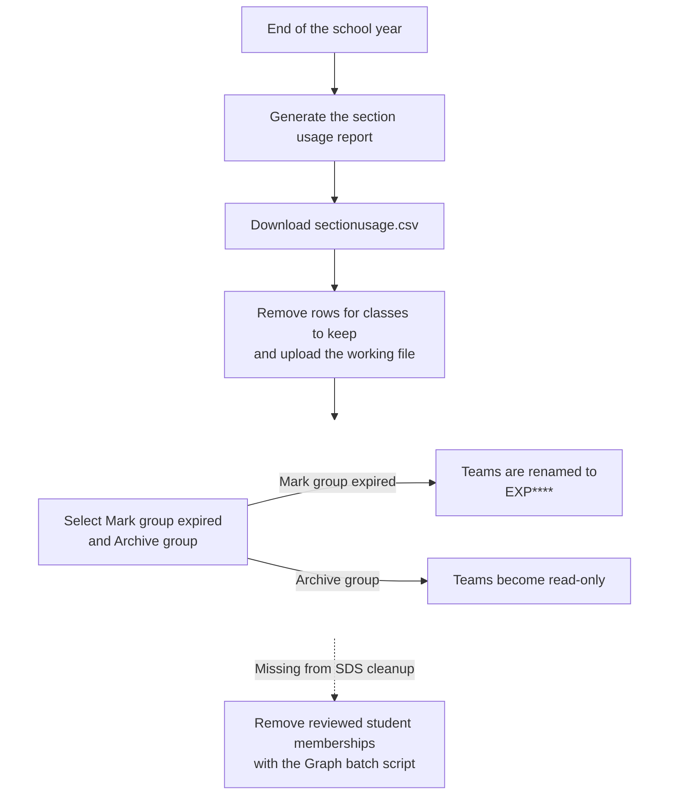

The last school bell has rung. Students are wrapping up, teachers are closing their final assignments, and Microsoft 365 administrators inherit one more end-of-year job: putting last year's class Teams away properly.

I feed Somtoday data into School Data Sync with a tool I built, and SDS turns that data into the classes and Teams used during the year. In my end-of-year process, every class Team provisioned through SDS is archived. But archiving is only half the job: the current SDS cleanup does not remove students, and removing those memberships one by one quickly becomes a mountain of Graph requests. Tony Redmond's batching article arrived at exactly the right moment.

<!-- truncate -->

## SDS brings an academic-year lifecycle

My [Somtoday To Microsoft School Data Sync](../docs/tools/somtoday-to-school-data-sync) utility prepares the CSV files that SDS needs. That solves the provisioning side, but it also means I need to finish the SDS lifecycle instead of leaving last year's digital classrooms mixed in with the new ones.

Microsoft's [academic-year transition guidance](https://learn.microsoft.com/en-us/microsoft-365/education/guide/1-reference/school-data-sync) advises reviewing the sync end date about three weeks before the school year ends and cleaning up the previous year about two weeks after it ends. In the SDS Admin Center, that cleanup starts with a section usage report. You remove every class you want to keep from `sectionusage.csv`, upload the remaining list, and choose the cleanup options.

Microsoft presents `Archive group` as one of those options, not as a universal requirement. My rule for this setup is deliberately stricter: every class Team provisioned through SDS is archived. The [Archive group option](https://learn.microsoft.com/en-us/schooldatasync/azure-ad-group-cleanup) makes the class read-only, prevents new conversations or data from being shared, and moves it into the archived classes folder in Teams.

:::warning[The report contains the classes that will be cleaned up]

Remove every class you want to keep from `sectionusage.csv` before uploading it. If you leave all rows in the report, SDS targets every listed class. Review the file as a change list, not just as a report.

:::

The same working file can then become the script's allowlist. In the report generated in my tenant, the `GraphId` column gives me the exact groups to process, so I can maintain the reviewed class Teams directly instead of searching the tenant by name. I still validate every value as a GUID and reject duplicates before making changes.

## Archiving does not remove the students

Here is the catch: Microsoft explicitly says that the [current SDS group cleanup does not remove students from the selected classes](https://learn.microsoft.com/en-us/schooldatasync/azure-ad-group-cleanup). Archiving and membership cleanup are therefore two different jobs. The Graph script in this article supplements the SDS cleanup; it does not replace it.

The two side branches show what the SDS options do. The dashed final step is the additional membership cleanup that is still missing from the built-in flow:



Why remove those memberships after the Team is archived? Archived is read-only, not inaccessible. Microsoft notes that members can still [view the team activity, files, chats, and channels](https://learn.microsoft.com/en-us/microsoftteams/archive-or-delete-a-team). For class Teams, Microsoft also confirms that [files, conversations, grades, and assignments remain saved and accessible](https://support.microsoft.com/en-us/teams/education/archiving-classes-at-the-end-of-the-school-year-in-microsoft-teams). That continuing access creates an avoidable opportunity to reuse material from the previous year.

A student could, for example, download files and quizzes from year 3 and later share them with someone who starts year 3 the following school year. Removing the membership later cannot undo earlier downloads or guarantee that nothing will be shared. It does take away the easy route back into the archived class Team and makes this kind of reuse less tempting and less convenient.

Microsoft's OfficeDev sample-script repository, O365-EDU-Tools, contains a [script for removing memberships from expired SDS sections](https://github.com/OfficeDev/O365-EDU-Tools/blob/master/SDS%20Scripts/Remove-Expired_Section_Memberships.ps1). The June 10, 2026 revision retrieves group owners and members, excludes owner accounts, removes the remaining user memberships, and exports the changes to CSV.

The script calls `Remove-MgGroupMemberByRef` once for every selected member. That works, but each membership means another Graph request. Across hundreds of class Teams, the requests add up quickly.

I still like the shape of this staged process: archive the class Team first, then remove the reviewed expired memberships while the owners remain in place. But the script cannot magically know who is a student. A teacher who is not registered as a group owner can also be selected, so I verify the owners and teachers before making any change.

The sample script finds candidate groups by matching `mailNickname` against `^Exp[0-9]{4}`. I treat that naming convention as a search aid, never as approval to remove members. If the owner lookup fails, the group is skipped rather than treated as ownerless.

## One request per membership adds up quickly

Then Tony Redmond published his [Microsoft Graph JSON batching primer](https://office365itpros.com/2026/07/21/json-batching-primer/) on July 21, 2026, together with a [PowerShell example that updates user accounts in batches](https://github.com/12Knocksinna/Office365itpros/blob/master/Update-UserAccountsBatch.PS1). The example updates users instead of class memberships, but the useful idea is exactly the same.

Microsoft Graph accepts [up to 20 requests in one JSON batch](https://learn.microsoft.com/en-us/graph/json-batching). Instead of making 20 separate trips to Graph, I can put 20 independent membership deletions in one payload and send it to `https://graph.microsoft.com/v1.0/$batch`.

That saves time. With every separate request, PowerShell waits for the trip to Graph and back. A batch makes that trip once for up to 20 deletions. Graph still handles every deletion separately, so a batch is not automatically twenty times faster. Across hundreds of class Teams, though, fewer network trips make a real difference.

## Twenty deletes, one Graph call

JSON batching works at the HTTP layer. The batch contains relative Microsoft Graph URLs and HTTP methods, not a list of Graph PowerShell cmdlets. `Invoke-MgGraphRequest` sends the completed payload.

This is the small part of the pattern worth borrowing. It starts after `$groupId` and `$membersToRemove` have been checked and owner accounts have been excluded; it is not a complete end-of-year cleanup script:

```powershell
$batchSize = 20
$membersToRemove = @($membersToRemove)

for ($offset = 0; $offset -lt $membersToRemove.Count; $offset += $batchSize) {
    $lastIndex = [Math]::Min(
        $offset + $batchSize - 1,
        $membersToRemove.Count - 1
    )
    $currentMembers = @($membersToRemove[$offset..$lastIndex])
    $requestMap = @{}

    $requests = for ($index = 0; $index -lt $currentMembers.Count; $index++) {
        $member = $currentMembers[$index]
        $requestId = [string]($index + 1)
        $requestMap[$requestId] = $member

        [ordered]@{
            id     = $requestId
            method = 'DELETE'
            url    = ('/groups/{0}/members/{1}/$ref' -f $groupId, $member.Id)
        }
    }

    $batchBody = @{requests = @($requests)} | ConvertTo-Json -Depth 5

    try {
        $batchResponse = Invoke-MgGraphRequest `
            -Method POST `
            -Uri 'https://graph.microsoft.com/v1.0/$batch' `
            -Body $batchBody `
            -ContentType 'application/json' `
            -ErrorAction Stop
    }
    catch {
        throw "The complete batch request failed: $($_.Exception.Message)"
    }

    foreach ($result in $batchResponse.responses) {
        $member = $requestMap[[string]$result.id]
        if ($null -eq $member) {
            throw "The response contains an unknown request ID: $($result.id)"
        }

        $memberName = [string]$member.DisplayName
        if ([string]::IsNullOrWhiteSpace($memberName)) {
            $memberName = [string]$member.AdditionalProperties.displayName
        }
        if ([string]::IsNullOrWhiteSpace($memberName)) {
            $memberName = [string]$member.Id
        }

        $status = [int]$result.status
        if ($status -eq 204) {
            Write-Host "Removed $memberName from group $groupId"
        }
        elseif ($status -eq 429 -or ($status -ge 500 -and $status -lt 600)) {
            Write-Warning "Temporary failure for ${memberName}: HTTP $status"
        }
        else {
            Write-Error "Removal failed for ${memberName}: HTTP $status - $($result.body.error.message)"
        }
    }
}
```

## A successful batch can still contain failures

The IDs keep each request tied to its response, even when Graph returns them in a different order. `HTTP 200` only says that Graph accepted the batch; a deletion inside it can still fail. I therefore check every response: `204 No Content` is success, and everything else goes onto the failure list.

A batch is not all-or-nothing. If 17 deletions succeed and three fail, those 17 stay removed. Graph does not roll them back.

:::danger[Keep /$ref in the delete URL]

Use `DELETE /groups/{group-id}/members/{member-id}/$ref` to remove the membership relationship. [Microsoft warns](https://learn.microsoft.com/en-us/graph/api/group-delete-members?view=graph-rest-1.0) that omitting `/$ref` can delete the member object itself from Microsoft Entra ID when the calling app also has permission to manage that object type.

:::

## Retry only temporary failures

The example code reports `429` and `5xx`, but it does not retry them. A complete script should keep only those temporary failures and try them again a limited number of times. For `429`, it follows `Retry-After`; `400` and `403` need investigation, not another attempt.

## Start small

Batching only starts when the selection is right. I use the reviewed `sectionusage.csv` as the boundary. In the report generated in my tenant, its `GraphId` column identifies the exact class Teams; every GUID is validated and duplicates are rejected.

Before the first deletion, the script shows the tenant and a preview. If owners or members cannot be retrieved, it skips that Team; owner accounts never enter a delete batch. I start with one or two Teams and save every result. The connection uses the least-privileged `GroupMember.ReadWrite.All` [permission](https://learn.microsoft.com/en-us/graph/api/group-delete-members?view=graph-rest-1.0), an appropriate delegated Entra role, and only the extra discovery permissions it needs.

## Ready for summer

In the end, the pattern is simple: SDS marks and archives the old class Teams; the Graph script removes the reviewed student memberships afterward. Sending them 20 at a time means fewer trips to Graph and a shorter cleanup.

Last year's classrooms closed, a clear results file, and no afternoon lost to separate requests. That sounds like a better start to the summer.

## Further reading

- [Tony Redmond: How to use JSON batching to speed up Graph processing](https://office365itpros.com/2026/07/21/json-batching-primer/)
- [Tony Redmond's Update-UserAccountsBatch.PS1 example](https://github.com/12Knocksinna/Office365itpros/blob/master/Update-UserAccountsBatch.PS1)

## Official Microsoft documentation and sample scripts

- [Microsoft 365 Education academic-year transition with School Data Sync](https://learn.microsoft.com/en-us/microsoft-365/education/guide/1-reference/school-data-sync)
- [Class and section group cleanup in School Data Sync](https://learn.microsoft.com/en-us/schooldatasync/azure-ad-group-cleanup)
- [Archive or delete a team in Microsoft Teams](https://learn.microsoft.com/en-us/microsoftteams/archive-or-delete-a-team)
- [Archive classes at the end of the school year in Microsoft Teams for Education](https://support.microsoft.com/en-us/teams/education/archiving-classes-at-the-end-of-the-school-year-in-microsoft-teams)
- [Combine multiple HTTP requests using JSON batching](https://learn.microsoft.com/en-us/graph/json-batching)
- [Microsoft Graph throttling guidance](https://learn.microsoft.com/en-us/graph/throttling)
- [Remove a member from a group](https://learn.microsoft.com/en-us/graph/api/group-delete-members?view=graph-rest-1.0)
- [Microsoft OfficeDev O365-EDU-Tools SDS sample scripts](https://github.com/OfficeDev/O365-EDU-Tools/tree/master/SDS%20Scripts)
- [Remove expired SDS section memberships](https://github.com/OfficeDev/O365-EDU-Tools/blob/master/SDS%20Scripts/Remove-Expired_Section_Memberships.ps1)

## Related guides

- [Somtoday To Microsoft School Data Sync](../docs/tools/somtoday-to-school-data-sync)
- [Teams](../docs/services/teams)
- [Permissions And Ownership](../docs/admin-and-governance/permissions-and-ownership)
