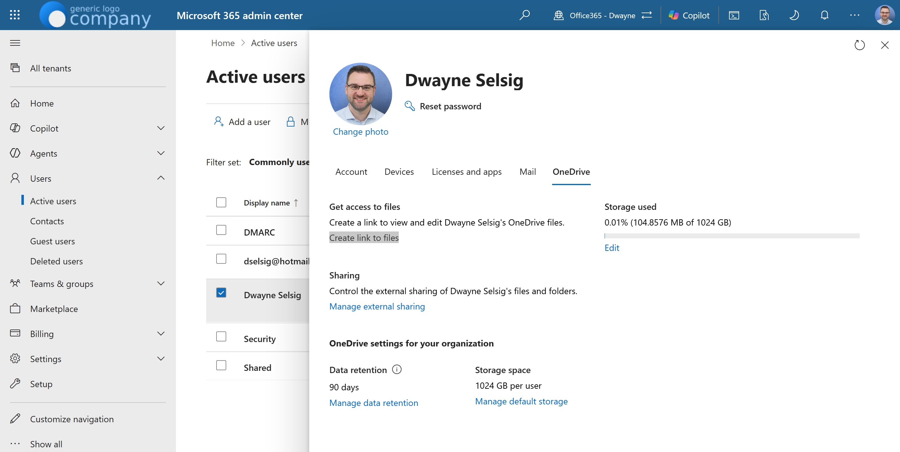
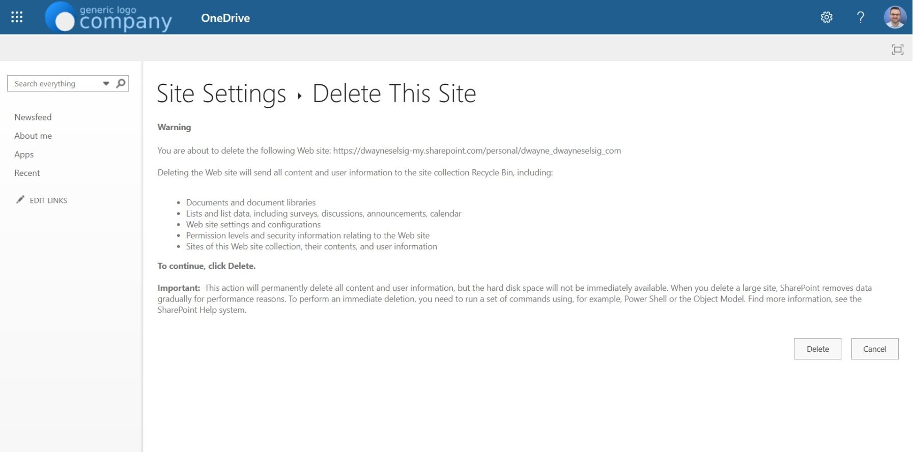

John Smith uses `john.smith@m365wizard.com` for purchasing. It works while John is in the role, so nobody stops to create `procurement@m365wizard.com`. `john.smith@m365wizard.com` belongs to John, while the purchasing process belongs to the organization.

That distinction becomes visible when John leaves. The organization converts his mailbox to a shared mailbox and removes the license to save money. The email remains available, but the personal OneDrive does not become part of the shared mailbox. It remains a separate Microsoft 365 object.

This is usually a process problem before it is a mailbox problem. If a process belongs to the organization, give it a shared identity from the beginning.

<!-- truncate -->

## The Process Failed Before The Mailbox Did

The same sequence appears in many offboarding processes:

1. A team process uses a personal account.
2. The employee leaves the role or the organization.
3. The old user mailbox is converted to a shared mailbox.
4. The license is removed.
5. The mailbox continues to exist.
6. The personal OneDrive remains as a separate object.

Microsoft says that converting a user mailbox retains the existing email and calendar. Microsoft also says not to delete the old user account because the account remains the anchor for the shared mailbox. A shared mailbox usually does not need its own Exchange Online license, but every person who accesses it needs a licensed Exchange Online mailbox. See Microsoft's guidance on [shared mailboxes](https://learn.microsoft.com/en-us/microsoft-365/admin/email/about-shared-mailboxes?view=o365-worldwide) and [converting a user mailbox](https://learn.microsoft.com/en-us/microsoft-365/admin/email/convert-user-mailbox-to-shared-mailbox?view=o365-worldwide).

Removing that license was meant to reduce cost. It can instead leave data inaccessible, create storage or reactivation charges, introduce deletion risk, and eventually cause data loss. The [Microsoft policy for unlicensed OneDrive accounts](https://learn.microsoft.com/en-us/sharepoint/unlicensed-onedrive-accounts) puts an account into read-only mode after 60 unlicensed days and archives it after 93 days. From July 1, 2026, unpaid accounts can also reach deletion risk after 365 cumulative unpaid days. Microsoft names exceptions for EDU, GCC, and DoD tenants, so check the policy for your tenant type.

:::warning[Do not treat this as a mailbox-only cleanup]

The mailbox can be healthy while the OneDrive is inaccessible or at risk. Decide what happens to the files before deleting the site. Archived unlicensed OneDrive accounts can create storage and reactivation charges when the relevant billing is enabled, and Microsoft warns that retained content can still become unrecoverable after deletion.

:::

## Three Objects, Three Decisions

Keep these objects separate when you investigate the former employee:

- **The Exchange Online mailbox** contains email and calendar data. Converting it to a shared mailbox changes who can use the mailbox; it does not turn the OneDrive into shared storage.
- **The user account** anchors the shared mailbox after conversion. Keep it in place, block sign-in, and manage its license according to the mailbox and compliance requirements.
- **The personal OneDrive site** is a SharePoint site collection for the user's files. It has its own URL, data, ownership, retention state, and lifecycle.

The GDPR does not prescribe one specific mailbox type. It does require organizations to manage personal data lawfully and protect it against unauthorized access, loss, and destruction. A shared identity is therefore a better fit for a continuing business process: access can follow the team, ownership is clearer, and the process does not depend on one person's account. This is a process and governance decision, not a claim that a shared mailbox alone makes a process GDPR-compliant. The [GDPR principles in Article 5](https://eur-lex.europa.eu/legal-content/EN/TXT/?uri=CELEX:32016R0679#:~:text=Principles-,Article%205,for%2C%20and%20be%20able%20to%20demonstrate%20compliance%20with%2C%20paragraph%C2%A01%20(%E2%80%98accountability%E2%80%99).,-Article%206) are the useful reference point.

John Smith should not use `john.smith@m365wizard.com` for procurement. Start with `procurement@m365wizard.com` instead of building a permanent process around his personal address.

## Decide Before You Delete

The cleanup belongs with the IT administrator, the process owner, and whoever is responsible for retention or legal discovery. Before deleting anything, check the business owner, files, sharing, retention policy, eDiscovery, and legal holds. Move or retain important data first. Use [Where Should This File Live?](../docs/decisions/where-should-this-file-live) to choose an appropriate new home for files that must remain available.

OneDrive does not expose the standard **Site Settings** or **Delete this site** links. Use the direct deletion page instead:

1. Go to the [Microsoft 365 admin center](https://admin.cloud.microsoft/).
2. Go to **Users > Active users**.
3. Find and select the account.
4. Make sure the account temporarily has a license that includes SharePoint.
5. Open the **OneDrive** tab and, under **Get access to files**, select **Create link to files**. Microsoft documents this route in its guidance for [accessing a former user's OneDrive files](https://learn.microsoft.com/en-us/microsoft-365/admin/add-users/remove-former-employee-step-5?view=o365-worldwide).



6. Copy the generated link, for example `https://dwayneselsig-my.sharepoint.com/personal/john_smith_m365wizard_com`.
7. Paste the link into the browser, append `/_layouts/15/deleteweb.aspx`, and press Enter.
8. Verify that you opened the correct site, then select **Delete**.



Treat this deletion as a move to **Deleted Sites**. Do not permanently purge the site until the recovery and compliance decision is complete. Microsoft documents that retention policies, eDiscovery holds, and legal holds can prevent deletion. A failed delete is often a signal to review the hold, not a reason to force the command. The [Microsoft guidance on permanently deleting SharePoint sites](https://learn.microsoft.com/en-us/troubleshoot/sharepoint/sites/cannot-permanently-delete-site) explains this boundary.

## Remove One Known OneDrive With PowerShell

The following example is deliberately narrow. It removes one known user's OneDrive; it does not inventory all shared mailboxes. Check the URL character by character before running a destructive command.

```powershell
Install-Module -Name Microsoft.Online.SharePoint.PowerShell -Scope CurrentUser

$AdminSiteUrl = "https://dwayneselsig-admin.sharepoint.com"
Connect-SPOService -Url $AdminSiteUrl

$OneDriveSiteUrl = "https://dwayneselsig-my.sharepoint.com/personal/john_smith_m365wizard_com"

# Moves the site to Deleted Sites.
Remove-SPOSite -Identity $OneDriveSiteUrl

# Check that the site is in Deleted Sites.
Get-SPODeletedSite -Identity $OneDriveSiteUrl

# Permanent removal. Run only after the data decision is final.
Remove-SPODeletedSite -Identity $OneDriveSiteUrl
```

`Remove-SPOSite` moves the site collection to the SharePoint Online Recycle Bin, which administrators commonly see as **Deleted Sites**. `Remove-SPODeletedSite` removes that deleted site permanently. The [Remove-SPOSite](https://learn.microsoft.com/en-us/powershell/module/microsoft.online.sharepoint.powershell/remove-sposite?view=sharepoint-ps), [Get-SPODeletedSite](https://learn.microsoft.com/en-us/powershell/module/microsoft.online.sharepoint.powershell/get-spodeletedsite?view=sharepoint-ps), and [Remove-SPODeletedSite](https://learn.microsoft.com/en-us/powershell/module/microsoft.online.sharepoint.powershell/remove-spodeletedsite?view=sharepoint-ps) documentation describes the permissions and lifecycle.

Retention policies, eDiscovery holds, and legal holds can block these operations. If the command fails, stop and check the policy before changing it. The [SharePoint Diary example](https://www.sharepointdiary.com/2017/04/how-to-delete-onedrive-for-business-site-collection-sharepoint-online.html) is useful background for this command sequence, but Microsoft's cmdlet documentation is the authority for the current behavior.

## Bonus: Tenant-Wide Cleanup Script

For a tenant-wide cleanup, use [Remove OneDrive From Shared Mailboxes](../docs/tools/scripts/remove-onedrive-from-shared-mailboxes). The tool guide explains the required modules, matching logic, confirmation options, and retention cautions, and it provides both the download and the full script from one maintained source file.

Start with `-WhatIf`, validate every mailbox-to-site match, and treat `-Purge` as an irreversible data decision.

## Official Microsoft Documentation

- [Manage unlicensed OneDrive user accounts](https://learn.microsoft.com/en-us/sharepoint/unlicensed-onedrive-accounts)
- [About shared mailboxes in Microsoft 365](https://learn.microsoft.com/en-us/microsoft-365/admin/email/about-shared-mailboxes?view=o365-worldwide)
- [Convert a user mailbox to a shared mailbox](https://learn.microsoft.com/en-us/microsoft-365/admin/email/convert-user-mailbox-to-shared-mailbox?view=o365-worldwide)
- [Give another employee access to OneDrive and Outlook data](https://learn.microsoft.com/en-us/microsoft-365/admin/add-users/remove-former-employee-step-5?view=o365-worldwide)
- [Fix: Can't delete a Microsoft 365 group site permanently](https://learn.microsoft.com/en-us/troubleshoot/sharepoint/sites/cannot-permanently-delete-site)
- [Remove-SPOSite](https://learn.microsoft.com/en-us/powershell/module/microsoft.online.sharepoint.powershell/remove-sposite?view=sharepoint-ps)
- [Get-SPODeletedSite](https://learn.microsoft.com/en-us/powershell/module/microsoft.online.sharepoint.powershell/get-spodeletedsite?view=sharepoint-ps)
- [Remove-SPODeletedSite](https://learn.microsoft.com/en-us/powershell/module/microsoft.online.sharepoint.powershell/remove-spodeletedsite?view=sharepoint-ps)

**Related sources:** [Reddit discussion about unlicensed OneDrive accounts after conversion](https://www.reddit.com/r/Office365/comments/1v558b0/unlicensed_onedrive_user_accounts_user_to_shared/), [SharePoint Diary: delete a OneDrive for Business site](https://www.sharepointdiary.com/2017/04/how-to-delete-onedrive-for-business-site-collection-sharepoint-online.html).

The lesson is simple: if the work is shared, the identity should be shared before the first message or file is created. Offboarding can then close a person's access without having to discover which personal storage quietly became part of the business process.
