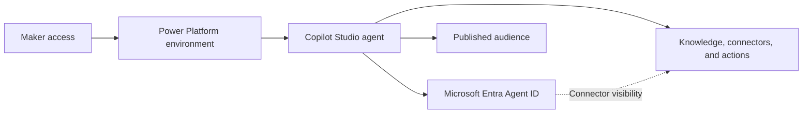

Giving someone access to Microsoft Copilot Studio can look like a licensing or adoption decision. A license is assigned, the maker receives access to an environment, and experimentation starts.

Currently, every new Copilot Studio agent automatically receives a **Microsoft Entra Agent ID**. Microsoft describes this identity as a **service principal with the Agent subtype**. Copilot Studio creates and manages the identity and its credentials.

Maker access therefore allows people to create directory identities and access paths that the organization must inventory, govern, and eventually retire.

<!-- truncate -->

## Maker access creates new identities and access paths

[Microsoft Security recommends](https://www.microsoft.com/en-us/security/blog/2026/01/20/four-priorities-for-ai-powered-identity-and-network-access-security-in-2026/) inventorying agents, assigning clear ownership, governing what they can access, and applying consistent security standards to human and agent identities.

That advice becomes concrete in Copilot Studio. An agent can use knowledge sources, connectors, actions, HTTP requests, triggers, and external services. Publishing determines who can use the agent. The identities, information, and actions behind it require additional access decisions.

The diagram is deliberately not a straight permission chain. The Agent ID improves identity and connector visibility, while Copilot Studio, Power Platform policies, connections, and user permissions still determine what happens at runtime.

## What the Agent ID makes visible

For new agents, Copilot Studio creates and manages the Agent ID automatically. A maker does not receive a reusable client secret or an unrestricted service principal.

When the agent is published, Copilot Studio adds API permission scopes that represent supported Power Platform connectors configured for the agent. These are connector scopes, not direct resource permissions such as `Mail.Read` or `Files.Read.All`. Administrators gain visibility into authentication activity and configured connector access, while the Power Platform connector runtime still checks applicable connector and data policies.

This is useful, but it is not a complete inventory of everything the agent can reach. Custom connectors, MCP servers, and REST API tools do not add the same API permissions to the Agent ID. Entra visibility should therefore support the Copilot Studio and Power Platform review, not replace it.

## Separate licensing from security decisions

Having Copilot Studio licenses does not automatically make an environment unsafe. The mistake is treating license assignment as the complete decision.

A maker can create an agent with its own identity and connect it to information and capabilities within the policies and permissions that the organization allows.

Those are separate decisions:

- who may build agents;
- where they may build them;
- which knowledge sources, connectors, actions, HTTP endpoints, and triggers are allowed;
- who may publish an agent and to which audience;
- who owns and supports it after publication;
- how changes are reviewed;
- when the agent and its dependencies are retired.

If those decisions have not been made, broad maker access lets governance emerge one agent at a time.

## Agent Builder uses a different identity model

The word *agent* does not refer to one identity model across Microsoft products.

Currently, Microsoft 365 Copilot Agent Builder agents do not require an app registration ID or Microsoft Entra Agent ID. Full Copilot Studio agents do. That does not remove governance from Agent Builder; it shifts the emphasis toward knowledge access, sharing, discoverability, and ownership.

Copilot Studio adds environments, connectors, actions, triggers, publication channels, agent identities, and a separate operational lifecycle. The policy should reflect the capability being enabled instead of treating every agent as the same object.

## Set boundaries before broad rollout

My preferred starting point is a controlled maker group rather than unrestricted organization-wide authoring. Give makers a suitable development environment, apply data policies before they publish, and require a review before an agent reaches a production audience.

That review should answer who owns the agent, what it can use, who can use it, how its access is monitored, and what happens when the owner or purpose changes. This does not prevent experimentation. It keeps experimentation inside boundaries that somebody has deliberately chosen and can maintain.

The practical implementation is in [Govern Copilot Studio Agents Before Enabling Makers](../docs/admin-and-governance/govern-copilot-studio-agents).

:::tip[Decide Before Granting Maker Access]

Before you grant maker access, decide which identities, access paths, and actions that maker may create.

:::

## Official Microsoft documentation

- [App registration, agent identities, and authentication for Microsoft Copilot Studio](https://learn.microsoft.com/en-us/microsoft-copilot-studio/requirements-certificates-configuration-values)
- [Automatically create Microsoft Entra Agent IDs for Copilot Studio agents](https://learn.microsoft.com/en-us/microsoft-copilot-studio/admin-use-entra-agent-identities)
- [Security and governance in Microsoft Copilot Studio](https://learn.microsoft.com/en-us/microsoft-copilot-studio/security-and-governance)
- [Secure your Copilot Studio projects](https://learn.microsoft.com/en-us/microsoft-copilot-studio/guidance/sec-gov-phase3)
- [Configure data policies for agents](https://learn.microsoft.com/en-us/microsoft-copilot-studio/admin-data-loss-prevention)
