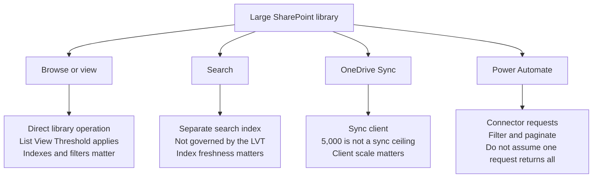

A SharePoint library reaches 5,000 files, and then a view stops working or a flow misses records. The library still has room for far more content.

Microsoft's [List View Threshold guidance](https://support.microsoft.com/en-us/sharepoint/lists/data-and-lists/list-view-threshold-for-large-lists-and-libraries) says that a SharePoint list or library can contain up to **30 million items or files**. The familiar 5,000 figure is the **List View Threshold**. It limits how much work certain database operations, such as a query, can do at once. Microsoft also notes that the exact threshold can vary.

Most users and many libraries will never run into the List View Threshold. But when a view, flow, migration, or permission change does hit a limit, the visible error rarely tells the complete story. You first need to understand which technical path is failing and why.

Do not split a library simply because it passes 5,000 files. First ask how people and systems find, show, synchronize, secure, and process those files.

<!-- truncate -->

## 5,000 Is About Work, Not Storage

The List View Threshold protects SharePoint from heavy operations that could slow the service for other users. This explains a situation that often feels inconsistent: a large library works, but one view or process fails.

That is why **indexed columns** and filtered views matter. An index helps SharePoint find a smaller set without checking the complete library. Sorting, grouping, and columns such as Person, Lookup, or Managed Metadata can make a query heavier. Folders can help, but they are not a free pass. A query inside one folder can still cross the threshold. Microsoft explains these choices in its guidance for [working with the List View Threshold](https://support.microsoft.com/en-us/sharepoint/data-and-lists/working-with-the-list-view-threshold-limit-for-all-versions-of-sharepoint).

:::tip[Recommendation]

Keep common views and queries small. The library itself does not necessarily have to be.

:::

Permissions use another set of limits. SharePoint supports up to **50,000 unique permission scopes** in a list or library, while Microsoft recommends a general limit of 5,000. For migrations, Microsoft's [permission guidance](https://learn.microsoft.com/en-us/sharepoint/dev/apis/migration-perm-guidance) recommends fewer than 5,000 unique scopes per library. A permission scope is created when content stops inheriting access from its parent. It is another exception that someone must understand and review. This limit is separate from the List View Threshold.

## The Same Library Has Different Limits

There is no single limit for every way of using a library. A browser view, Search, OneDrive Sync, and Power Automate each reach the same content differently.

| Access pattern | What matters | Practical consequence |
| --- | --- | --- |
| **Browse or view** | The query, filter, index, sorting, grouping, and result size | Create default and task-specific views that return manageable subsets. |
| **Search** | A separate search index that is not subject to the List View Threshold | Use Search to find content, but allow for the time needed to index changes. |
| **OneDrive Sync** | Sync-client scale, device resources, and the total synchronized item count | Synchronize only what the work requires. Do not rebuild the entire file server in File Explorer. |
| **Power Automate** | Connector limits, query design, filtering, and pagination | Retrieve a targeted set and explicitly handle additional pages. |

The 5,000 List View Threshold is **not a OneDrive Sync limit**. Microsoft currently [recommends synchronizing no more than 300,000 items](https://support.microsoft.com/en-us/onedrive/restrictions-and-limitations-in-onedrive-and-sharepoint) across cloud storage for optimum performance. That number concerns the sync client and the device. A library with more than 5,000 files can synchronize, while a poor view or flow against the same library can still fail.

Search follows another route. Microsoft's guidance explains that [SharePoint Search uses its own index and is not subject to the List View Threshold](https://support.microsoft.com/en-us/sharepoint/data-and-lists/working-with-the-list-view-threshold-limit-for-all-versions-of-sharepoint). Search is therefore a good way to find content in a large library. It is not a real-time bulk-processing tool because a recent change first needs to reach the index.

## Power Automate Makes the Problem Visible

Power Automate often exposes a weak query before users notice a problem in the browser.

The SharePoint **Get items** and **Get files** actions return 100 items by default. You can raise **Top Count** to 5,000. On a list with more than 5,000 items, **Get items** can return no matches when the matching records are outside the first 5,000 items. Microsoft tells you to enable **pagination** for this situation.

Pagination lets the flow continue with extra requests. It does not make "get everything" a good design. Filter at the source, use suitable indexed columns, retrieve only what the process needs, and test with realistic volumes. The [Get items and Get files guidance](https://learn.microsoft.com/en-us/sharepoint/dev/business-apps/power-automate/guidance/working-with-get-items-and-get-files) documents the connector behavior.

A successful test with 200 items proves little about a library that will contain 20,000. The flow owner should test the filters, pagination, error handling, and support process at realistic scale.

## A Migration Can Copy the Problem

A file-server migration brings these limits together. Copy the old structure without redesign and you may also copy deep folders, NTFS permission exceptions, unclear ownership, and the expectation that everyone will synchronize everything back into File Explorer.

Microsoft's [file-share migration guide](https://learn.microsoft.com/en-us/sharepointmigration/fileshare-to-odsp-migration-guide) starts with planning, assessment, remediation, and target preparation. Migration and user onboarding follow. The copy is not the first design step.

Use existing NTFS permissions as evidence, not as the automatic target model. Prefer clear SharePoint groups and inherited permissions. Give every exception an owner and a review date. Microsoft permits 50,000 unique scopes, but its [migration permission guidance](https://learn.microsoft.com/en-us/sharepoint/dev/apis/migration-perm-guidance) recommends staying below 5,000 per library. A supported maximum is not a sensible target.

Business owners and Key Users should decide which information is still needed, who should have access, and how users need to retrieve it. The migration lead and Microsoft 365 team should own assessment, destination preparation, permission translation, testing, tooling, and cut-over. The detailed working pattern is in [From File Server To SharePoint: Copy Or Reorganize?](../docs/admin-and-governance/migrate-file-server-to-sharepoint).

## Design Around the Way People Work

A large library can work well. The trouble starts when nobody has designed how people will use it or who will maintain it.

Before content grows or moves, make these decisions explicit:

| Decision | Primary owner | Question to answer |
| --- | --- | --- |
| Structure and common views | Business owner and Key User | How will people retrieve a useful subset? |
| Indexed columns and technical configuration | SharePoint administrator | Which filters must continue to work at scale? |
| Automation | Flow owner | Does the flow filter at the source and handle pagination? |
| Synchronization | Business owner and IT | Who genuinely needs this content in File Explorer? |
| Permissions | Site owner and IT | Is each break in inheritance necessary and reviewable? |
| Migration | Migration lead and business owner | Who owns the move, and who owns the information decision? |

Use [Site, Library, Or Folder](../docs/decisions/site-library-or-folder) to choose a structure and [Permissions And Ownership](../docs/admin-and-governance/permissions-and-ownership) to assign responsibility.

Do not let one famous number decide the structure. Check whether each view, search, synchronization choice, flow, and permission model still supports the work.

## Official Microsoft Documentation

- [List View Threshold for large lists and libraries](https://support.microsoft.com/en-us/sharepoint/lists/data-and-lists/list-view-threshold-for-large-lists-and-libraries)
- [Working with the List View Threshold limit for all versions of SharePoint](https://support.microsoft.com/en-us/sharepoint/data-and-lists/working-with-the-list-view-threshold-limit-for-all-versions-of-sharepoint)
- [Get items and Get files guidance for Power Automate](https://learn.microsoft.com/en-us/sharepoint/dev/business-apps/power-automate/guidance/working-with-get-items-and-get-files)
- [Restrictions and limitations in OneDrive and SharePoint](https://support.microsoft.com/en-us/onedrive/restrictions-and-limitations-in-onedrive-and-sharepoint)
- [SharePoint migration permission guidance](https://learn.microsoft.com/en-us/sharepoint/dev/apis/migration-perm-guidance)
- [Migrate file shares to SharePoint and OneDrive](https://learn.microsoft.com/en-us/sharepointmigration/fileshare-to-odsp-migration-guide)
