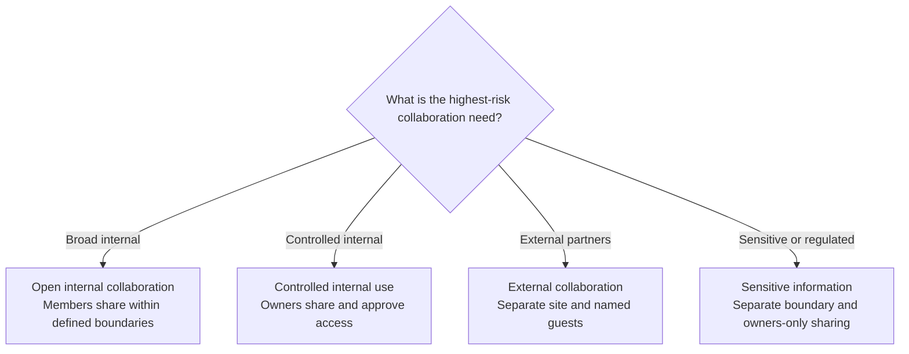

# Govern Sharing In SharePoint

Keep sharing available, but govern it per site. SharePoint is designed for people to work with shared information. Turning off sharing everywhere recreates file-server friction, while allowing every user to share every item can create access that nobody can explain or review.

Choose who may share, with whom, through which link type, and under which review process before a site goes live.

## Start With The Site And Ownership Model

Moving content to SharePoint instead of Teams can support organization-managed ownership, but SharePoint does not guarantee that model by itself. The site type and operating agreements determine who controls access:

- manage a group-connected team site's owners and members primarily through its Microsoft 365 group or Team;
- manage a communication site or another nongroup-connected site through its SharePoint Owners, Members, and Visitors groups;
- use centrally managed Microsoft Entra security groups when membership must follow an authoritative organizational process;
- keep at least two suitable owners and record who may approve access and sharing exceptions.

Do not manage a group-connected site as if it were independent from its Microsoft 365 group. Users added directly to the SharePoint site do not automatically receive access to the other group services. See [sharing and permissions in the SharePoint modern experience](https://learn.microsoft.com/en-us/sharepoint/modern-experience-sharing-permissions).

## Choose A Sharing Pattern

| Information pattern | Recommended membership and sharing model |
| --- | --- |
| Open internal collaboration | Let members share within defined tenant and site boundaries. Use groups and inherited access for the stable audience. |
| Controlled internal use | Let owners share files, folders, and the site. Route access requests to accountable owners and use named groups for recurring access. |
| External collaboration | Use a separate, clearly owned site. Prefer named recipients, review guests and links, set end dates, and restrict partner domains where appropriate. |
| Sensitive or regulated information | Use a separate security boundary, disable external sharing, limit sharing to owners, and add applicable Purview or site-access controls. |

The pattern is a governance choice, not a permanent property of the product. Review it when the purpose, audience, sensitivity, or owner changes.

## Apply Controls In Layers

Use the least complex combination that produces an explainable result:

1. **Tenant settings** define the most permissive sharing available to SharePoint and OneDrive.
2. **Site settings** can be more restrictive for external sharing, guest expiration, the default link type, and the default permission.
3. **Membership** gives the stable audience access through Microsoft 365 groups, SharePoint groups, or Microsoft Entra security groups.
4. **Sharing permissions** determine whether members can share files and folders or only site owners can share and process access requests.
5. **Information controls** can classify, protect, monitor, or restrict sensitive activity.

A site setting cannot be more permissive than the tenant setting. Use [site-level sharing settings](https://learn.microsoft.com/en-us/sharepoint/change-external-sharing-site) and [access-request settings](https://support.microsoft.com/en-us/sharepoint/sharepoint-sharing-and-permissions/set-up-and-manage-access-requests) to implement the selected pattern.

## Understand Sharing Links

| Link type | Access effect | Main caution |
| --- | --- | --- |
| **People with existing access** | Does not grant new access | Recipients still need access through membership or another permission. |
| **Specific people** | Grants access only to the named recipients | Review the named access when the work or relationship ends. |
| **People in your organization** | Grants access to anyone in the organization who receives the link | A forwarded link can create a much broader internal audience than the owner intended. |
| **Anyone** | Grants anonymous access to anyone who receives the link | Recipients do not authenticate, so access cannot be reliably attributed to a person. |

Set the safest practical default for each site. A default reduces mistakes, but it is not always a hard security boundary because a user might be able to choose another permitted link type before sharing.

:::warning[Do Not Build A Permission Web]

Sharing a file or folder can create a unique permission scope that no longer follows its parent. Prefer groups and inherited permissions for recurring access. When content needs a structurally different audience or owner, use a separate site instead of a deep tree of exceptions.

See [Microsoft's guidance for managing permission scopes](https://learn.microsoft.com/en-us/sharepoint/manage-permission-scope).

:::

## Separate Baseline And Advanced Controls

Use baseline controls first:

- clear site boundaries and accountable owners;
- SharePoint, Microsoft 365, or Microsoft Entra groups;
- inherited permissions;
- owners-only sharing where the risk requires it;
- access requests, external-sharing settings, and safe link defaults;
- an exception process and scheduled review.

Add licensed capabilities when the risk and scale justify them:

- Microsoft Purview sensitivity labels can configure supported site and sharing settings;
- Data Loss Prevention can audit, warn, restrict, or block configured sensitive activities;
- data access governance reports can help identify broad or direct access;
- Restricted Access Control can require users to have both normal permission and membership in an approved control group.

Restricted Access Control requires SharePoint Advanced Management. It can stop access through a direct permission or shared link for users outside the approved group, and search and Copilot honor that restriction. Verify prerequisites in the [Restricted Access Control documentation](https://learn.microsoft.com/en-us/sharepoint/restricted-access-control).

Purview adds classification and protection; it does not repair unclear ownership or excessive permissions. A label applied to a site or group does not automatically label the files inside it. When useful, a label can provide a safer default sharing link for supported sites or documents, but users might still be able to choose another allowed option. See [default sharing links with sensitivity labels](https://learn.microsoft.com/en-us/purview/sensitivity-labels-default-sharing-link) and [sensitivity labels for groups and sites](https://learn.microsoft.com/en-us/purview/sensitivity-labels-teams-groups-sites).

## Protect Downloads And Synced Copies

Cloud access and local access are different control points. Files On-Demand can leave content online until it is opened, but users can make files available offline and applications can automatically download online-only files. SharePoint permissions alone do not necessarily continue to protect an ordinary downloaded copy.

Use managed-device requirements, device encryption, screen locking, remote incident actions, and restrictions for unmanaged devices as the baseline. For sensitive information, consider encrypted sensitivity labels, Endpoint DLP, or the licensed SharePoint library option that extends current SharePoint permissions to downloaded, copied, or moved files. Test supported file types and applications; classification without encryption is not persistent access control.

Do not enable synchronization for every site by default. Approve it for a defined working pattern, use Files On-Demand, review current item and path limits, and include local-copy removal in leaver and lost-device procedures. The [file-server migration guide](./migrate-file-server-to-sharepoint.md) provides the operational checklist.

## Review Ownership And Access

Define the operational responsibilities:

- the **business owner** decides the intended audience and acceptable sharing;
- the **site owners** manage approved access, requests, links, and exceptions;
- **IT** configures tenant and site boundaries, reporting, support, and escalation;
- **identity management** maintains authoritative identities and managed group membership;
- the **information or compliance owner** defines additional classification, protection, retention, and evidence requirements.

At the agreed review date, confirm:

- that the site still has a valid purpose and at least two suitable owners;
- that members, visitors, guests, and direct access are still justified;
- that sharing links and access requests have accountable owners;
- that unique permissions and exceptions remain necessary;
- that external-sharing, link-default, and sensitivity settings still match the content;
- that inactive or obsolete information has an approved lifecycle decision.

## Prepare For Copilot And Search

Microsoft 365 Copilot and organization-wide search respect existing permissions. They do not grant new access, but they can make information that a user can already access easier to discover and reuse.

Before a broad Copilot rollout, identify ownerless or inactive sites, broad organization access, direct permissions, old links, guests, and sensitive information with weak protection. Correct access and sharing first, then use Purview and applicable SharePoint governance capabilities as additional safeguards. Follow Microsoft's [secure and governed data foundation for Copilot](https://learn.microsoft.com/en-us/microsoft-365/copilot/secure-govern-copilot-foundational-deployment-guidance).

## Official Microsoft Documentation

- [Sharing and permissions in the SharePoint modern experience](https://learn.microsoft.com/en-us/sharepoint/modern-experience-sharing-permissions)
- [Change the sharing settings for a site](https://learn.microsoft.com/en-us/sharepoint/change-external-sharing-site)
- [Set up and manage access requests](https://support.microsoft.com/en-us/sharepoint/sharepoint-sharing-and-permissions/set-up-and-manage-access-requests)
- [Manage permission scopes in SharePoint](https://learn.microsoft.com/en-us/sharepoint/manage-permission-scope)
- [Restrict SharePoint site access](https://learn.microsoft.com/en-us/sharepoint/restricted-access-control)
- [Use sensitivity labels to configure the default sharing link](https://learn.microsoft.com/en-us/purview/sensitivity-labels-default-sharing-link)
- [Control access from unmanaged devices](https://learn.microsoft.com/en-us/sharepoint/control-access-from-unmanaged-devices)
- [Extend SharePoint permissions to downloaded documents](https://learn.microsoft.com/en-us/purview/sensitivity-labels-sharepoint-extend-permissions)
- [Learn about Endpoint Data Loss Prevention](https://learn.microsoft.com/en-us/purview/endpoint-dlp-learn-about)
- [Restrictions and limitations in OneDrive and SharePoint](https://support.microsoft.com/en-us/onedrive/restrictions-and-limitations-in-onedrive-and-sharepoint)

## Related Guides

- [Permissions And Ownership](./permissions-and-ownership.md)
- [External Sharing](./external-sharing.md)
- [From File Server To SharePoint: Copy Or Reorganize?](./migrate-file-server-to-sharepoint.md)
- [SharePoint Content: Sites, Libraries, Lists, And Permissions](../services/sharepoint/sharepoint-content-structure.md)
- [Which Microsoft Purview Solution Should You Use?](../decisions/which-purview-solution-should-you-use.md)
