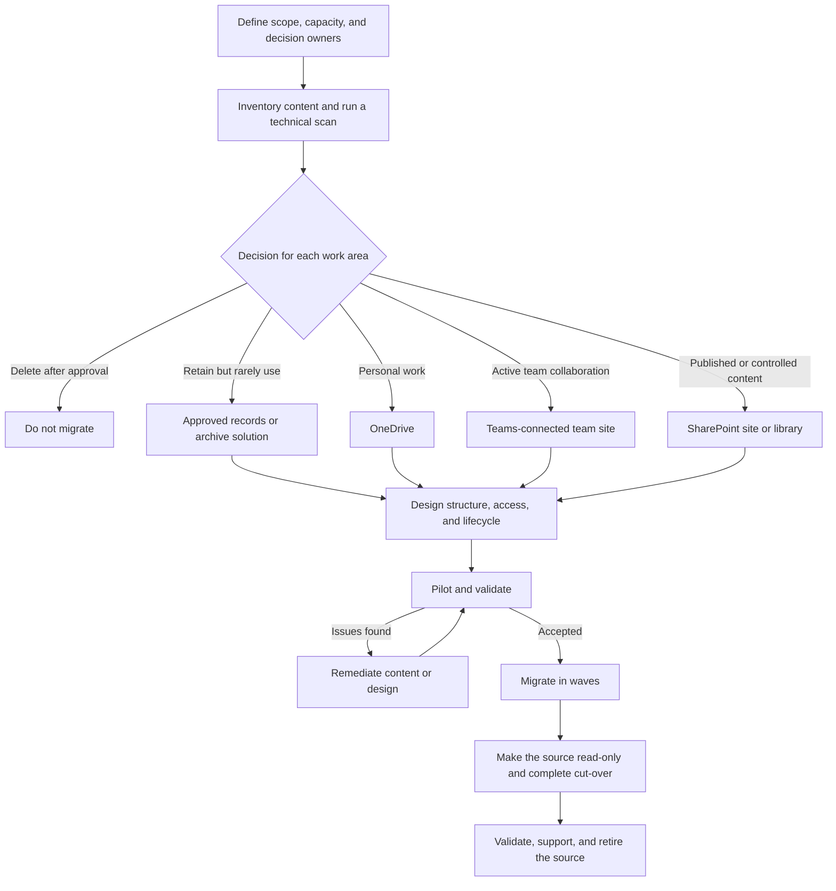

# From File Server To SharePoint: Copy Or Reorganize?

Reorganize before you migrate. A file server is usually arranged around drives, folders, and inherited permissions. SharePoint works best when its structure reflects purpose, ownership, collaboration, access, and information lifecycle.

A migration is therefore an information and adoption project supported by technology, not just a copy job.

## Recommended Approach

Do not migrate everything first and decide how to organize it afterward. Work in manageable areas, such as a department, process, or project. For each area, decide what to keep, who owns it, where it belongs, and how people will work after the move.

> Do not automatically move existing disorder to a new platform.

## Migration Flow

## Reserve Time And Capacity

A schedule based only on file count and transfer speed is incomplete. The technical copy is only one part of the work. Reserve named people and working time for:

- inventory and content decision workshops;
- owners to review, reorganize, and approve their information;
- target structure, access, retention, and security design;
- remediation of files, links, identities, and application dependencies;
- pilot testing, feedback, and design changes;
- communication, task-based training, and instructions for each audience;
- cut-over validation, user support, and post-migration improvements.

These are planned project activities, not tasks for owners and Key Users to fit around their regular work. Agree on decision deadlines and escalation routes, and give each migration wave contingency for findings from the previous wave. Use the pilot to estimate the review and support effort; the number of files alone does not predict that effort.

If the people who understand the content have no scheduled capacity, the migration will wait for decisions even when the technology is ready.

## 1. Define Scope And Decision Rights

Start with the people who can make content decisions. A migration team cannot determine by itself whether an old contract may be deleted or whether a project folder should become a separate site.

For each migration area, assign:

- a **business owner** who decides what is needed and who should have access;
- a **migration lead** who plans scans, test runs, waves, and issue handling;
- an **IT or Microsoft 365 owner** who prepares destinations, identities, security, and support;
- a **records, legal, or security contact** when retention, confidentiality, or regulatory requirements apply.

Record the decision, approver, and date for deletion, archiving, destination, and exceptional access. This prevents technical staff from becoming the accidental owner of business information.

## 2. Inventory And Assess The Source

Use two complementary assessments. The business inventory explains what the content means; the technical scan shows what might fail or require remediation.

| Business inventory | Technical inventory |
| --- | --- |
| Owner and users | File and folder count |
| Purpose and document types | Total size and large files |
| Active, historical, or obsolete | Last modified date |
| Confidentiality and retention need | Path length, names, and file types |
| Required access | Existing source permissions |
| Business applications and processes | Links, macros, and other dependencies |

Treat existing permissions as evidence, not as the target design. Years of exceptions and individual access entries can hide the intended audience. Ask the owner to confirm who needs read, edit, or owner access in the new location.

[Microsoft Migration Manager can scan and assess file shares](https://learn.microsoft.com/en-us/sharepointmigration/mm-fileshare-scan-assess) and produce summary reports and detailed logs before migration. Use those results to find technical blockers, but do not expect a scan to decide ownership, value, or retention for you.

## 3. Choose The Destination

Choose a destination for each coherent work area, not for the entire drive at once.

| Information pattern | Recommended destination |
| --- | --- |
| Work files owned by one person and not yet part of a team process | OneDrive |
| Documents that a defined group actively creates and maintains | A Teams-connected SharePoint team site |
| Published reference information for a broad audience | A SharePoint communication site |
| Formal documents with a defined process, owner, and access model | A governed SharePoint site or document library |
| Information that must be retained but is rarely used | An approved records or archive solution based on retention and access requirements |
| Obsolete, duplicate, or ownerless content with approved disposal | Do not migrate it |

OneDrive, Teams, and SharePoint are not interchangeable folders. The destination determines ownership, lifecycle, access, and how people find and use the content. See [Where Should This File Live?](../decisions/where-should-this-file-live.md) for the underlying choice.

:::warning[Archive Is A Lifecycle Decision]

Do not call content an archive merely because nobody uses it. Confirm its owner, required retention period, access needs, legal holds, and approved disposal process. Configure [Microsoft Purview retention for SharePoint and OneDrive](https://learn.microsoft.com/en-us/purview/retention-policies-sharepoint) where policy or regulation requires it.

:::

## 4. Design The New Structure And Access

Do not automatically turn every top-level folder into a site. Create a site when content shares a clear purpose, owner, audience, and lifecycle. Use a separate site when the security boundary or ownership is materially different.

Within a site:

- use document libraries for distinct content sets or management rules;
- keep folders understandable and reasonably shallow;
- add metadata when people need to filter, group, search, or manage documents across folders;
- prefer groups and inherited permissions over individual access and many exceptions;
- define at least two suitable owners for important workspaces;
- agree on naming, navigation, versioning, sharing, retention, and review before migration.

The objective is not to remove every folder. It is to make the structure explainable to a new employee without relying on knowledge of the old drive.

## 5. Clean Up And Remediate

Have the business owner approve whether content should be migrated, archived, or deleted. Investigate content that:

- is duplicated, obsolete, or has no owner;
- has not been used within the agreed review period;
- cannot be opened or is password protected;
- depends on mapped drives, fixed paths, shortcuts, macros, or applications;
- has names, types, sizes, or paths reported as migration issues;
- has permissions that cannot be mapped to active Microsoft 365 identities.

Do not use last modified date as the only deletion rule. Some records are rarely opened but must still be retained. Conversely, a recently modified duplicate is not necessarily valuable.

## 6. Pilot With A Representative Group

Choose a pilot that contains realistic complexity: folders, Office files, special permissions, links, larger files, and users with different working patterns. A technically easy folder proves very little.

Validate at least:

- file counts and migration reports;
- names, paths, and whether documents open correctly;
- access for owners, members, visitors, and exceptional cases;
- Word, PowerPoint, and Excel behavior, including external links and macros;
- OneDrive sync only where synchronization is part of the intended pattern;
- search, metadata, views, and navigation;
- sharing and approval processes;
- user instructions, support readiness, and owner acceptance.

[Microsoft's file share migration guidance](https://learn.microsoft.com/en-us/sharepointmigration/fileshare-to-odsp-migration-guide) recommends an incremental pilot followed by a cut-over. Use the pilot findings to update the destination design, remediation rules, communications, and wave plan before scaling up.

## 7. Migrate In Waves And Cut Over

Migrate by work area so that each wave has an accountable owner and a known audience. A typical wave has these checkpoints:

1. The owner approves the content list, destination, and access model.
2. IT resolves scan findings and prepares the destination.
3. The migration team performs an initial or incremental copy.
4. Users validate the destination before the agreed deadline.
5. The source becomes read-only, the final changes are migrated, and users switch to Microsoft 365.
6. The team validates reports, permissions, critical files, and business processes.
7. Support records unresolved issues and confirms when the source can be retired.

Publish the cut-over time, write-freeze rules, new location, support route, and rollback criteria in advance. Avoid leaving both locations writable for an extended period; duplicate working copies make it unclear which version is authoritative.

## Definition Of Done

A wave is complete when:

- the business owner has accepted the content, structure, and access;
- migration reports have been reviewed and exceptions have owners;
- users know where to find and save documents and how to share them;
- critical links and processes have been tested or deliberately replaced;
- retention, review, and workspace ownership are documented;
- the old location is read-only or retired according to the plan;
- a post-migration review date is scheduled.

Measure success by findability, correct access, owner acceptance, process continuity, and reduced use of the file server—not only by the number of copied files.

:::warning[Common Migration Mistakes]

- Copying everything one-to-one.
- Creating a site for every top-level folder.
- Reviewing permissions only after migration.
- Leaving old and new storage writable for too long.
- Missing Excel links, macros, shortcuts, and application dependencies.
- Treating adoption as an afterthought, so users lack a clear new working pattern and fall back to the file server or local copies.
- Making only the technical migration partner accountable.
- Treating copied item count as the definition of success.

:::

## Official Microsoft Documentation

- [Overview of Migration Manager for file shares](https://learn.microsoft.com/en-us/sharepointmigration/mm-get-started)
- [Scan and assess file shares with Migration Manager](https://learn.microsoft.com/en-us/sharepointmigration/mm-fileshare-scan-assess)
- [Microsoft's file share migration planning guide](https://learn.microsoft.com/en-us/sharepointmigration/fileshare-to-odsp-migration-guide)
- [Information architecture in modern SharePoint](https://learn.microsoft.com/en-us/sharepoint/information-architecture-modern-experience)
- [Retention for SharePoint and OneDrive](https://learn.microsoft.com/en-us/purview/retention-policies-sharepoint)
- [SharePoint service limits](https://learn.microsoft.com/en-us/office365/servicedescriptions/sharepoint-online-service-description/sharepoint-online-limits)

## Related Guides

- [Where Should This File Live?](../decisions/where-should-this-file-live.md)
- [SharePoint Content: Sites, Libraries, Lists, And Permissions](../services/sharepoint/sharepoint-content-structure.md)
- [Permissions And Ownership](./permissions-and-ownership.md)
- [Collaborate On Documents](../scenarios/collaborate-on-documents.md)
