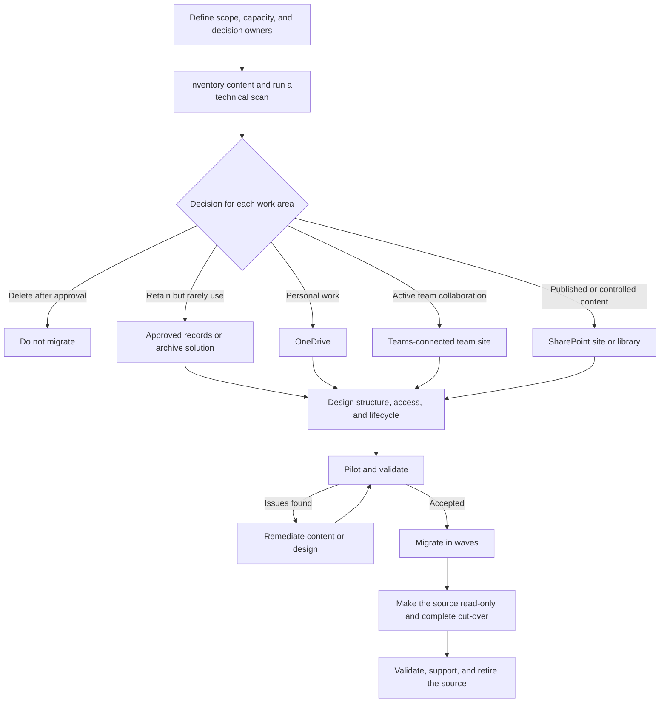
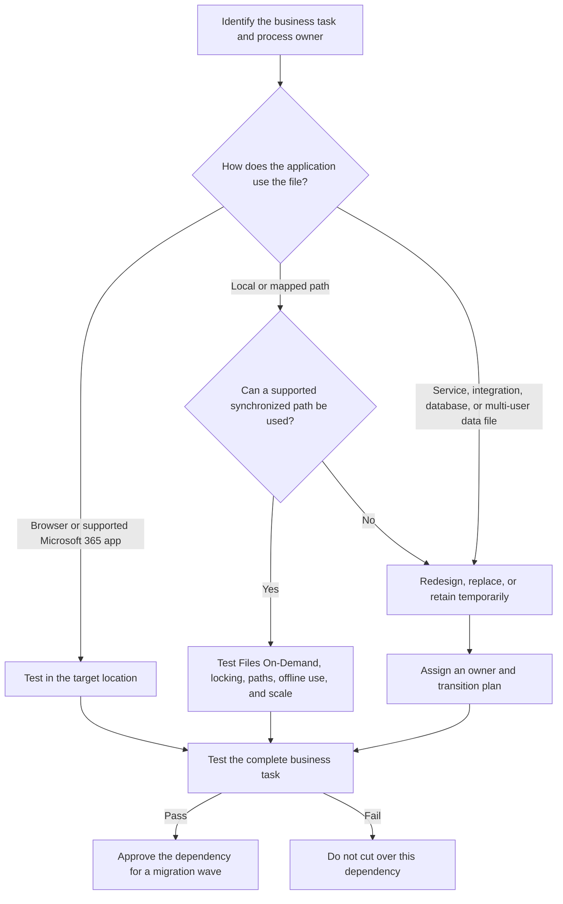

# From File Server To SharePoint: Copy Or Reorganize?

Reorganize before you migrate. A file server is usually arranged around drives, folders, and inherited permissions. SharePoint works best when its structure reflects purpose, ownership, collaboration, access, and information lifecycle.

A migration is therefore an information and adoption project supported by technology, not just a copy job.

## Recommended Approach

Do not migrate everything first and decide how to organize it afterward. Work in manageable areas, such as a department, process, or project. For each area, decide what to keep, who owns it, where it belongs, and how people will work after the move.

> Do not automatically move existing disorder to a new platform.

## Migration Flow

```mermaid
flowchart TD
    Scope[Define scope, capacity, and decision owners] --> Assess[Inventory content and run a technical scan]
    Assess --> Decide{Decision for each work area}
    Decide -->|Delete after approval| Delete[Do not migrate]
    Decide -->|Retain but rarely use| Archive[Approved records or archive solution]
    Decide -->|Personal work| OneDrive[OneDrive]
    Decide -->|Active team collaboration| Team[Teams-connected team site]
    Decide -->|Published or controlled content| SharePoint[SharePoint site or library]

    Archive --> Design[Design structure, access, and lifecycle]
    OneDrive --> Design
    Team --> Design
    SharePoint --> Design
    Design --> Pilot[Pilot and validate]
    Pilot -->|Issues found| Fix[Remediate content or design]
    Fix --> Pilot
    Pilot -->|Accepted| Waves[Migrate in waves]
    Waves --> Cutover[Make the source read-only and complete cut-over]
    Cutover --> Review[Validate, support, and retire the source]
```

## Reserve Time And Capacity

A schedule based only on file count and transfer speed is incomplete. The technical copy is only one part of the work. Reserve named people and working time for:

- inventory and content decision workshops;
- owners to review, reorganize, and approve their information;
- target structure, access, retention, and security design;
- remediation of files, links, identities, and application dependencies;
- pilot testing, feedback, and design changes;
- communication, task-based training, and instructions for each audience;
- cut-over validation, user support, and post-migration improvements.

These are planned project activities, not tasks for owners and Key Users to fit around their regular work. Agree on decision deadlines and escalation routes, and give each migration wave contingency for findings from the previous wave. Use the pilot to estimate the review and support effort; the number of files alone does not predict that effort.

If the people who understand the content have no scheduled capacity, the migration will wait for decisions even when the technology is ready.

## 1. Define Scope And Decision Rights

Start with the people who can make content decisions. A migration team cannot determine by itself whether an old contract may be deleted or whether a project folder should become a separate site.

For each migration area, assign:

- a **business owner** who decides what is needed and who should have access;
- a **migration lead** who plans scans, test runs, waves, and issue handling;
- an **IT or Microsoft 365 owner** who prepares destinations, identities, security, and support;
- a **records, legal, or security contact** when retention, confidentiality, or regulatory requirements apply.

Record the decision, approver, and date for deletion, archiving, destination, and exceptional access. This prevents technical staff from becoming the accidental owner of business information.

## 2. Inventory And Assess The Source

Use two complementary assessments. The business inventory explains what the content means; the technical scan shows what might fail or require remediation.

| Business inventory | Technical inventory |
| --- | --- |
| Owner and users | File and folder count |
| Purpose and document types | Total size and large files |
| Active, historical, or obsolete | Last modified date |
| Confidentiality and retention need | Path length, names, and file types |
| Required access | Existing source permissions |
| Business applications and processes | Links, macros, and other dependencies |

Treat existing permissions as evidence, not as the target design. Years of exceptions and individual access entries can hide the intended audience. Ask the owner to confirm who needs read, edit, or owner access in the new location.

[Microsoft Migration Manager can scan and assess file shares](https://learn.microsoft.com/en-us/sharepointmigration/mm-fileshare-scan-assess) and produce summary reports and detailed logs before migration. Use those results to find technical blockers, but do not expect a scan to decide ownership, value, or retention for you.

### Map Work Process Dependencies

A file inventory does not show how a business process uses a file. Applications outside the Microsoft Office family often expect a local or mapped path, a specific folder name, exclusive file locking, or a service account. A sync client can provide a local path in some cases, but it does not make every file-based application cloud compatible.

Trace each critical process from task to application, file, identity, and path. Test the complete task rather than only checking whether the migrated file opens.

```mermaid
flowchart TD
    Process[Identify the business task and process owner] --> Use{How does the application use the file?}
    Use -->|Browser or supported Microsoft 365 app| Cloud[Test in the target location]
    Use -->|Local or mapped path| Local{Can a supported synchronized path be used?}
    Use -->|Service, integration, database, or multi-user data file| Redesign[Redesign, replace, or retain temporarily]
    Local -->|Yes| Sync[Test Files On-Demand, locking, paths, offline use, and scale]
    Local -->|No| Redesign
    Cloud --> Task[Test the complete business task]
    Sync --> Task
    Redesign --> Plan[Assign an owner and transition plan]
    Plan --> Task
    Task -->|Pass| Approve[Approve the dependency for a migration wave]
    Task -->|Fail| Block[Do not cut over this dependency]
```

Complete this checklist before scheduling the affected migration wave:

- [ ] Name the process owner, users, criticality, and acceptable outage.
- [ ] Record every application, automation, macro, integration, service account, and scheduled task that reads or writes the files.
- [ ] Record mapped drives, fixed paths, shortcuts, input folders, output folders, and embedded links.
- [ ] Test concurrent use, file locking, offline use, Files On-Demand, and the target path with the real application.
- [ ] Choose and approve one outcome: use the browser, use a supported synchronized path, change the application, replace the process, or keep the dependency on managed storage temporarily.
- [ ] Define monitoring, support, rollback, and a date for removing any temporary exception.

## 3. Choose The Destination

Choose a destination for each coherent work area, not for the entire drive at once.

| Information pattern | Recommended destination |
| --- | --- |
| Work files owned by one person and not yet part of a team process | OneDrive |
| Documents that a defined group actively creates and maintains | A Teams-connected SharePoint team site |
| Published reference information for a broad audience | A SharePoint communication site |
| Formal documents with a defined process, owner, and access model | A governed SharePoint site or document library |
| Information that must be retained but is rarely used | An approved records or archive solution based on retention and access requirements |
| Obsolete, duplicate, or ownerless content with approved disposal | Do not migrate it |

OneDrive, Teams, and SharePoint are not interchangeable folders. The destination determines ownership, lifecycle, access, and how people find and use the content. See [Where Should This File Live?](../decisions/where-should-this-file-live.md) for the underlying choice.

Use a governed communication site or nongroup-connected SharePoint site when the organization must centrally manage publication, membership, or access. Use a group-connected team site when a defined group should collaborate and its owners can be accountable for membership. SharePoint does not keep ownership central by itself; the site type, groups, owners, and sharing settings create that operating model. Follow [Govern Sharing In SharePoint](./govern-sharing-in-sharepoint.md) before selecting the final destination.

:::warning[Archive Is A Lifecycle Decision]

Do not call content an archive merely because nobody uses it. Confirm its owner, required retention period, access needs, legal holds, and approved disposal process. Configure [Microsoft Purview retention for SharePoint and OneDrive](https://learn.microsoft.com/en-us/purview/retention-policies-sharepoint) where policy or regulation requires it.

Use [Which Microsoft Purview Solution Should You Use?](../decisions/which-purview-solution-should-you-use.md) when migration decisions also require sensitivity labels, DLP, records, evidence, or investigation controls.

:::

## 4. Design The New Structure And Access

Do not automatically turn every top-level folder into a site. Create a site when content shares a clear purpose, owner, audience, and lifecycle. Use a separate site when the security boundary or ownership is materially different.

Use [Site, Library, Or Folder: Where Should You Organize Documents?](../decisions/site-library-or-folder.md) to work through this design before creating migration destinations.

Within a site:

- use document libraries for distinct content sets or management rules;
- keep folders understandable and reasonably shallow;
- add metadata when people need to filter, group, search, or manage documents across folders;
- prefer groups and inherited permissions over individual access and many exceptions;
- define at least two suitable owners for important workspaces;
- agree on naming, navigation, versioning, sharing, retention, and review before migration.

:::warning[Do Not Transfer Access Governance By Accident]

File-server access is often based on groups maintained by IT or identity management. A group-connected SharePoint team site or Team can let workspace owners manage membership. If that membership does not follow an authoritative joiner, mover, and leaver process, a role change can leave someone without required access or with access that should have ended.

For every destination, record whether membership is centrally managed, owner-managed, or hybrid. Name the business owner, at least two workspace owners, the identity source, the approver, the exception route, and the review date. Use [Permissions And Ownership](./permissions-and-ownership.md) for the responsibility model.

Team membership is not the only access path. Direct file or folder sharing can create unique SharePoint permissions, and private or shared Teams channels use separate SharePoint sites. Review members, guests, sharing links, direct access, and channel sites as separate evidence. Use [Govern Sharing In SharePoint](./govern-sharing-in-sharepoint.md) and [Teams and SharePoint integration](https://learn.microsoft.com/en-us/sharepoint/teams-connected-sites) for the applicable controls.

Microsoft 365 Copilot respects existing permissions, but it can make accessible information easier to find and reuse. Before a broad rollout, remediate oversharing, ownerless content, and obsolete access. Use Purview to discover, classify, and protect sensitive information, but do not treat labels as a replacement for access remediation. A site or group label does not automatically label the files inside it. See Microsoft's [secure and governed data foundation for Copilot](https://learn.microsoft.com/en-us/microsoft-365/copilot/secure-govern-copilot-foundational-deployment-guidance) and [sensitivity labels for groups and sites](https://learn.microsoft.com/en-us/purview/sensitivity-labels-teams-groups-sites).

:::

The objective is not to remove every folder. It is to make the structure explainable to a new employee without relying on knowledge of the old drive.

## 5. Control Synchronization And Local Data Risk

Oversharing is usually a loss of confidentiality rather than loss of the file itself. Synchronization introduces a different risk: OneDrive synchronizes additions, changes, and deletions between the device and the cloud. An accidental deletion, destructive application, or compromised device can therefore affect the shared cloud copy and other synchronized devices. Treat synchronization as an access method, not as a backup.

| Risk | What can happen | Required design response |
| --- | --- | --- |
| Oversharing | Broad membership, direct permissions, or links expose information to unintended people | Remediate access and follow [Govern Sharing In SharePoint](./govern-sharing-in-sharepoint.md) |
| Local exposure | Locally available or always-available files can be read through an unlocked or compromised user session | Require managed device controls, disk encryption, screen locking, incident response, and appropriate download restrictions |
| Propagated deletion or damage | A synchronized deletion or modification can reach SharePoint and other devices | Configure versioning and recovery, retain appropriate recycle-bin or restore options, and test the recovery procedure |
| Excessive synchronization | Large libraries, too many synchronized items, or widespread offline copies can affect storage, network use, and sync reliability | Synchronize only what the work pattern requires, use Files On-Demand, and test against the current OneDrive and SharePoint limits |
| Incompatible process | An application expects a mapped drive, fixed path, locking behavior, or local data file | Resolve the dependency before cut-over or keep an explicitly managed temporary exception |

Files On-Demand can keep file contents online until needed, but a user can make files always available and some applications can automatically download online-only files. It is therefore a storage and synchronization control, not a security boundary.

SharePoint permissions also do not by themselves protect every downloaded copy. Start with managed and compliant devices, device encryption, strong sign-in and locking, and controls for unmanaged devices. Add Purview sensitivity labels with encryption, protection that extends SharePoint permissions to downloaded files, and Endpoint DLP when the information risk and licensing justify them. A label used only for classification does not prevent someone who can use the authorized, unlocked session from reading the file.

Before enabling synchronization for a site or library:

- [ ] Approve which roles need synchronization and which libraries they need.
- [ ] Keep Files On-Demand as the normal pattern and document justified offline exceptions.
- [ ] Check item counts, path lengths, available storage, bandwidth, and the current synchronization limits.
- [ ] Confirm the device-management, encryption, lock, remote-action, and unmanaged-device requirements.
- [ ] Decide whether sensitive files need encryption, extended protection on download, Endpoint DLP, or a no-download pattern.
- [ ] Test deletion, version restore, recycle-bin recovery, and the incident escalation route.
- [ ] Include removal of synchronized data and access in the leaver, lost-device, and device-replacement processes.

## 6. Clean Up And Remediate

Have the business owner approve whether content should be migrated, archived, or deleted. Investigate content that:

- is duplicated, obsolete, or has no owner;
- has not been used within the agreed review period;
- cannot be opened or is password protected;
- depends on mapped drives, fixed paths, shortcuts, macros, or applications;
- has names, types, sizes, or paths reported as migration issues;
- has permissions that cannot be mapped to active Microsoft 365 identities.

Do not use last modified date as the only deletion rule. Some records are rarely opened but must still be retained. Conversely, a recently modified duplicate is not necessarily valuable.

## 7. Pilot With A Representative Group

Choose a pilot that contains realistic complexity: folders, Office files, special permissions, links, larger files, and users with different working patterns. A technically easy folder proves very little.

Validate at least:

- [ ] File counts, migration reports, failures, and exclusions have been reviewed.
- [ ] Names, paths, and representative documents work in the intended target experience.
- [ ] Owners, members, visitors, and approved exceptions have the expected access.
- [ ] Former members, role changers, expired guests, direct permissions, and old sharing links are denied as expected in the applicable negative access tests.
- [ ] Word, PowerPoint, and Excel behavior, including external links and macros, has been tested.
- [ ] Critical non-Office applications and complete business tasks pass their dependency tests.
- [ ] OneDrive synchronization is enabled only where it is part of the intended pattern; Files On-Demand, offline use, item volume, deletion, and recovery have been tested.
- [ ] Managed- and unmanaged-device behavior and applicable Purview protection have been tested with representative sensitive files.
- [ ] Search, metadata, views, navigation, sharing, and approval processes work as designed.
- [ ] User instructions, support readiness, rollback criteria, and owner acceptance are complete.

[Microsoft's file share migration guidance](https://learn.microsoft.com/en-us/sharepointmigration/fileshare-to-odsp-migration-guide) recommends an incremental pilot followed by a cut-over. Use the pilot findings to update the destination design, remediation rules, communications, and wave plan before scaling up.

## 8. Migrate In Waves And Cut Over

Migrate by work area so that each wave has an accountable owner and a known audience. A typical wave has these checkpoints:

1. The owner approves the content list, destination, and access model.
2. IT resolves scan findings and prepares the destination.
3. The migration team performs an initial or incremental copy.
4. Users validate the destination before the agreed deadline.
5. The source becomes read-only, the final changes are migrated, and users switch to Microsoft 365.
6. The team validates reports, permissions, critical files, and business processes.
7. Support records unresolved issues and confirms when the source can be retired.

Publish the cut-over time, write-freeze rules, new location, support route, and rollback criteria in advance. Avoid leaving both locations writable for an extended period; duplicate working copies make it unclear which version is authoritative.

## Definition Of Done

A wave is complete when:

- [ ] The business owner has accepted the content, structure, access, and working pattern.
- [ ] Migration reports have been reviewed and exceptions have owners and end dates.
- [ ] Users know where to find and save documents, when to synchronize, and how to share them.
- [ ] Critical links, applications, and processes have been tested or deliberately replaced.
- [ ] Retention, recovery, device protection, review, and workspace ownership are documented.
- [ ] The membership source, sharing model, access-review owner, and exception route are documented.
- [ ] The old location is read-only or retired according to the plan.
- [ ] A post-migration review date is scheduled.

Measure success by findability, correct access, owner acceptance, process continuity, and reduced use of the file server—not only by the number of copied files.

:::warning[Common Migration Mistakes]

- Copying everything one-to-one.
- Creating a site for every top-level folder.
- Reviewing permissions only after migration.
- Assuming that SharePoint keeps access centrally managed without configuring ownership, membership, and sharing.
- Leaving old and new storage writable for too long.
- Missing Excel links, macros, shortcuts, and application dependencies.
- Treating adoption as an afterthought, so users lack a clear new working pattern and fall back to the file server or local copies.
- Making only the technical migration partner accountable.
- Treating copied item count as the definition of success.

:::

## Official Microsoft Documentation

- [Overview of Migration Manager for file shares](https://learn.microsoft.com/en-us/sharepointmigration/mm-get-started)
- [Scan and assess file shares with Migration Manager](https://learn.microsoft.com/en-us/sharepointmigration/mm-fileshare-scan-assess)
- [Microsoft's file share migration planning guide](https://learn.microsoft.com/en-us/sharepointmigration/fileshare-to-odsp-migration-guide)
- [Information architecture in modern SharePoint](https://learn.microsoft.com/en-us/sharepoint/information-architecture-modern-experience)
- [Retention for SharePoint and OneDrive](https://learn.microsoft.com/en-us/purview/retention-policies-sharepoint)
- [SharePoint service limits](https://learn.microsoft.com/en-us/office365/servicedescriptions/sharepoint-online-service-description/sharepoint-online-limits)
- [Teams and SharePoint integration](https://learn.microsoft.com/en-us/sharepoint/teams-connected-sites)
- [Secure and govern Microsoft 365 Copilot](https://learn.microsoft.com/en-us/microsoft-365/copilot/secure-govern-copilot-foundational-deployment-guidance)
- [Use sensitivity labels for groups and sites](https://learn.microsoft.com/en-us/purview/sensitivity-labels-teams-groups-sites)
- [Sync files between a computer and OneDrive](https://support.microsoft.com/en-us/onedrive/sync-your-computer-s-files-and-folders-with-onedrive)
- [Restrictions and limitations in OneDrive and SharePoint](https://support.microsoft.com/en-us/onedrive/restrictions-and-limitations-in-onedrive-and-sharepoint)
- [Control SharePoint and OneDrive access from unmanaged devices](https://learn.microsoft.com/en-us/sharepoint/control-access-from-unmanaged-devices)
- [Extend SharePoint permissions to downloaded documents](https://learn.microsoft.com/en-us/purview/sensitivity-labels-sharepoint-extend-permissions)
- [Learn about Endpoint Data Loss Prevention](https://learn.microsoft.com/en-us/purview/endpoint-dlp-learn-about)
- [Safeguarding data in SharePoint and OneDrive](https://learn.microsoft.com/en-us/sharepoint/safeguarding-your-data)

## Related Guides

- [Where Should This File Live?](../decisions/where-should-this-file-live.md)
- [Site, Library, Or Folder: Where Should You Organize Documents?](../decisions/site-library-or-folder.md)
- [Which Microsoft Purview Solution Should You Use?](../decisions/which-purview-solution-should-you-use.md)
- [Microsoft Purview](../services/purview.md)
- [SharePoint Content: Sites, Libraries, Lists, And Permissions](../services/sharepoint/sharepoint-content-structure.md)
- [Permissions And Ownership](./permissions-and-ownership.md)
- [Govern Sharing In SharePoint](./govern-sharing-in-sharepoint.md)
- [Collaborate On Documents](../scenarios/collaborate-on-documents.md)
