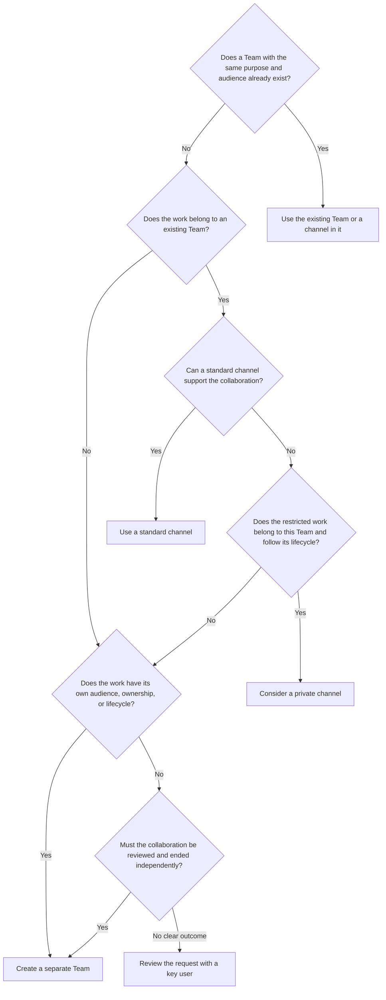

# Microsoft Teams Governance: Prevent Sprawl

## Why It Matters

Without governance, every new question, activity, or working group can result in a separate Team. Over time, several Teams can have almost the same name, overlapping members, and duplicate files.

Users then do not know:

- which Team is authoritative;
- where the current version of a file is stored;
- who is responsible for membership;
- which workspace is still active;
- when a Team can be archived or deleted.

Sprawl is not only a technical management problem. It makes daily collaboration harder and increases the chance that people work in the wrong Team or file.

Teams governance must not delay collaboration unnecessarily. Its purpose is to give each Team a clear goal, recognizable name, suitable structure, accountable owners, and agreed lifecycle.

:::info[An Intentional Organization Choice]

Microsoft allows users to create Microsoft 365 groups by default and describes this as the recommended starting point for fast collaboration.

Restricting group creation is an M365Wizard recommendation for organizations that have demonstrable sprawl, unclear ownership, or duplicate information sources. Always combine the restriction with a simple and fast request route.

:::

## Recommendation

Give every Team a clear purpose, recognizable name, suitable owners, access decision, and review date. Create Teams for recognizable collaborations, such as departments and projects. Use standard channels for topics and workstreams within a Team.

Create a separate Team when the audience, ownership, or lifecycle is materially different. Use private channels sparingly. Prefer a new Team over a shared channel when the collaboration needs an independent lifecycle.

Use a durable naming convention at organization or company level. Keep the complete Team name short enough for files that users synchronize with OneDrive. Do not include changeable attributes such as department or job title in the technically enforced name.

Keep Team creation available when the organization can manage it without material sprawl. Restrict creation only when there is a demonstrated need, and then provide a fast request route through key users or another delegated role.

Ask Team owners to periodically confirm ownership, membership, and whether the Team is still needed. Where collaboration volume, risk, and licensing justify it, add native Microsoft controls for naming, ownerless groups, access reviews, and group expiration. Use Microsoft Entra ID, the Microsoft 365 admin center, and the Teams admin center for ownership, access, and lifecycle management.

## Apply Governance Proportionately

The same governance principles apply to every organization, but not every tenant needs the same controls. Select measures based on collaboration volume, staff and student turnover, external access, information sensitivity, regulatory requirements, and available management capacity. Tenant size alone is not sufficient: a small regulated organization can need tighter controls than a larger organization with stable membership and little external collaboration.

| Context | Proportionate Approach |
| --- | --- |
| Small business | Keep creation open while it remains manageable. Use a simple naming agreement, suitable owners, an owner-led periodic review, and an archive-first cleanup process. Add restrictions only when sprawl or risk is demonstrated. |
| Medium-sized organization | Use delegated creation through key users when needed. Add native reporting and, when justified and licensed, policies for ownerless groups and expiration. |
| Large organization | Set central guardrails and delegate execution by business unit, location, or service. Distinguish Team types and add automated follow-up, access reviews, and classification based on risk. |
| School | Manage class Teams through the education data process and academic-year lifecycle. Apply the regular department and project guidance to staff, subject, management, and project Teams. |
| Multi-school organization | When schools share one tenant, set tenant-wide guardrails and manage School Data Sync centrally. Delegate standard requests and ownership to each school, and manage cross-school Teams as separate collaborations. |

For every organization, the minimum is a clear purpose, a recognizable and sufficiently short name, suitable owners, a decision about external access, and an agreed review or end date. Prefer two owners. When a very small organization cannot appoint two suitable owners, include the Team explicitly in administrator offboarding and ownership checks.

Add technical enforcement only when it solves a real volume, delegation, or risk problem. A manual owner confirmation supported by native reports is a valid baseline. Microsoft Entra access reviews, sensitivity labels, ownerless-groups policy, and expiration policy are optional controls that require suitable licenses, configuration, and operational ownership.

## When Should You Create A New Team?

Create a Team for a recognizable collaboration with its own purpose, audience, ownership, or lifecycle.

A department is usually a durable collaboration. A project normally has a clear goal and an expected end. Topics within a department or project usually belong in standard channels of the existing Team.

| Situation | Recommended Choice |
| --- | --- |
| A department collaborates continuously | Create a Team for the department |
| A project has its own project group or end date | Create a Team for the project |
| A topic belongs to an existing department | Use a standard channel |
| A workstream belongs to an existing project | Use a standard channel |
| A subset of members handles restricted information that belongs to the Team | Consider a private channel |
| The audience or ownership is structurally different | Create a separate Team |
| The collaboration has its own lifecycle | Create a separate Team |
| The collaboration must be reviewed or ended independently | Create a separate Team |

For example, do not create separate Teams for *Budget*, *Planning*, and *Communication* within the same project. Create a separate Team for each project and use channels within that Team for the project's workstreams.

### Match The Channel Structure To The Work

Do not impose one fixed channel structure on departments and projects. Each Team supports different work and needs a suitable structure.

A Team with two members works differently from a Team with two hundred members. However, the number of members does not determine how many channels are needed. A small project can have many separate subjects, while a large project can work with only a few channels. A department also has a different purpose and rhythm from a temporary project.

Let Team owners determine the channel structure based on:

- the work and recurring workstreams;
- subjects that remain relevant for a longer period;
- how members search for information;
- responsibilities within the Team;
- meaningful access differences;
- the expected lifetime of the work.

Start with the channels that are demonstrably needed. Add a channel when a subject or workstream is sufficiently independent and durable.

Do not create a channel for a one-time question, short activity, or subject with almost no separate collaboration. Use a post, conversation, or folder within an existing channel.

### Use Private Channels Sparingly

A private channel has different membership within its parent Team and therefore needs additional management. Use it when some Team members demonstrably must not have access and the restricted work still belongs to the purpose and lifecycle of the parent Team.

This need can be temporary or long-term. For example, restricted operational or management information for department leaders can fit in a private channel when that information belongs to the department Team. If the information is owned and used by a management team across departments, store it in the management Team instead. The fact that a team leader belongs to both Teams does not determine where the information belongs.

When the restricted collaboration needs an independently managed audience, owners, or lifecycle, create a separate Team. This makes access, accountability, and retirement easier to understand.

### Prefer A New Team When The Lifecycle Must Be Independent

A shared channel has no Microsoft 365 group of its own and cannot independently use the Microsoft 365 group expiration policy. Its lifecycle remains connected to its parent Team.

Prefer a new Team when the collaboration:

- has its own start and end date;
- needs different owners;
- needs a separate access review;
- includes external participants;
- has its own information or retention requirements;
- must be archived or deleted independently.

Use a shared channel for a bounded collaboration that belongs to the parent Team and follows the same general lifecycle.

Microsoft Teams creates a separate connected SharePoint site for each private or shared channel. This makes file, access, retention, and lifecycle management more complex. Review the Microsoft documentation for [shared channels](https://learn.microsoft.com/en-us/microsoftteams/shared-channels), [private channels](https://learn.microsoft.com/en-us/microsoftteams/private-channels), and [Teams-connected SharePoint sites](https://learn.microsoft.com/en-us/sharepoint/teams-connected-sites).

## Limit Team Creation

A Team uses a Microsoft 365 group for membership and ownership. By default, users can create Microsoft 365 groups themselves.

When sprawl is a real problem, IT can limit Microsoft 365 group creation to the members of one designated group. Microsoft supports nesting other groups in this designated group. This makes it possible to appoint delegated creators for each business unit, location, or school, for example.

Key users provide a recognizable contact point for users who need a Team. They can check whether a suitable Team already exists and advise on the right structure.

Consider the consequences: the restriction is not limited to Microsoft Teams. It also affects other services that use Microsoft 365 groups, including Outlook, SharePoint, Planner, and Viva Engage. Check which processes will change before enabling the restriction.

Microsoft Entra ID P1, P2, or Basic EDU licensing requirements apply to configuring the restriction and to the users who are allowed to create groups. See [Manage who can create Microsoft 365 Groups](https://learn.microsoft.com/en-us/previous-versions/microsoft-365/solutions/manage-creation-of-groups).

:::warning[Do Not Turn The Request Route Into A Blocker]

If users wait too long for a Team, they will find other ways to collaborate and share files. Process a standard request within an agreed, short period.

:::

## Design The Request Process

Ask only for information that is needed to make a good decision:

- the purpose of the Team;
- the department, project, or collaboration;
- the proposed business owner and Team owners, preferably at least two;
- the intended participants;
- the expected end or review date;
- the need for guests or other external participants;
- the sensitivity of the information;
- the reason an existing Team or channel is not sufficient.

Use this decision order:

Create a new Team when the work is an independent collaboration. Use a standard channel when the subject fits the existing purpose, audience, and lifecycle of a Team. Consider a private channel when restricted work belongs to the parent Team and follows its lifecycle. Ask a key user to review requests without a clear outcome.

### Separate Class Teams From Other School Teams

At a school or multi-school organization, do not put class Teams and organizational Teams through the same lifecycle process.

- **Class Teams:** use the student information system and [School Data Sync](https://learn.microsoft.com/en-us/schooldatasync/) to provision and maintain classes when available. Align creation, membership, archiving, and cleanup with the academic year.
- **Staff, subject, department, management, and project Teams:** use the decision flow in this guide. These Teams usually follow an organizational or project lifecycle instead of a class roster.
- **Cross-school Teams:** create a separate Team when the collaboration has a school-independent audience, ownership, or lifecycle. Do not place it under one participating school's Team only because a school leader is a member of both.

Use an explicit [academic-year transition](https://learn.microsoft.com/en-us/microsoft-365/education/tutorial-academic-year-transition/) for class Teams. Central IT or the education data owner manages tenant policy and School Data Sync. Local key users and Team owners support requests, access, and lifecycle decisions within each school.

### Delegate Through Key Users Where Needed

When one tenant serves several business units, locations, or schools, appoint a few key users for each appropriate organizational unit. They can:

- check whether the Team already exists;
- help decide whether a new Team or channel is needed;
- record the correct owners;
- apply the naming agreements;
- explain channels and file storage;
- send nonstandard requests to IT.

Keep this role limited to a manageable number of people and arrange cover for absences. Periodically review who is still allowed to create Teams.

Small organizations do not need to add a key-user layer when users can contact a Team owner or administrator directly. The request route must match the organization without creating unnecessary handoffs.

Central IT remains responsible for tenant policy, technical configuration, licensing, reporting, and exceptions.

## Use Durable Naming And Minimum Setup Principles

A name must help users recognize a Team, but must not depend too heavily on information that changes regularly.

### Keep The Enforced Name At A High Level

Microsoft Entra ID supports the attributes `[Department]`, `[Company]`, `[Office]`, `[StateOrProvince]`, `[CountryOrRegion]`, and `[Title]` in a naming policy for Microsoft 365 groups and Teams.

An enforced Microsoft Entra naming policy is a licensed control. When technical enforcement is not justified or licensed, use the same naming principles as a documented agreement and apply them during creation. See [Enforce a naming policy on Microsoft 365 groups](https://learn.microsoft.com/en-us/entra/identity/users/groups-naming-policy).

Technical support for an attribute does not make it suitable for durable naming.

Prefer a stable organization- or company-level identifier. Use a fixed organization code or, when identity data is managed reliably, the `[Company]` attribute.

Do not use `[Title]`. A job title is personal, changes when a role changes, and says little about the purpose or ownership of a Team.

Do not use `[Department]` as a technically enforced part of the Team name. A cross-department project can move to another department during its lifetime. The name would then incorrectly suggest that the Team still belongs to the original department.

The same risk applies to other changeable attributes, such as `[Office]`, when people or work move between locations.

:::warning[Naming Depends On Identity Management]

A naming policy uses attributes of the person who creates the Microsoft 365 group. When a key user creates a Team for another department, location, or company, the attribute can describe the key user instead of the Team.

Use dynamic attributes only when the source data is complete, reliable, and suitable for the request process. Align the naming policy with the people responsible for identity management.

:::

### Separate Technical Naming From Functional Naming

Use two layers:

- **Technical naming policy:** a stable organization or company identifier that Microsoft Entra ID enforces.
- **Functional naming agreement:** a clear name for the purpose of the Team, applied during the request process.

Examples:

| Type | Example |
| --- | --- |
| Department | `CONTOSO-Finance` |
| Project | `CONTOSO-ERP-Modernization` |
| Cross-department project | `CONTOSO-Digital-Workplace` |
| Project with a stable project code | `CONTOSO-PRJ-1042-Intranet` |

Use a stable project code when the organization already manages one. Do not include a department when the project can later move to another department.

### Keep Team Names And File Paths Short

Set a local maximum for the complete Team name, including enforced prefixes and suffixes. As a practical starting point, M365Wizard recommends no more than 50 characters. This is an organizational target, not a Microsoft service limit, and it does not guarantee that every file path will work.

The Team name contributes to the connected SharePoint site and synchronized-library path. OneDrive and SharePoint allow a decoded cloud file path of up to 400 characters, but Windows File Explorer and Office desktop apps commonly encounter a 260-character path limit. The local OneDrive root, organization name, site or library name, folders, and file name all consume space in the path.

Long Team names therefore leave less space for clear folder and file names. Keep folder structures shallow and test the full path with the OneDrive sync app and the Office desktop applications that the organization supports. See [file path length limits](https://support.microsoft.com/en-us/onedrive/what-are-file-path-length-limits) and the [SharePoint service limits](https://learn.microsoft.com/en-us/office365/servicedescriptions/sharepoint-online-service-description/sharepoint-online-limits).

Do not solve the problem with opaque abbreviations. A short name must still be recognizable in Teams, Outlook, SharePoint, and File Explorer.

### Treat Renaming As A Managed Change

A Team can be renamed when its purpose changes. Check the description, owners, classification, connected information, and references during the change.

Changing the Team display name is not the same as changing the connected SharePoint site address, group email address, or every existing link and synchronization relationship. Treat an address change as a separate administrator action and assess its impact. See [Change a SharePoint site address](https://learn.microsoft.com/en-us/sharepoint/change-site-address).

### Standardize Governance, Not The Channel Layout

Do not use templates that create the same channels for every Team. Standardize only the minimum governance requirements:

- a clear purpose and description;
- a business owner and suitable Team owners, preferably at least two;
- suitable privacy and, when used, a sensitivity label;
- a review or end date;
- a decision about external access;
- a recognizable and sufficiently short name.

Let Team owners determine the channel structure. They understand the work and can adapt the structure as the Team develops.

## Maintain Ownership And Access

Appoint at least two suitable owners where possible. A Team with one owner is vulnerable because that person can leave, be absent for a long period, or change roles. When only one suitable owner is available, include the Team in administrator offboarding and ownership checks.

Team owners are responsible for:

- the purpose and description of the Team;
- adding and removing members;
- the channel structure;
- periodic access checks;
- appointing replacement owners;
- renewing, archiving, or ending the Team.

Where tenant scale, risk, and licensing justify it, configure the [ownerless Microsoft 365 groups and Teams policy](https://learn.microsoft.com/en-us/microsoft-365/admin/create-groups/ownerless-groups-teams?view=o365-worldwide). This policy can ask active group members to become an owner when a Team no longer has one. Otherwise, use native administrator reports and offboarding checks to identify Teams that need a replacement owner.

The ownerless-groups policy is a safety net. If nobody accepts the invitation, the policy does not assign an owner automatically. An administrator must still review the Team.

Include ownership in the offboarding process. Assign a replacement owner for every affected Team before deleting an owner's account.

### Review Members, Guests, And Direct Sharing

Ask owners to periodically confirm:

- whether all members still need access;
- whether guests are still part of the collaboration;
- whether private and shared channels are still needed;
- whether privacy and classification are still suitable;
- whether direct file or folder sharing and sharing links are still justified;
- whether channel owners, apps, tabs, connectors, and automations still have an accountable owner;
- whether exceptions are still justified.

Do not review only the Team membership. Direct SharePoint permissions can remain after a person is removed from a Team or shared channel. Owner confirmation is the baseline. Where risk, scale, and licensing justify automation, Microsoft Entra ID access reviews can support the membership review. See [access reviews](https://learn.microsoft.com/en-us/entra/id-governance/access-reviews-overview), [Plan for governance in Teams](https://learn.microsoft.com/en-us/microsoftteams/plan-teams-governance), and use [External Sharing](./external-sharing.md) for more detailed guidance about guests and other external access.

Use [Permissions And Ownership](./permissions-and-ownership.md) to separate workspace ownership from technical access. When classification, protection, retention, or records requirements apply, use [Which Microsoft Purview Solution Should You Use?](../decisions/which-purview-solution-should-you-use.md).

## Review And Retire Teams

Record when a Team must be reviewed when it is created. For a project, this can be the planned end date. For a department, it can be an annual review.

During the review, check:

- whether the original purpose still exists;
- whether the owners are still suitable;
- whether members and guests still need access;
- whether the channel structure is still understandable;
- whether the Team is actively used;
- whether information or connected work must be transferred;
- whether the Team must be kept, archived, or deleted.

A [Microsoft 365 group expiration policy](https://learn.microsoft.com/en-us/entra/identity/users/groups-lifecycle) can expire inactive groups. Activity in supported Microsoft 365 services can automatically renew a group. If this does not happen, owners receive reminders.

Microsoft Entra ID supports one Microsoft 365 group expiration policy per organization. The policy can apply to all groups or selected groups. Select its scope carefully when departments, projects, class Teams, and long-term collaborations have different lifecycles. Licensing requirements apply to members of groups covered by the policy. A manual review supported by native reports can be more proportionate for a smaller tenant.

A group that is not renewed is deleted. Microsoft provides a 30-day recovery period after deletion.

Do not use the expiration policy as the only control. A Team can be technically active even when its original purpose no longer exists. The owner must still perform a substantive review.

### Distinguish Archive, Delete, And Retain

- **Archive:** active Team collaboration stops, but members can still view the Team. An administrator or owner can reactivate it. SharePoint content becomes read-only for members only when that option is selected; owners can still edit it.
- **Delete:** the Microsoft 365 group and connected services are deleted, with a limited recovery period.
- **Retain:** compliance policy can preserve supported information even when users can no longer open the Team.

:::warning[Archive Does Not Stop Expiration]

An archived Team remains subject to the Microsoft 365 group expiration policy. Exclude or renew it when the organization intentionally needs the archived Team for longer than the expiration period.

:::

Archive first and use an agreed cooling-off period before deletion. This gives owners and users time to identify missed dependencies without treating the archive as permanent storage.

Before deletion, decide:

- where authoritative files will be managed;
- which links, tabs, notebooks, plans, forms, flows, connectors, or recurring meetings still depend on the Team;
- whether guests or partners must be informed;
- which information must be retained or declared as a record;
- who approves the final deletion.

An expiration policy does not replace retention policy, Records Management, or a legal hold. See [lifecycle management for Microsoft Teams](https://learn.microsoft.com/en-us/microsoftteams/plan-teams-lifecycle) and [archive or delete a Team](https://learn.microsoft.com/en-us/microsoftteams/archive-or-delete-a-team).

## Clean Up Existing Sprawl

New governance does not remove existing duplicate or abandoned Teams. Perform a one-time cleanup when introducing the governance process.

1. Inventory all Teams by using the Teams admin center and Microsoft Entra ID.
2. Identify Teams without an owner or with only one owner.
3. Find Teams with similar names, participants, or purposes.
4. Check activity, guests, private channels, shared channels, and direct sharing.
5. Let the business owner decide which Team is authoritative.
6. Decide where the current files and connected work must be managed.
7. Communicate when an old Team will be archived or deleted.
8. Archive first, then delete duplicate and abandoned Teams after the agreed check.
9. Record exceptions, dependencies, and incomplete migrations.

Do not delete a duplicate Team until the current files are known and links, apps, automations, or work processes that still refer to the old Team have been addressed.

Use a small set of indicators to keep the situation manageable:

- percentage of Teams with at least two owners;
- number of Teams without an owner;
- number of Teams past their review date;
- number of Teams without recent activity;
- number of unresolved external-access or lifecycle exceptions;
- average request processing time.

Metrics should trigger a review, not make the lifecycle decision automatically.

## Responsibilities

| Role | Responsibility |
| --- | --- |
| Requester | Describes the purpose, participants, and expected lifetime |
| Business owner | Decides whether the Team remains necessary and what happens to information when it ends |
| Key user | Checks existing Teams, advises on structure, and processes standard requests |
| Team owner | Manages members, channels, access, and daily structure |
| IT | Configures the applicable creation, naming, ownerless-groups, expiration, and reporting controls, and manages technical exceptions |
| Identity management | Manages the quality and meaning of attributes used in naming policies |
| Information or compliance owner | Defines additional protection, retention, and records requirements |

Define who can approve exceptions. Record the reason, owner, and review date for each exception.

## Official Microsoft Documentation

- [Manage who can create Microsoft 365 Groups](https://learn.microsoft.com/en-us/previous-versions/microsoft-365/solutions/manage-creation-of-groups?view=o365-worldwide)
- [Enforce a naming policy on Microsoft 365 groups](https://learn.microsoft.com/en-us/entra/identity/users/groups-naming-policy)
- [File path length limits for OneDrive and SharePoint](https://support.microsoft.com/en-us/onedrive/what-are-file-path-length-limits)
- [SharePoint service limits](https://learn.microsoft.com/en-us/office365/servicedescriptions/sharepoint-online-service-description/sharepoint-online-limits)
- [Manage ownerless Microsoft 365 groups and Teams](https://learn.microsoft.com/en-us/microsoft-365/admin/create-groups/ownerless-groups-teams?view=o365-worldwide)
- [Plan and manage access reviews](https://learn.microsoft.com/en-us/entra/id-governance/access-reviews-overview)
- [Configure a Microsoft 365 group expiration policy](https://learn.microsoft.com/en-us/entra/identity/users/groups-lifecycle)
- [School Data Sync](https://learn.microsoft.com/en-us/schooldatasync/)
- [Plan the academic-year transition](https://learn.microsoft.com/en-us/microsoft-365/education/tutorial-academic-year-transition/)
- [Plan for governance in Teams](https://learn.microsoft.com/en-us/microsoftteams/plan-teams-governance)
- [Plan lifecycle management for Microsoft Teams](https://learn.microsoft.com/en-us/microsoftteams/plan-teams-lifecycle)
- [Archive or delete a Team](https://learn.microsoft.com/en-us/microsoftteams/archive-or-delete-a-team)
- [Teams and SharePoint integration](https://learn.microsoft.com/en-us/sharepoint/teams-connected-sites)
- [Private channels in Microsoft Teams](https://learn.microsoft.com/en-us/microsoftteams/private-channels)
- [Shared channels in Microsoft Teams](https://learn.microsoft.com/en-us/microsoftteams/shared-channels)

## Related Guides

- [Teams](../services/teams.md)
- [Somtoday To Microsoft School Data Sync](../tools/apps/somtoday-to-school-data-sync.md)
- [Permissions And Ownership](./permissions-and-ownership.md)
- [External Sharing](./external-sharing.md)
- [Which Microsoft Purview Solution Should You Use?](../decisions/which-purview-solution-should-you-use.md)
- [Where Should This File Live?](../decisions/where-should-this-file-live.md)
- [Site, Library, Or Folder: Where Should You Organize Documents?](../decisions/site-library-or-folder.md)
