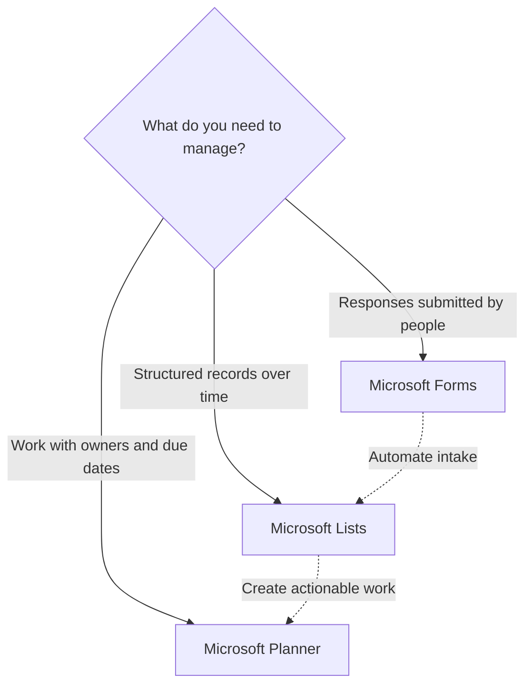

# Forms, Lists, Or Planner?

Forms, Lists, and Planner all collect information, but they answer different questions.

## Quick Answer

Use Forms to collect responses. Use Lists to track structured records. Use Planner to manage work that needs owners, due dates, and progress.

## Decision Flow

## Use Forms When

Use Microsoft Forms when people submit information and the submitter does not need to manage the item afterward.

Good fits include surveys, registrations, feedback, quizzes, simple intake, and quick polls.

## Use Lists When

Use Microsoft Lists when the organization needs to track a set of items over time.

Good fits include asset registers, issue logs, request trackers, content inventories, and structured operational data.

## Use Planner When

Use Planner when each item is work that someone must complete.

Good fits include team tasks, campaign checklists, lightweight project boards, onboarding plans, and recurring operational work.

## A Practical Pattern

Use Forms for intake, Lists for the record of what was submitted, and Planner for the work created from that submission. Do not force one tool to do all three jobs unless the process is very small.
