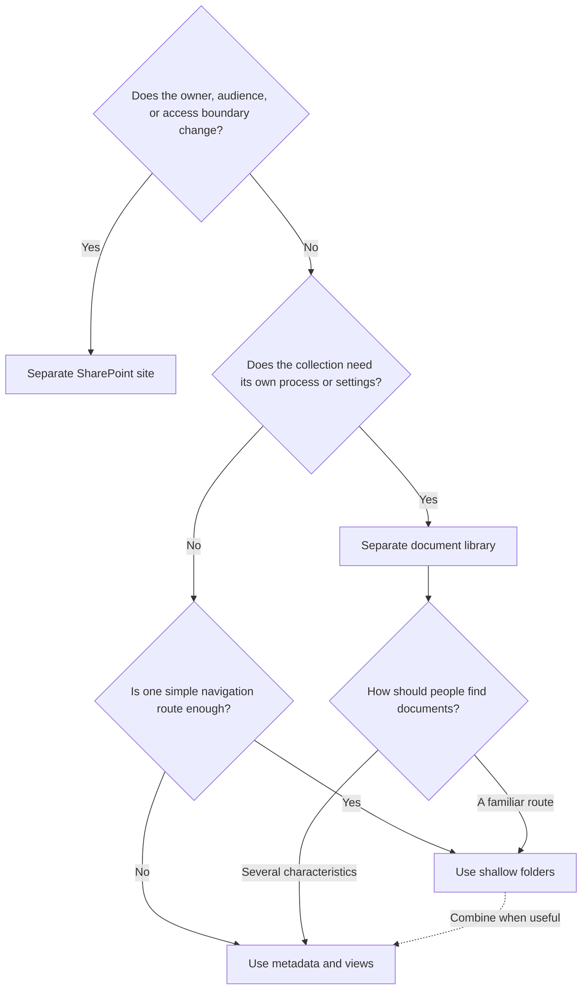

# Site, Library, Or Folder: Where Should You Organize Documents?

Choose the boundary before you choose the layout. Use a site when ownership or access changes, a library when the content management pattern changes, a folder for a familiar route, and metadata when people need more than one way to find the same documents.

## Quick Answer

Use:

- a **site** for a distinct group, responsibility, audience, or workspace lifecycle;
- a **library** for a recognizable set of documents with its own purpose, process, or library-wide settings;
- a **folder** for simple and familiar navigation within a library;
- **metadata and views** to filter, group, and find documents across folder paths.

The main rule is:

> Do not change the structure merely because the documents are different. Change the boundary when ownership, access, or the way the content is managed is different.

Metadata is not another storage level. It describes documents so that the same content can appear in several useful views without being moved or duplicated.

## Decision Flow

Use the flow from top to bottom. Decide ownership and access before process, and decide process before navigation. A folder should not compensate for an unclear site or library boundary.

## Compare The Boundaries

| Choice | Use it when | What it changes |
| --- | --- | --- |
| Site | Ownership, audience, collaboration, access, or the workspace lifecycle is materially different | Site owners, membership, navigation, access, and workspace governance |
| Library | A coherent content set needs its own process, columns, views, document types, or library-wide settings | How that set of documents is created, described, presented, and managed |
| Folder | People need a stable, familiar path through a library | The browsing route and file path |
| Metadata and views | People need to find the same documents by several characteristics | Filtering, sorting, grouping, search context, and task-focused views |

Microsoft supports using folders, columns, and views together in a library. Choose the smallest combination that makes the content understandable and manageable. See [Microsoft's introduction to libraries](https://support.microsoft.com/en-us/sharepoint/libraries/introduction-to-libraries) for how these features complement each other.

## Use A Separate Site When

Create a separate site when:

- another group is accountable for the information;
- a materially different audience needs access;
- the workspace must be created, reviewed, or retired independently;
- it represents a distinct project, team, department, process, or publishing area;
- users experience it as a separate place to work or consume information.

Treat a site as an ownership, work, and access boundary—not as a large folder. Modern SharePoint architecture can connect related sites with hubs and shared navigation without forcing them into a rigid hierarchy. Microsoft recommends thinking in terms of a site for each coherent unit of work in its [guidance for planning SharePoint hub sites](https://learn.microsoft.com/en-us/sharepoint/planning-hub-sites).

Do not create a site merely for file categories such as contracts, presentations, and meeting notes. Those are usually document types or content sets, not independent workspaces.

## Use A Separate Library When

Create a separate library when documents share the site's owners and audience but need a recognizable management pattern, such as:

- their own approval or publishing process;
- different columns, content types, or public views;
- distinct document creation options or templates;
- different library-wide versioning or content management settings;
- a purpose users can name, such as working documents, approved policies, contracts, templates, or meeting papers.

Do not automatically create one library for every file type or old top-level folder. Use one library when documents share the same purpose, audience, settings, and findability needs. Split it when explaining or managing those differences inside one library would become confusing.

## Use Folders When

Folders work well when:

- users need a simple and recognizable browsing route;
- only a few levels are needed;
- the structure is stable and reflects actual work;
- people commonly think in terms of a project phase, customer, case, or year;
- the folders can inherit the library's access.

Keep folders shallow enough that people can predict the destination before opening several levels. This is a usability recommendation, not a fixed SharePoint limit. If a new employee needs an explanation of each branch, redesign the structure or add metadata and views.

A folder is less useful when people must find the same documents by year, department, status, document type, and owner. A single folder tree can represent only one primary route without duplicating documents.

## Use Metadata And Views When

Use metadata when a document needs useful characteristics such as department, document type, owner, status, publication date, project, or customer. Build public views around real tasks, for example:

- documents awaiting my review;
- current policies by department;
- contracts expiring this year;
- approved deliverables by project phase.

Columns allow people to sort, filter, and group items, while views present selected columns and filters without changing the documents themselves. See Microsoft's documentation about [column types](https://support.microsoft.com/en-us/office/list-and-library-column-types-and-options-0d8ddb7b-7dc7-414d-a283-ee9dca891df7) and [library and list views](https://support.microsoft.com/en-US/SharePoint/lists/data-and-lists/create-change-or-delete-a-view-of-a-list-or-library).

Start with a small set of metadata that supports a decision, view, search pattern, or governance rule. Too many required fields add friction and usually reduce data quality. Metadata should improve navigation, not replace every familiar route.

## Combine Them In One Working Pattern

For a customer project named Atlas, a practical design could be:

- **Site:** Customer Project Atlas, owned by the project team.
- **Libraries:** Working Documents and Approved Deliverables, because publishing and management differ.
- **Folders:** Workstreams and Meetings, when these are familiar navigation routes.
- **Metadata:** Document type, owner, status, and project phase.
- **Views:** Awaiting Review, Recently Changed, and Approved Deliverables.

The site determines accountability and access. Each library defines how a coherent content set is managed. Folders help people browse, while metadata and views let them find documents across those paths.

## Keep Access Understandable

Let libraries, folders, and documents inherit access from the site whenever possible. Breaking inheritance creates a unique permission scope. Large numbers of exceptions make access harder to review and can affect performance; Microsoft recommends keeping unique scopes well below the supported maximum. See [Manage Permission Scopes in SharePoint](https://learn.microsoft.com/en-us/sharepoint/manage-permission-scope).

:::warning[Do Not Hide A Security Model In Folders]

If a collection structurally needs another audience or owner, prefer a clearly owned site. Use unique library or folder permissions only for a documented exception with an owner and a review date.

:::

## Treat Retention As A Policy Decision

A different retention requirement is a signal to involve records, legal, security, or compliance owners. It can influence the site or library design, but it does not automatically require one library or site per retention period.

Define the policy first, and then apply the appropriate Microsoft Purview retention policies or labels. Microsoft explains how retention works for these locations in [Retention for SharePoint and OneDrive](https://learn.microsoft.com/en-us/purview/retention-policies-sharepoint).

Structure, permissions, sensitivity, and retention answer different questions. Use [Which Microsoft Purview Solution Should You Use?](./which-purview-solution-should-you-use.md) when the requirement extends beyond where documents should be organized.

## Ask These Design Questions

1. Who is accountable for this information?
2. Who should be able to read, edit, and manage it?
3. Does it have a distinct creation, review, approval, or publishing process?
4. Which retention, sensitivity, or compliance rules apply?
5. Do people need more than one way to find the same document?
6. Can a new user understand the proposed structure without private knowledge?
7. Who will review the workspace, access, metadata, and obsolete content?

Record the answers before creating containers. If the owner, audience, or purpose cannot be named, another site or library will not solve the underlying governance problem.

:::warning[Common Design Mistakes]

- Copying the complete file server tree.
- Creating a library for every former top-level folder.
- Creating a site for every library or document category.
- Applying unique permissions deep in a folder tree.
- Using more folder levels than people can confidently navigate.
- Adding many required metadata fields without useful views.
- Organizing from the technology outward instead of from work and ownership inward.

:::

## Recommended Approach

1. Define each site's purpose, business owner, audience, and review point.
2. Group content with the same process and management needs into a limited number of libraries.
3. Add shallow folders for familiar navigation where they help.
4. Add only the metadata needed for useful views, findability, process, or governance.
5. Test the structure with real tasks and representative documents.
6. Document access and retention exceptions with an owner and review date.
7. Review the design when the team, process, audience, or content volume changes.

## Official Microsoft Documentation

- [Information architecture principles in SharePoint](https://learn.microsoft.com/en-us/sharepoint/information-architecture-principles)
- [Planning SharePoint hub sites](https://learn.microsoft.com/en-us/sharepoint/planning-hub-sites)
- [Introduction to document libraries](https://support.microsoft.com/en-us/sharepoint/libraries/introduction-to-libraries)
- [Manage permission scopes in SharePoint](https://learn.microsoft.com/en-us/sharepoint/manage-permission-scope)
- [Retention for SharePoint and OneDrive](https://learn.microsoft.com/en-us/purview/retention-policies-sharepoint)

## Related Guides

- [Where Should This File Live?](./where-should-this-file-live.md)
- [Which Microsoft Purview Solution Should You Use?](./which-purview-solution-should-you-use.md)
- [SharePoint Content: Sites, Libraries, Lists, And Permissions](../services/sharepoint/sharepoint-content-structure.md)
- [Permissions And Ownership](../admin-and-governance/permissions-and-ownership.md)
- [From File Server To SharePoint: Copy Or Reorganize?](../admin-and-governance/migrate-file-server-to-sharepoint.md)
