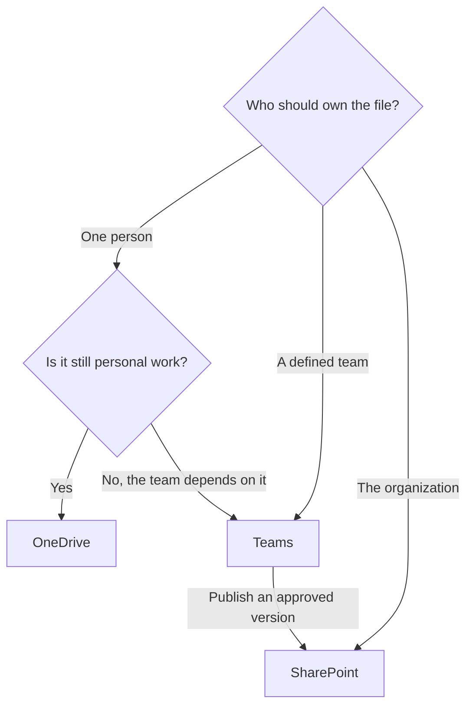

# Where Should This File Live?

Choosing where a file lives is really choosing who owns it, who should work on it, and how stable it needs to be.

## Quick Answer

Use OneDrive for personal work documents. Use Teams when the document becomes shared team work. Use SharePoint when the document is published, official, or meant for a wider audience.

## Decision Flow

## Use OneDrive When

- You are the main owner of the document.
- The document is a draft, note, or personal work file.
- You are sharing with one person for short-term feedback.
- The file is not yet part of a repeatable team process.

Use OneDrive for Business for work documents. Keep personal photos and private files in a personal OneDrive account, not in your work tenant.

## Move To Teams When

Move the file to a Team when collaboration becomes structural. If several people keep editing, reviewing, or depending on the document, the file should belong to the team instead of one person's OneDrive.

That shift matters because team ownership survives vacations, role changes, and employee departures.

## Publish Through SharePoint When

Use SharePoint when a wider audience needs stable access to published information. The working version can stay in Teams while a reviewed copy is published to SharePoint.

This allows the team to keep improving the source document without changing what the organization currently sees.

Once SharePoint is the destination, use [Site, Library, Or Folder: Where Should You Organize Documents?](./site-library-or-folder.md) to choose the right structure within SharePoint.

## Watch For These Signals

- People ask, "Where is the latest version?"
- A file is shared with more people every week.
- The owner is becoming a bottleneck.
- The document is used in onboarding, operations, or policy.
- The file should remain available when the original author moves on.

When those signals appear, the file has outgrown personal storage.
