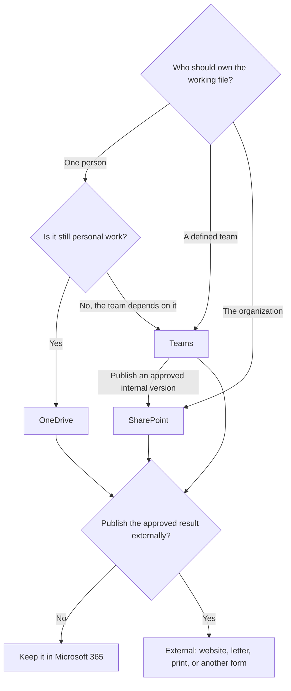

# Where Should This File Live?

Choosing where a file lives is really choosing who owns it, who should work on it, and how stable it needs to be.

## Quick Answer

Use OneDrive for personal work documents. Use Teams when the document becomes shared team work. Use SharePoint when the document is official or meant for a wider internal audience. After working on the file in one of these locations, choose External if the approved result must appear on a website, in a letter, in print, or in another form outside Microsoft 365.

## Decision Flow

```mermaid
flowchart TD
    Start{Who should own the working file?}
    Start -->|One person| Personal{Is it still personal work?}
    Start -->|A defined team| Teams[Teams]
    Start -->|The organization| SharePoint[SharePoint]

    Personal -->|Yes| OneDrive[OneDrive]
    Personal -->|No, the team depends on it| Teams
    Teams -->|Publish an approved internal version| SharePoint

    OneDrive --> Publish{Publish the approved result externally?}
    Teams --> Publish
    SharePoint --> Publish
    Publish -->|No| Keep[Keep it in Microsoft 365]
    Publish -->|Yes| External[External: website, letter, print, or another form]
```

## Use OneDrive When

- You are the main owner of the document.
- The document is a draft, note, or personal work file.
- You are sharing with one person for short-term feedback.
- The file is not yet part of a repeatable team process.

Use OneDrive for Business for work documents. Keep personal photos and private files in a personal OneDrive account, not in your work tenant.

## Move To Teams When

Move the file to a Team when collaboration becomes structural. If several people keep editing, reviewing, or depending on the document, the file should belong to the team instead of one person's OneDrive.

That shift matters because team ownership survives vacations, role changes, and employee departures.

## Publish Through SharePoint When

Use SharePoint when a wider audience needs stable access to published information. The working version can stay in OneDrive or Teams while a reviewed copy is published to SharePoint. People can then develop the next version without changing the version that the wider audience currently sees.

Treat the intranet as the source for the current approved internal version. If the prerequisites fit, M365Wizard recommends that IT designate the relevant intranet site as an authoritative site. Microsoft states that authoritative sites identify official, organization-managed SharePoint sources and that Copilot Search recognizes their content as trusted and promotes verified organizational sources. This supports recognition of the approved version, but it does not replace clear ownership, permissions, approval, or version management. See [SharePoint authoritative sites in Copilot Search](https://learn.microsoft.com/en-us/sharepoint/sharepoint-authoritative-sites).

Once SharePoint is the destination, use [Site, Library, Or Folder: Where Should You Organize Documents?](./site-library-or-folder.md) to choose the right structure within SharePoint.

## Publish Externally After Collaboration

After people have worked on the file in OneDrive, Teams, or SharePoint, choose an external destination when others must receive or use the approved result outside Microsoft 365. Examples include a public website, a letter, printed material, or another publication or delivery form.

External is the destination for the released output, not the working location for its source. Keep the draft in OneDrive or Teams when people must continue developing the next version. Keep the current approved version, its approval, and a record of the external publication in an owned SharePoint site. Assign an owner who can correct, replace, review, or withdraw the external version.

If external people must edit or review the managed file instead of only receiving the released output, use the working pattern in [External Sharing](../admin-and-governance/external-sharing.md).

:::warning[Check Before Publication]

Confirm the audience, approval, privacy, accessibility, publication date, and review or withdrawal date before content leaves Microsoft 365.

:::

## Watch For These Signals

- People ask, "Where is the latest version?"
- A file is shared with more people every week.
- The owner is becoming a bottleneck.
- The document is used in onboarding, operations, or policy.
- The file should remain available when the original author moves on.
- The approved output must appear on a website, in a letter, in print, or through another external form.

When those signals appear, the file has outgrown personal storage and needs a managed team, organization, or external publication route.

## Related Guides

- [Publish Information](../scenarios/publish-information.md)
- [External Sharing](../admin-and-governance/external-sharing.md)
