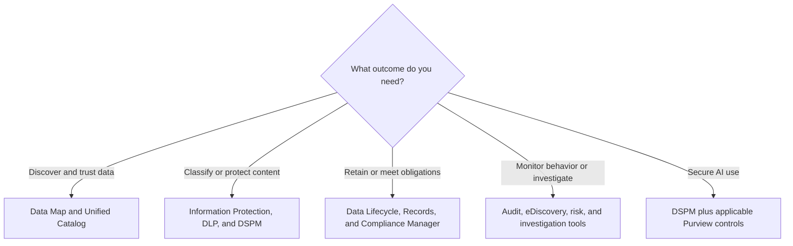

# Which Microsoft Purview Solution Should You Use?

Choose the business outcome before choosing a Purview solution. Start with the data, risk, obligation, and accountable owner; then select the smallest set of controls that addresses that need.

## Quick Answer

Use:

- **Data Map and Unified Catalog** to discover, describe, curate, and improve trust in data assets across the data estate;
- **Information Protection, DLP, and DSPM** to classify sensitive information, protect it, prevent risky handling, and understand data security posture;
- **Data Lifecycle Management and Records Management** to retain, delete, declare, review, and dispose of information;
- **Audit, eDiscovery, Compliance Manager, and investigation tools** for evidence, cases, regulatory assessments, and data incidents;
- **Insider Risk Management, Communication Compliance, Information Barriers, and Privileged Access Management** for defined risks involving behavior, communication, separation, or privileged tasks;
- **DSPM plus the applicable controls above** to manage supported AI interactions.

Purview solutions often work together. That does not mean every scenario needs all of them.

## Decision Flow

## Choose By The Problem

| Business problem | Purview solution | Recommended owners | First validation |
| --- | --- | --- | --- |
| We need an inventory, lineage, business meaning, ownership, or quality for data across analytics, SaaS, hybrid, or multicloud sources | [Data Map](https://learn.microsoft.com/en-us/purview/data-map) and [Unified Catalog](https://learn.microsoft.com/en-us/purview/unified-catalog) | Data office, data owners, data stewards, and IT | Select one governed domain and confirm supported sources, ownership, metadata, quality, and billing |
| People need to recognize and protect confidential documents and emails | [Information Protection and sensitivity labels](https://learn.microsoft.com/en-us/purview/information-protection) | Information owner, security, compliance, and IT | Define a small, understandable classification scheme and test protection in the apps and sharing routes people use |
| We need to warn, audit, restrict, or block risky handling of sensitive data | [Data Loss Prevention](https://learn.microsoft.com/en-us/purview/dlp-learn-about-dlp) | Security, compliance, workload owners, and support | Start in simulation or audit mode where supported, review matches and false positives, and define overrides before blocking |
| We need a combined view of sensitive-data risk or deeper analysis of data affected by an incident | [Data Security Posture Management](https://learn.microsoft.com/en-us/purview/data-security-posture-management-learn-about) and [Data Security Investigations](https://learn.microsoft.com/en-us/purview/data-security-investigations) | Security operations, data security, privacy, and incident owners | Review permissions, data scope, integrations, preview dependencies, and capacity or pay-as-you-go costs before investigation |
| We must keep or delete information consistently, or manage high-value records and their disposition | [Data Lifecycle Management and Records Management](https://learn.microsoft.com/en-us/purview/manage-data-governance) | Records, legal, compliance, information owners, and IT | Document the authority, trigger, period, outcome, exceptions, and approver before creating policies or labels |
| We need activity evidence, a legal or regulatory case, or an assessment of compliance obligations | [Audit](https://learn.microsoft.com/en-us/purview/audit-solutions-overview), [eDiscovery](https://learn.microsoft.com/en-us/purview/edisc), and [Compliance Manager](https://learn.microsoft.com/en-us/purview/compliance-manager) | Legal, compliance, audit, security, and privacy | Define the case or requirement, custodians and scope, least-privilege roles, evidence handling, and required license level |
| We must address risky behavior, inappropriate communications, conflicts of interest, or standing privileged access | [Insider Risk Management](https://learn.microsoft.com/en-us/purview/insider-risk-management-solution-overview), [Communication Compliance](https://learn.microsoft.com/en-us/purview/communication-compliance-solution-overview), [Information Barriers](https://learn.microsoft.com/en-us/purview/information-barriers), and [Privileged Access Management](https://learn.microsoft.com/en-us/purview/privileged-access-management-solution-overview) | Security, compliance, privacy, legal, HR, and IT | Confirm the legitimate purpose, proportionality, privacy controls, reviewers, escalation route, and supported workloads before enabling monitoring or restrictions |
| We need to reduce oversharing, leakage, or compliance gaps in Copilots, agents, or other generative AI apps | [Purview data security and compliance for generative AI](https://learn.microsoft.com/en-us/purview/ai-microsoft-purview) | AI service owner, security, compliance, data owners, and IT | Inventory the exact AI apps and agents, then verify the support matrix, licenses, billing, permissions, and policies for each one |

## Understand The Control Layers

These controls answer different questions and can apply to the same item:

| Control | Question it answers | Practical effect |
| --- | --- | --- |
| **Permissions** | Who can open or change this content here? | Grants or denies access in the current service or workspace; permissions are not a Purview replacement for classification or lifecycle |
| **Sensitivity label** | How sensitive is this, and which protection should travel with it? | Classifies supported content and can apply markings, encryption, or other protection settings |
| **DLP policy** | Which sensitive activity should be audited, warned about, restricted, or blocked? | Evaluates configured content, context, locations, and actions while people or processes handle data |
| **Retention policy** | Which broad locations or populations need the same keep or delete rule? | Applies retention settings to supported workloads without asking users to label each item |
| **Retention label** | Which item or document category needs a specific lifecycle? | Applies item-level retention or deletion and can be published, defaulted, or automatically applied when supported |
| **Record declaration** | Does this high-value item need stronger record controls and disposition evidence? | Uses Records Management capabilities such as record declaration, file plans, and disposition review |
| **Audit** | What supported user or administrator activity occurred? | Provides searchable activity records for security, forensic, compliance, or operational investigation |
| **eDiscovery** | Which electronic information must be identified, preserved, reviewed, or exported for a case? | Organizes legal or regulatory work around cases, holds, searches, review, and export |

A document can therefore have permissions, a sensitivity label, and a retention label at the same time. DLP can evaluate how it is handled, Audit can record supported activity, and eDiscovery can preserve or collect it for a case.

:::warning[Controls Do Not Create Policy]

Do not translate a vague instruction such as “keep everything” or “block confidential data” directly into a tenant-wide policy. Confirm the purpose, legal or policy authority, owner, scope, user impact, exceptions, and end-of-life action first.

:::

:::warning[Use Sensitive Risk Tools Proportionately]

Insider Risk Management, Communication Compliance, eDiscovery, and investigation tools can expose sensitive information about people and their work. Define privacy, legal, HR, reviewer, segregation-of-duties, and escalation safeguards before use.

:::

## Treat AI As A Cross-Cutting Scenario

Do not assume that buying or enabling one “AI security” feature covers every Copilot or agent. Start with the same foundations used for other data: correct access, known owners, useful classification, appropriate DLP, audit, retention, and investigation processes. Then verify which controls support each AI app or agent.

As of July 21, 2026, Microsoft marks some DSPM integrations and proactive AI insights that use Data Security Investigations as preview. Keep a stable monitoring or investigation route available and recheck preview status before making it part of an operational dependency.

## Recommended Starting Pattern

1. Describe one concrete risk, obligation, or data-governance outcome.
2. Name the business or data owner and the security, records, legal, privacy, or compliance decision owner.
3. Inventory the data, locations, users, processes, and AI apps in scope.
4. Confirm roles, supported workloads, licensing, billing, and technical prerequisites.
5. Pilot with representative data and users; use simulation, audit, or limited scope where the solution supports it.
6. Prepare user guidance, help-desk answers, exception handling, alert ownership, and escalation before enforcement.
7. Measure false positives, uncovered data, policy outcomes, user friction, and unresolved cases; then tune or expand.

:::warning[Check Licensing Before Design Becomes A Promise]

Feature rights can differ by policy type, application method, location, and benefiting user. Use the [official Microsoft Purview service description](https://learn.microsoft.com/en-us/office365/servicedescriptions/microsoft-365-service-descriptions/microsoft-365-tenantlevel-services-licensing-guidance/microsoft-purview-service-description) as the authoritative starting point. The [M365 Maps Purview Suite diagram](https://m365maps.com/files/Microsoft-Purview-Suite.htm) and [feature matrix](https://m365maps.com/matrix.htm) can help visualize plan overlap but are not official licensing terms.

:::

## Official Microsoft Documentation

- [Where to start with Microsoft Purview](https://learn.microsoft.com/en-us/purview/purview-where-to-start)
- [Microsoft Purview data security solutions](https://learn.microsoft.com/en-us/purview/purview-security)
- [Data governance with Microsoft Purview](https://learn.microsoft.com/en-us/purview/data-governance-overview)
- [Microsoft Purview data compliance solutions](https://learn.microsoft.com/en-us/purview/purview-compliance)
- [Microsoft Purview data security and compliance for generative AI](https://learn.microsoft.com/en-us/purview/ai-microsoft-purview)

## Related Guides

- [Microsoft Purview](../services/purview.md)
- [Site, Library, Or Folder: Where Should You Organize Documents?](./site-library-or-folder.md)
- [Permissions And Ownership](../admin-and-governance/permissions-and-ownership.md)
- [External Sharing](../admin-and-governance/external-sharing.md)
- [From File Server To SharePoint: Copy Or Reorganize?](../admin-and-governance/migrate-file-server-to-sharepoint.md)
