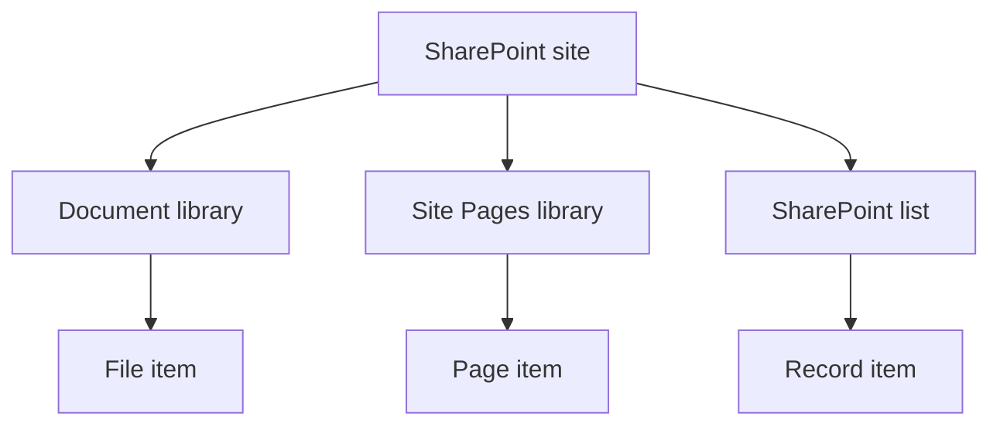
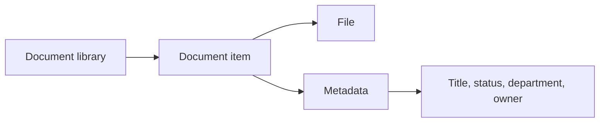
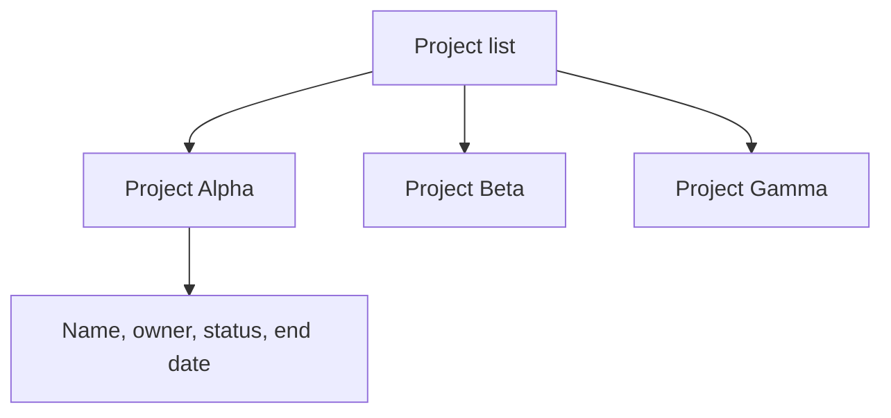
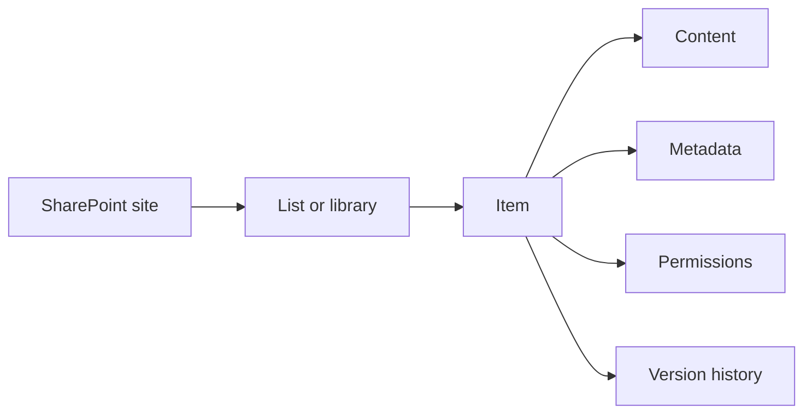
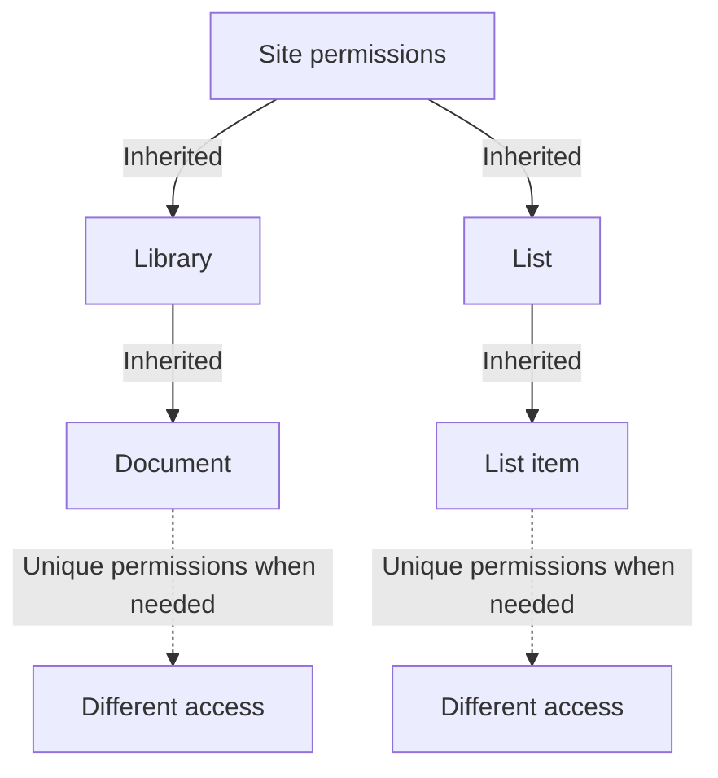

# SharePoint Content: Sites, Libraries, Lists, and Permissions

A SharePoint site is a shared place with a purpose: for example, a department site, a project site, or an intranet area. It contains the information and controls needed for that purpose.

## The Content Structure

A modern SharePoint site is technically managed as a site collection. In daily work, **site** is the useful term: it is the container where people find content, navigation, and access rules.

Within that container, a site can hold document libraries, lists, the Site Pages library, settings, and permissions. A site does not need to hold every kind of information. Its purpose should help people decide what belongs there and who looks after it.

## Libraries Store Files

A **document library** stores files such as Word documents, spreadsheets, PDFs, images, and folders. It also stores information *about* each file, including its owner, document type, status, or publication date. These extra fields are called **metadata** or columns.

Treat a library as more than a folder. Its metadata, version history, views, and permissions help people find and manage the right file.

For example, a policy library can use columns for department, policy status, owner, and publication date. People can then use a view to find current HR policies without having to know the exact file name or folder.

## Lists Store Records

A **SharePoint list** stores structured records. It can look like a spreadsheet, but it is designed to manage a shared set of records over time.

| Use a library when the central thing is... | Use a list when the central thing is... |
| --- | --- |
| A file, such as a policy or template | A record, such as a request, project, risk, contact, or task |

Each row in a list is an **item**. Each file in a library is also an item. Site pages are items in the **Site Pages** library.

| Location | What an item represents | Example |
| --- | --- | --- |
| Document library | A file and its metadata | `Purchasing-policy.pdf` |
| SharePoint list | A structured record | `Laptop request 2026-004` |
| Site Pages library | A SharePoint page | `Home.aspx` |

Libraries are technically related to lists, but they are specialized for file management. This is why a library has file-specific features such as document versions and folders, while a list is usually used to track records and their fields.

## Permissions: Inherit First

Sites commonly pass their permissions down to libraries, lists, folders, and items. This is called **inheritance**. Make inheritance the default: it means people who can read the site can usually read its content, and owners can understand access without tracing many exceptions.

You can give a library, folder, or item its own permissions when there is a real need. Use that sparingly. Many exceptions make it hard for owners to understand who has access and why. Before breaking inheritance, consider a separate site or source with its own purpose and owner instead.

The usual permissions range from reading content to adding, editing, deleting, or managing it. Start with the access people need for their role, rather than granting broad edit access because it is convenient. If a source needs a different audience, first consider whether it should live in a separate, clearly owned location.

Putting a link or web part on a homepage does not give someone access to the underlying file or record. The source still checks its own permissions.

## Next Step

See [how a SharePoint page is built](./sharepoint-pages-and-web-parts.md), then follow [what happens when someone opens a homepage](./sharepoint-homepage-experience.md).

## Related Guides

- [SharePoint](./index.mdx)
- [Where Should This File Live?](../../decisions/where-should-this-file-live.md)
- [Permissions And Ownership](../../admin-and-governance/permissions-and-ownership.md)
