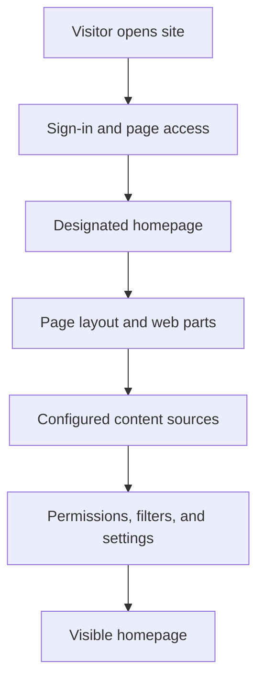
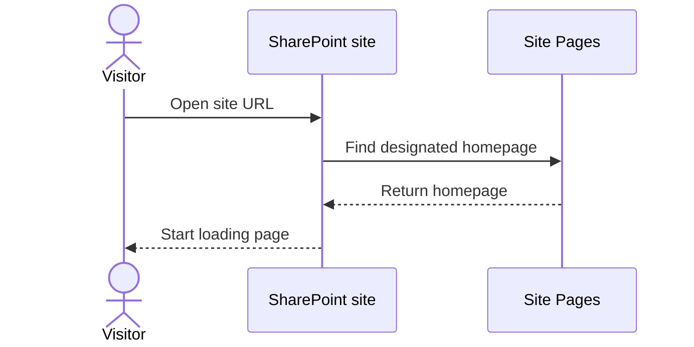
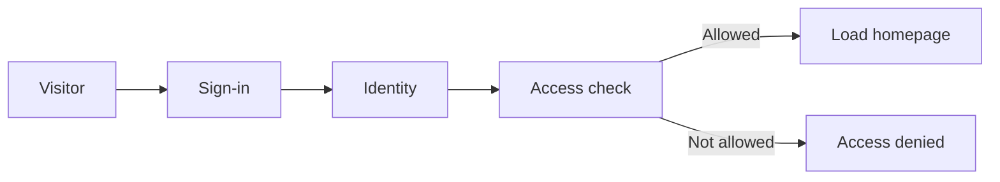
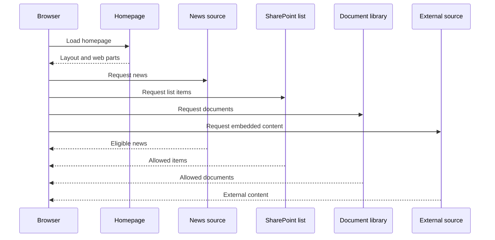
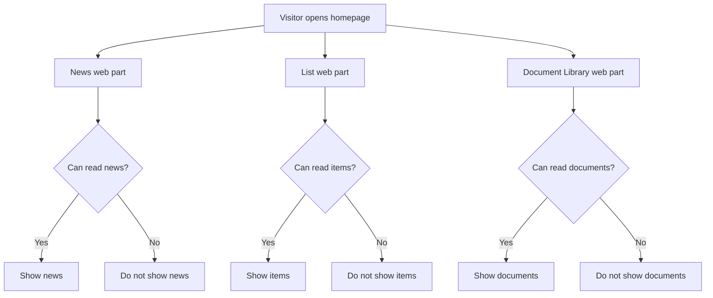
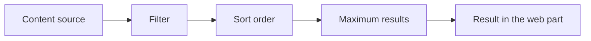

# What Happens When You Open a SharePoint Home Page?

Opening a SharePoint site starts more than one action. SharePoint identifies the visitor, checks whether they can open the site and page, and lets each web part retrieve content from its configured source.

## The Homepage Flow

The page layout can appear before every web part has finished retrieving its content. Web parts can load from different sources independently, so news, a list, a document library, and embedded content do not need to arrive at exactly the same time.

The flow is easier to understand when it is separated into the actions SharePoint takes for the page and the actions each web part takes for its source.

### 1. Open the site

The visitor opens a site URL, such as `https://organization.sharepoint.com/sites/hr`. SharePoint finds the page that is designated as that site's homepage. It is often `Home.aspx`, but a site owner can designate another page.

### 2. Check identity and page access

SharePoint checks who the visitor is, whether they are signed in, and whether they can open the site and page. A visitor who does not have access cannot use the homepage as a way around the site's permissions.

### 3. Read the page layout

SharePoint reads the page's configuration: its sections, columns, web parts, and each web part's settings. The browser can start drawing the structure of the page while individual web parts continue loading their results.

### 4. Retrieve web-part content

Each web part asks its own source for information. A News web part asks for eligible news pages; a List web part asks for list items; a Document Library web part asks for documents; and an Embed web part asks the external service to provide its content.

## Access Is Checked at More Than One Place

First, the visitor must be allowed to open the site and page. Then each source still applies its own permissions. A document library web part does not make restricted documents visible just because it is placed on a public-facing homepage.

Prefer inherited access for the site, Site Pages library, and each content source. Do not use a homepage or individual web part as a way to work around the normal permission structure. If a different audience truly needs different access, make that exception deliberate, documented, and owned.

This means two people can open the same homepage and see different results. One may see a document, list item, or news post that another person cannot access.

The same principle applies to sources outside the site. An embedded dashboard, form, or video can have its own sign-in and access requirements. A page can provide a useful entrance, but it cannot override the rules of the system that supplies the content.

## Web Parts Apply Their Own Settings

Web parts normally show a selected part of a source rather than everything in it. Their settings can use a chosen view, a filter, a sort order, or a maximum number of results. For example, a News web part might show the four newest posts rather than every news post on a site.

Audience targeting can help make content more relevant, but it is not a replacement for permissions. Use permissions to protect content; use targeting to guide the right audience toward content they can use.

After those rules are applied, the browser places the returned news cards, list rows, document links, and embedded content into their web parts. The visitor experiences one homepage even though the visible information can come from several storage locations and systems.

## What This Means for Page Owners

Keep the homepage focused on useful entry points, current information, and clear actions. Maintain content at its source, check that web-part settings still match the intended audience, and avoid hiding access problems behind page design.

## Continue Learning

Return to [how a SharePoint page is built](./sharepoint-pages-and-web-parts.md) or start with [sites, libraries, lists, and permissions](./sharepoint-content-structure.md).

## Related Guides

- [SharePoint](./index.md)
- [Publish Information](../../scenarios/publish-information.md)
- [Permissions And Ownership](../../admin-and-governance/permissions-and-ownership.md)
