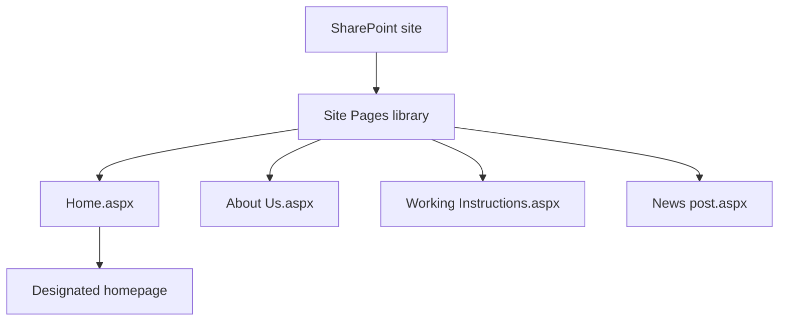
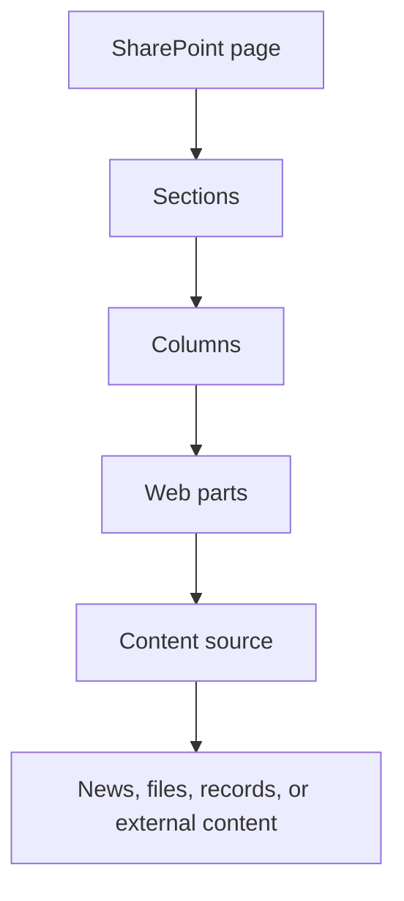
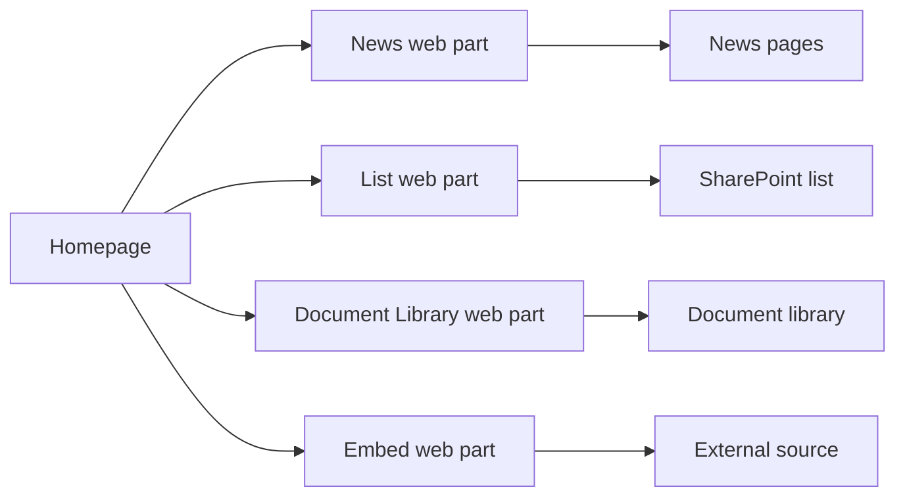
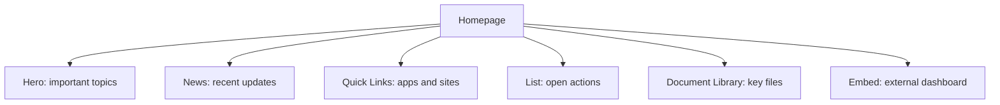

# How a SharePoint Page Is Built

A modern SharePoint page is a presentation layer. It gives information a useful layout, but much of the information a visitor sees can still live in a library, list, news page, or another system.

## Pages Live in Site Pages

Modern pages are stored in the **Site Pages** library. Technically, a page is an `.aspx` file. A site owner chooses one page as the homepage; it is often named `Home.aspx`, but it can have another name.

The same library can contain ordinary pages and news posts. A news post is normally a page with news-specific settings, not a separate copy of the homepage's content.

This also means that a site can have many pages: an About Us page, working instructions, news posts, and a homepage. Changing which page is designated as the homepage changes the first page visitors receive when they open the site, but it does not remove the other pages.

## From Layout to Content

**Sections** and **columns** decide where content appears on the screen. **Web parts** are the building blocks placed in those spaces.

For example, a page might use a wide top section for important topics, two columns for news and quick links, and a lower section for documents or open actions. A page's layout explains *where* something appears; a web part's settings explain *what* it should show.

Common web parts include Text, Hero, News, Quick Links, List, Document Library, People, Events, Power BI, and Embed. A page owner configures each web part to show the right source, view, layout, or number of results.

| Web part | Typical purpose | Where its content comes from |
| --- | --- | --- |
| News | Show recent published updates | Selected news pages on one or more sites |
| List | Show a useful set of records | A chosen SharePoint list and view |
| Document Library | Surface important files | A chosen library, folder, or view |
| Embed | Show another service in the page | An external page, video, form, or dashboard |

The News web part can select news from the current site, selected sites, or a hub. It normally shows a summary such as a title, image, date, and introduction that links to the full news page. It does not turn the homepage into the place where every news article is stored.

## A Page Is Not Usually the Source

For example, a News web part selects news pages to show. A List web part shows a selected view of an existing list. A Document Library web part shows files from an existing library. An Embed web part displays content delivered by another system.

This separation matters:

- Update a policy in its document library instead of pasting its text onto several pages.
- Maintain records in their list, then show the useful view on a page.
- Give every web part a clear reason to exist and a clear content owner.

The homepage is therefore a composed experience, not a storage location where everything should be duplicated.

When a web part shows a list or library, it reads the existing information. The page does not create a second set of projects or documents. That gives owners one place to update content and lets a homepage show only the most useful part of it.

## Keep Page Access Simple

Let Site Pages and the sources used by web parts inherit permissions from their site whenever possible. A web part's filter, layout, or audience setting is not a replacement for source permissions. Avoid giving individual pages or items unique access just to change what appears on a homepage; use a clearly owned source for a genuinely different audience.

## Next Step

Read [what happens when someone opens a SharePoint homepage](./sharepoint-homepage-experience.md). You can also return to [sites, libraries, lists, and permissions](./sharepoint-content-structure.md).

## Related Guides

- [SharePoint](./index.md)
- [Publish Information](../scenarios/publish-information.md)
- [Organization Assets Library](../admin-and-governance/organization-assets-library.md)
