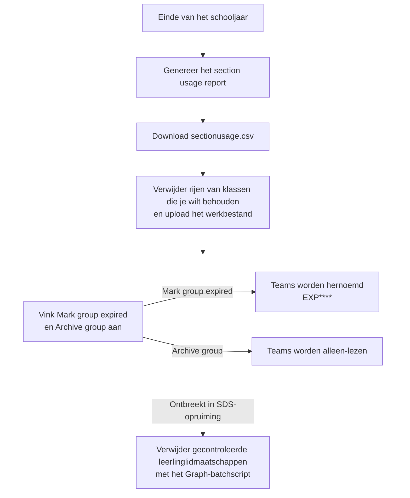

De laatste schoolbel heeft geklonken. Leerlingen ronden af, docenten sluiten de laatste opdrachten af en voor Microsoft 365-beheerders wacht nog één eindejaarsklus: de klasteams van het afgelopen schooljaar netjes wegzetten.

Ik voer Somtoday-gegevens met een zelfgebouwde tool aan bij School Data Sync en SDS maakt daarvan de klassen en Teams die tijdens het schooljaar worden gebruikt. In mijn eindejaarsproces archiveer ik elk klasteam dat via SDS is ingericht. Maar archiveren is slechts de helft van het werk: de huidige SDS-opruiming verwijdert geen leerlingen en als je die lidmaatschappen één voor één verwijdert, ontstaat al snel een berg Graph-aanvragen. Het artikel van Tony Redmond over batching kwam dus precies op het goede moment.

<!-- truncate -->

## SDS brengt een lifecycle voor het schooljaar mee

Mijn hulpmiddel [Somtoday naar Microsoft School Data Sync](../docs/tools/somtoday-to-school-data-sync) maakt de CSV-bestanden die SDS nodig heeft. Daarmee is de inrichting geregeld, maar ik moet de SDS-lifecycle ook afronden in plaats van de digitale klaslokalen van vorig jaar tussen de nieuwe te laten staan.

Microsoft adviseert in de [richtlijnen voor de overgang naar een nieuw schooljaar](https://learn.microsoft.com/en-us/microsoft-365/education/guide/1-reference/school-data-sync) om de einddatum van de synchronisatie ongeveer drie weken voor het einde van het schooljaar te controleren en het vorige jaar ongeveer twee weken na afloop op te ruimen. In het SDS Admin Center begint die opruiming met een section usage report. Je verwijdert iedere klas die je wilt behouden uit `sectionusage.csv`, uploadt de resterende lijst en kiest de opruimopties.

Microsoft presenteert `Archive group` als een van die opties, niet als een universele verplichting. Mijn beheerregel voor deze inrichting is bewust strenger: ieder klasteam dat via SDS is ingericht, wordt gearchiveerd. De optie [`Archive group`](https://learn.microsoft.com/en-us/schooldatasync/azure-ad-group-cleanup) maakt de klas alleen-lezen, voorkomt dat nieuwe gesprekken of gegevens worden gedeeld en verplaatst de klas naar de map met gearchiveerde klassen in Teams.

:::warning[Het rapport bevat de klassen die worden opgeruimd]

Verwijder vóór het uploaden iedere klas die je wilt behouden uit `sectionusage.csv`. Laat je alle rijen staan, dan richt SDS de opruiming op alle vermelde klassen. Beoordeel het bestand als een wijzigingenlijst, niet alleen als een rapport.

:::

Hetzelfde werkbestand kan daarna dienen als toegestane lijst voor het script. In het rapport dat in mijn tenant wordt gegenereerd, bevat de kolom `GraphId` de exacte groepen die ik moet verwerken. Zo kan ik de gecontroleerde klasteams rechtstreeks onderhouden zonder de tenant op naam te doorzoeken. Vóór iedere wijziging valideer ik elke waarde nog steeds als GUID en weiger ik dubbele waarden.

## Archiveren verwijdert de leerlingen niet

Daar zit de crux: Microsoft zegt expliciet dat de [huidige SDS-groepsopruiming geen leerlingen uit de geselecteerde klassen verwijdert](https://learn.microsoft.com/en-us/schooldatasync/azure-ad-group-cleanup). Archiveren en lidmaatschappen opruimen zijn dus twee verschillende taken. Het Graph-script uit deze blog vult de SDS-opruiming aan; het vervangt die niet.

De twee zijtakken laten zien wat de SDS-opties doen. De gestippelde laatste stap is de aanvullende lidmaatschapsopruiming die nog in de ingebouwde route ontbreekt:



Waarom verwijder ik die lidmaatschappen nadat het Team is gearchiveerd? Gearchiveerd betekent alleen-lezen, niet ontoegankelijk. Microsoft vermeldt dat leden de [Teamactiviteit, bestanden, chats en kanalen nog steeds kunnen bekijken](https://learn.microsoft.com/en-us/microsoftteams/archive-or-delete-a-team). Voor klasteams bevestigt Microsoft bovendien dat [bestanden, gesprekken, cijfers en opdrachten opgeslagen en toegankelijk blijven](https://support.microsoft.com/en-us/teams/education/archiving-classes-at-the-end-of-the-school-year-in-microsoft-teams). Die blijvende toegang geeft een vermijdbare gelegenheid om materiaal uit het vorige schooljaar opnieuw te gebruiken.

Een leerling kan bijvoorbeeld bestanden en quizzen uit leerjaar 3 downloaden en die later delen met iemand die het volgende schooljaar in leerjaar 3 begint. Het lidmaatschap later verwijderen maakt eerdere downloads niet ongedaan en biedt geen garantie dat er niets wordt gedeeld. Het haalt wel de makkelijke toegang tot het gearchiveerde klasteam weg en maakt dit soort hergebruik minder laagdrempelig.

Microsofts OfficeDev-repository met voorbeeldscripts, O365-EDU-Tools, bevat een [script om lidmaatschappen uit verlopen SDS-secties te verwijderen](https://github.com/OfficeDev/O365-EDU-Tools/blob/master/SDS%20Scripts/Remove-Expired_Section_Memberships.ps1). De versie van 10 juni 2026 haalt groepseigenaars en leden op, sluit accounts van eigenaars uit, verwijdert de overige gebruikerslidmaatschappen en exporteert de wijzigingen naar CSV.

Het script roept voor elk geselecteerd lid afzonderlijk `Remove-MgGroupMemberByRef` aan. Dat werkt, maar ieder lidmaatschap betekent weer een Graph-aanvraag. Bij honderden klasteams loopt dat snel op.

De opbouw van dit stapsgewijze proces spreekt mij nog steeds aan: archiveer eerst het klasteam en verwijder daarna de gecontroleerde verlopen lidmaatschappen terwijl de eigenaars behouden blijven. Het script weet alleen niet vanzelf wie een leerling is. Ook een docent die niet als groepseigenaar is geregistreerd, kan worden geselecteerd. Daarom controleer ik de eigenaars en docenten voordat er iets wordt gewijzigd.

Het voorbeeldscript vindt kandidaatgroepen door `mailNickname` te vergelijken met `^Exp[0-9]{4}`. Ik gebruik die naamconventie alleen om te zoeken, nooit als toestemming om leden te verwijderen. Mislukt het ophalen van de eigenaars, dan wordt de groep overgeslagen en niet als een groep zonder eigenaars behandeld.

## Eén aanvraag per lidmaatschap loopt snel op

Toen publiceerde Tony Redmond op 21 juli 2026 zijn [inleiding tot Microsoft Graph JSON-batching](https://office365itpros.com/2026/07/21/json-batching-primer/), samen met een [PowerShell-voorbeeld dat gebruikersaccounts in batches bijwerkt](https://github.com/12Knocksinna/Office365itpros/blob/master/Update-UserAccountsBatch.PS1). Het voorbeeld werkt gebruikers bij in plaats van klaslidmaatschappen, maar het slimme idee is precies hetzelfde.

Microsoft Graph accepteert [maximaal 20 aanvragen in één JSON-batch](https://learn.microsoft.com/en-us/graph/json-batching). In plaats van twintig afzonderlijke reizen naar Graph kan ik twintig onafhankelijke verwijderingen van lidmaatschappen in één payload zetten en naar `https://graph.microsoft.com/v1.0/$batch` sturen.

Dat scheelt tijd. Bij ieder los verzoek wacht PowerShell op de reis naar Graph en terug. Met een batch maak je die reis één keer voor maximaal twintig verwijderingen. Graph handelt iedere verwijdering nog steeds apart af, dus een batch is niet automatisch twintig keer zo snel. Bij honderden klasteams maken die vermeden netwerkritten wel degelijk verschil.

## Twintig verwijderingen, één Graph-aanroep

JSON-batching werkt op HTTP-niveau. De batch bevat relatieve Microsoft Graph-URL's en HTTP-methoden, geen lijst met Graph PowerShell-cmdlets. Met `Invoke-MgGraphRequest` verstuur je de voltooide payload.

Dit is het kleine deel van het patroon dat de moeite waard is om over te nemen. Het begint nadat `$groupId` en `$membersToRemove` zijn gecontroleerd en accounts van eigenaars zijn uitgesloten; het is geen volledig script voor de eindejaarsopruiming:

```powershell
$batchSize = 20
$membersToRemove = @($membersToRemove)

for ($offset = 0; $offset -lt $membersToRemove.Count; $offset += $batchSize) {
    $lastIndex = [Math]::Min(
        $offset + $batchSize - 1,
        $membersToRemove.Count - 1
    )
    $currentMembers = @($membersToRemove[$offset..$lastIndex])
    $requestMap = @{}

    $requests = for ($index = 0; $index -lt $currentMembers.Count; $index++) {
        $member = $currentMembers[$index]
        $requestId = [string]($index + 1)
        $requestMap[$requestId] = $member

        [ordered]@{
            id     = $requestId
            method = 'DELETE'
            url    = ('/groups/{0}/members/{1}/$ref' -f $groupId, $member.Id)
        }
    }

    $batchBody = @{requests = @($requests)} | ConvertTo-Json -Depth 5

    try {
        $batchResponse = Invoke-MgGraphRequest `
            -Method POST `
            -Uri 'https://graph.microsoft.com/v1.0/$batch' `
            -Body $batchBody `
            -ContentType 'application/json' `
            -ErrorAction Stop
    }
    catch {
        throw "De volledige batchaanvraag is mislukt: $($_.Exception.Message)"
    }

    foreach ($result in $batchResponse.responses) {
        $member = $requestMap[[string]$result.id]
        if ($null -eq $member) {
            throw "Het antwoord bevat een onbekende aanvraag-ID: $($result.id)"
        }

        $memberName = [string]$member.DisplayName
        if ([string]::IsNullOrWhiteSpace($memberName)) {
            $memberName = [string]$member.AdditionalProperties.displayName
        }
        if ([string]::IsNullOrWhiteSpace($memberName)) {
            $memberName = [string]$member.Id
        }

        $status = [int]$result.status
        if ($status -eq 204) {
            Write-Host "$memberName is verwijderd uit groep $groupId"
        }
        elseif ($status -eq 429 -or ($status -ge 500 -and $status -lt 600)) {
            Write-Warning "Tijdelijke fout voor ${memberName}: HTTP $status"
        }
        else {
            Write-Error "Verwijderen is mislukt voor ${memberName}: HTTP $status - $($result.body.error.message)"
        }
    }
}
```

## Een geslaagde batch kan toch fouten bevatten

De ID's houden ieder verzoek en antwoord bij elkaar, ook als Graph de antwoorden in een andere volgorde terugstuurt. `HTTP 200` zegt alleen dat Graph de batch heeft aangenomen; een verwijdering daarbinnen kan nog steeds mislukken. Daarom controleer ik ieder antwoord: `204 No Content` is geslaagd en de rest komt op de foutenlijst.

Een batch is niet alles-of-niets. Slagen zeventien verwijderingen en mislukken er drie, dan blijven die zeventien uitgevoerd. Graph draait ze niet terug.

:::danger[Behoud /$ref in de verwijderings-URL]

Gebruik `DELETE /groups/{group-id}/members/{member-id}/$ref` om de lidmaatschapsrelatie te verwijderen. [Microsoft waarschuwt](https://learn.microsoft.com/en-us/graph/api/group-delete-members?view=graph-rest-1.0) dat het weglaten van `/$ref` het lidobject zelf uit Microsoft Entra ID kan verwijderen wanneer de aanroepende app ook toestemming heeft om dat objecttype te beheren.

:::

## Probeer alleen tijdelijke fouten opnieuw

De voorbeeldcode meldt `429` en `5xx`, maar probeert ze niet opnieuw. Een volledig script bewaart alleen zulke tijdelijke fouten en probeert ze een beperkt aantal keren opnieuw. Bij `429` volgt het `Retry-After`; `400` en `403` vragen om onderzoek, niet om nog een poging.

## Begin klein

Batching gaat pas aan wanneer de selectie klopt. Ik gebruik het gecontroleerde `sectionusage.csv` als afbakening. In het rapport uit mijn tenant wijst de kolom `GraphId` de exacte klasteams aan; iedere GUID wordt gevalideerd en dubbele waarden worden geweigerd.

Vóór de eerste verwijdering toont het script de tenant en een voorbeeld van de wijzigingen. Kunnen de eigenaars of leden niet worden opgehaald, dan slaat het dat Team over; eigenaars komen nooit in een verwijderingsbatch terecht. Ik begin met één of twee Teams en sla ieder resultaat op. De verbinding gebruikt de minimaal benodigde [machtiging](https://learn.microsoft.com/en-us/graph/api/group-delete-members?view=graph-rest-1.0) `GroupMember.ReadWrite.All`, een passende gedelegeerde Entra-rol en alleen de aanvullende zoekmachtigingen die nodig zijn.

## Klaar voor de zomer

Uiteindelijk is de procedure eenvoudig: SDS markeert en archiveert de oude klasteams; het Graph-script verwijdert daarna de gecontroleerde leerlinglidmaatschappen. Door ze per twintig te versturen, zijn minder ritten naar Graph nodig en is de opruiming sneller klaar.

De oude klaslokalen dicht, een helder resultatenbestand en geen middag vol losse aanvragen. Dat is een prettiger begin van de zomer.

## Verder lezen

- [Tony Redmond: JSON-batching gebruiken om Graph-verwerking te versnellen](https://office365itpros.com/2026/07/21/json-batching-primer/)
- [Tony Redmonds voorbeeld Update-UserAccountsBatch.PS1](https://github.com/12Knocksinna/Office365itpros/blob/master/Update-UserAccountsBatch.PS1)

## Officiële Microsoft-documentatie en voorbeeldscripts

- [Overgang naar een nieuw schooljaar met Microsoft School Data Sync](https://learn.microsoft.com/en-us/microsoft-365/education/guide/1-reference/school-data-sync)
- [Groepen voor klassen en secties opruimen in School Data Sync](https://learn.microsoft.com/en-us/schooldatasync/azure-ad-group-cleanup)
- [Een Team archiveren of verwijderen in Microsoft Teams](https://learn.microsoft.com/en-us/microsoftteams/archive-or-delete-a-team)
- [Klassen aan het einde van het schooljaar archiveren in Microsoft Teams voor Onderwijs](https://support.microsoft.com/en-us/teams/education/archiving-classes-at-the-end-of-the-school-year-in-microsoft-teams)
- [Meerdere HTTP-aanvragen combineren met JSON-batching](https://learn.microsoft.com/en-us/graph/json-batching)
- [Richtlijnen voor throttling in Microsoft Graph](https://learn.microsoft.com/en-us/graph/throttling)
- [Een lid uit een groep verwijderen](https://learn.microsoft.com/en-us/graph/api/group-delete-members?view=graph-rest-1.0)
- [Microsoft OfficeDev O365-EDU-Tools SDS-voorbeeldscripts](https://github.com/OfficeDev/O365-EDU-Tools/tree/master/SDS%20Scripts)
- [Lidmaatschappen uit verlopen SDS-secties verwijderen](https://github.com/OfficeDev/O365-EDU-Tools/blob/master/SDS%20Scripts/Remove-Expired_Section_Memberships.ps1)

## Gerelateerde handleidingen

- [Somtoday naar Microsoft School Data Sync](../docs/tools/somtoday-to-school-data-sync)
- [Teams](../docs/services/teams)
- [Machtigingen en eigenaarschap](../docs/admin-and-governance/permissions-and-ownership)
