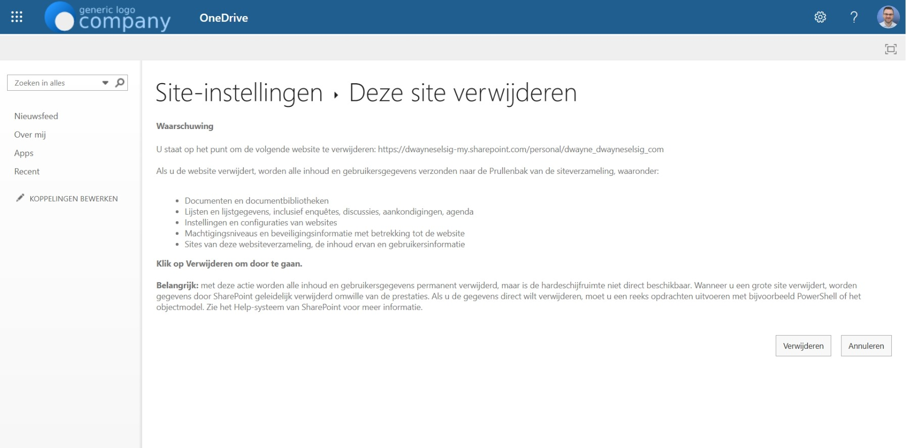

Piet Jansen gebruikt `piet.jansen@m365wizard.nl` voor inkoop. Dat werkt zolang Piet die rol heeft. Daarom maakt niemand een adres als `inkoop@m365wizard.nl`. `piet.jansen@m365wizard.nl` hoort bij Piet, terwijl het inkoopproces bij de organisatie hoort.

Dat verschil wordt zichtbaar wanneer Piet vertrekt. De organisatie converteert zijn postvak naar een gedeelde mailbox en verwijdert de licentie om kosten te besparen. De e-mail blijft beschikbaar, maar de persoonlijke OneDrive wordt geen onderdeel van de gedeelde mailbox. Het blijft een apart Microsoft 365-object.

Dit is meestal eerst een procesprobleem en daarna pas een mailboxprobleem. Hoort een proces bij de organisatie, geef het dan vanaf het begin een gedeelde identiteit.

<!-- truncate -->

## Het proces faalde al vóór het postvak

In veel offboardingprocessen zie je dezelfde volgorde:

1. Een teamproces gebruikt een persoonlijk account.
2. De medewerker verlaat de rol of de organisatie.
3. Het oude gebruikerspostvak wordt omgezet naar een gedeelde mailbox.
4. De licentie wordt verwijderd.
5. Het postvak blijft bestaan.
6. De persoonlijke OneDrive blijft een apart object.

Microsoft zegt dat bij het converteren van een gebruikerspostvak de bestaande e-mail en agenda behouden blijven. Microsoft zegt ook dat je het oude gebruikersaccount niet mag verwijderen, omdat dit account het anker van de gedeelde mailbox blijft. Een gedeelde mailbox heeft meestal geen eigen Exchange Online-licentie nodig, maar iedereen die toegang heeft, heeft wel een gelicentieerd Exchange Online-postvak nodig. Zie Microsofts uitleg over [gedeelde mailboxen](https://learn.microsoft.com/en-us/microsoft-365/admin/email/about-shared-mailboxes?view=o365-worldwide) en [het converteren van een gebruikerspostvak](https://learn.microsoft.com/en-us/microsoft-365/admin/email/convert-user-mailbox-to-shared-mailbox?view=o365-worldwide).

De licentie verwijderen was bedoeld om kosten te besparen. Het kan juist leiden tot ontoegankelijke gegevens, opslag- of reactiveringskosten, verwijderingsrisico en uiteindelijk gegevensverlies. Volgens het [Microsoft-beleid voor OneDrive-accounts zonder licentie](https://learn.microsoft.com/en-us/sharepoint/unlicensed-onedrive-accounts) wordt een account na 60 dagen zonder licentie alleen-lezen en na 93 dagen gearchiveerd. Vanaf 1 juli 2026 kunnen onbetaalde accounts bovendien na 365 cumulatieve onbetaalde dagen een verwijderingsrisico lopen. Microsoft noemt uitzonderingen voor EDU-, GCC- en DoD-tenants. Controleer daarom het beleid voor jouw type tenant.

:::warning[Maak hier geen mailboxopruiming van]

Het postvak kan gezond zijn terwijl de OneDrive ontoegankelijk is of risico loopt. Beslis wat er met de bestanden moet gebeuren voordat je de site verwijdert. Gearchiveerde OneDrive-accounts zonder licentie kunnen opslag- en reactiveringskosten veroorzaken wanneer de betreffende facturering is ingeschakeld. Microsoft waarschuwt ook dat bewaarde inhoud na verwijdering onherstelbaar kan worden.

:::

## Drie objecten, drie beslissingen

Houd deze objecten uit elkaar wanneer je de voormalige medewerker onderzoekt:

- **Het Exchange Online-postvak** bevat e-mail en agenda. Door het om te zetten naar een gedeelde mailbox verandert wie het mag gebruiken; de OneDrive wordt geen gedeelde opslag.
- **Het gebruikersaccount** verankert de gedeelde mailbox na de conversie. Laat het bestaan, blokkeer aanmelding en beheer de licentie volgens de eisen voor het postvak en compliance.
- **De persoonlijke OneDrive-site** is een SharePoint-siteverzameling voor de bestanden van de gebruiker. De site heeft een eigen URL, gegevens, eigenaarschap, retentiestatus en lifecycle.

De AVG schrijft niet letterlijk één specifiek type mailbox voor. De AVG verlangt wel dat organisaties persoonsgegevens rechtmatig beheren en beschermen tegen onbevoegde toegang, verlies en vernietiging. Een gedeelde identiteit past daarom beter bij een doorlopend bedrijfsproces: toegang volgt het team, eigenaarschap is duidelijker en het proces hangt niet af van één persoonlijk account. Dit is een proces- en governancebeslissing; een gedeelde mailbox maakt een proces niet vanzelf AVG-conform. Het [AVG-beginsel in artikel 5](https://eur-lex.europa.eu/legal-content/EN/TXT/?uri=CELEX:32016R0679#:~:text=Principles-,Article%205,for%2C%20and%20be%20able%20to%20demonstrate%20compliance%20with%2C%20paragraph%C2%A01%20(%E2%80%98accountability%E2%80%99).,-Article%206) is het relevante uitgangspunt.

Piet Jansen hoort `piet.jansen@m365wizard.nl` niet voor inkoop te gebruiken. Begin met `inkoop@m365wizard.nl` in plaats van een permanent proces rond zijn persoonlijke adres te bouwen.

## Beslis eerst wat er met de gegevens gebeurt

De IT-beheerder, de proceseigenaar en de verantwoordelijke voor retentie of juridisch onderzoek horen deze opruiming samen te beoordelen. Controleer vóór de verwijdering de eigenaar van het bedrijfsproces, bestanden, delen, retentiebeleid, eDiscovery en juridische holds. Verplaats of bewaar belangrijke gegevens eerst. Gebruik [Waar moet dit bestand staan?](../docs/decisions/where-should-this-file-live) om een passende nieuwe plek te kiezen voor bestanden die beschikbaar moeten blijven.

OneDrive toont de standaardkoppelingen **Site-instellingen** en **Deze site verwijderen** niet. Gebruik daarom rechtstreeks de verwijderingspagina:

1. Ga naar het [Microsoft 365-beheercentrum](https://admin.cloud.microsoft/).
2. Ga naar **Gebruikers > Actieve gebruikers**.
3. Zoek en selecteer het account.
4. Zorg dat het account tijdelijk een licentie heeft waarin SharePoint is inbegrepen.
5. Open het tabblad **OneDrive** en selecteer onder **Toegang krijgen tot bestanden** de optie **Koppeling naar bestanden maken**. Microsoft beschrijft deze route in de uitleg over [toegang tot de OneDrive-bestanden van een voormalige gebruiker](https://learn.microsoft.com/nl-nl/microsoft-365/admin/add-users/remove-former-employee-step-5?view=o365-worldwide).


6. Kopieer de aangemaakte koppeling, bijvoorbeeld `https://dwayneselsig-my.sharepoint.com/personal/piet_jansen_m365wizard_nl`.
7. Plak de koppeling in de browser, voeg `/_layouts/15/deleteweb.aspx` toe en druk op Enter.
8. Controleer of je de juiste site hebt geopend en selecteer daarna **Verwijderen**.



Beschouw deze verwijdering als een verplaatsing naar **Verwijderde sites**. Voer geen permanente verwijdering uit voordat de herstel- en compliancebeslissing rond is. Microsoft documenteert dat retentiebeleid, eDiscovery-holds en juridische holds verwijdering kunnen verhinderen. Een mislukte verwijdering is meestal een signaal om de hold te onderzoeken, niet om de opdracht te forceren. Zie de [Microsoft-uitleg over SharePoint-sites permanent verwijderen](https://learn.microsoft.com/en-us/troubleshoot/sharepoint/sites/cannot-permanently-delete-site).

## Eén bekende OneDrive verwijderen met PowerShell

Dit voorbeeld is bewust beperkt. Het verwijdert de OneDrive van één bekende gebruiker; het inventariseert niet alle gedeelde mailboxen. Controleer de URL teken voor teken voordat je een destructieve opdracht uitvoert.

```powershell
Install-Module -Name Microsoft.Online.SharePoint.PowerShell -Scope CurrentUser

$AdminSiteUrl = "https://dwayneselsig-admin.sharepoint.com"
Connect-SPOService -Url $AdminSiteUrl

$OneDriveSiteUrl = "https://dwayneselsig-my.sharepoint.com/personal/piet_jansen_m365wizard_nl"

# Moves the site to Deleted Sites.
Remove-SPOSite -Identity $OneDriveSiteUrl

# Check that the site is in Deleted Sites.
Get-SPODeletedSite -Identity $OneDriveSiteUrl

# Permanent removal. Run only after the data decision is final.
Remove-SPODeletedSite -Identity $OneDriveSiteUrl
```

`Remove-SPOSite` verplaatst de siteverzameling naar de SharePoint Online-prullenbak, die beheerders vaak als **Deleted Sites** zien. `Remove-SPODeletedSite` verwijdert die verwijderde site permanent. De documentatie voor [Remove-SPOSite](https://learn.microsoft.com/en-us/powershell/module/microsoft.online.sharepoint.powershell/remove-sposite?view=sharepoint-ps), [Get-SPODeletedSite](https://learn.microsoft.com/en-us/powershell/module/microsoft.online.sharepoint.powershell/get-spodeletedsite?view=sharepoint-ps) en [Remove-SPODeletedSite](https://learn.microsoft.com/en-us/powershell/module/microsoft.online.sharepoint.powershell/remove-spodeletedsite?view=sharepoint-ps) beschrijft de benodigde rechten en lifecycle.

Retentiebeleid, eDiscovery-holds en juridische holds kunnen deze opdrachten blokkeren. Stopt de opdracht met een fout, controleer dan eerst het beleid voordat je het wijzigt. Het voorbeeld van [SharePoint Diary](https://www.sharepointdiary.com/2017/04/how-to-delete-onedrive-for-business-site-collection-sharepoint-online.html) is nuttige achtergrond voor deze opdrachtvolgorde, maar de Microsoft-documentatie van de cmdlets is leidend voor het actuele gedrag.

## Bonus: tenantbrede opruiming

Gebruik voor een tenantbrede opruiming de gids [OneDrive van gedeelde postvakken verwijderen](../docs/tools/scripts/remove-onedrive-from-shared-mailboxes). De toolgids beschrijft de benodigde modules, koppellogica, bevestigingsopties en retentierisico's en biedt zowel de download als het volledige script vanuit één onderhouden bronbestand.

Begin met `-WhatIf`, controleer elke koppeling tussen postvak en site en behandel `-Purge` als een onomkeerbare gegevensbeslissing.

## Officiële Microsoft-documentatie

- [Manage unlicensed OneDrive user accounts](https://learn.microsoft.com/en-us/sharepoint/unlicensed-onedrive-accounts)
- [About shared mailboxes in Microsoft 365](https://learn.microsoft.com/en-us/microsoft-365/admin/email/about-shared-mailboxes?view=o365-worldwide)
- [Convert a user mailbox to a shared mailbox](https://learn.microsoft.com/en-us/microsoft-365/admin/email/convert-user-mailbox-to-shared-mailbox?view=o365-worldwide)
- [Een andere werknemer toegang geven tot OneDrive- en Outlook-gegevens](https://learn.microsoft.com/nl-nl/microsoft-365/admin/add-users/remove-former-employee-step-5?view=o365-worldwide)
- [Fix: Can't delete a Microsoft 365 group site permanently](https://learn.microsoft.com/en-us/troubleshoot/sharepoint/sites/cannot-permanently-delete-site)
- [Remove-SPOSite](https://learn.microsoft.com/en-us/powershell/module/microsoft.online.sharepoint.powershell/remove-sposite?view=sharepoint-ps)
- [Get-SPODeletedSite](https://learn.microsoft.com/en-us/powershell/module/microsoft.online.sharepoint.powershell/get-spodeletedsite?view=sharepoint-ps)
- [Remove-SPODeletedSite](https://learn.microsoft.com/en-us/powershell/module/microsoft.online.sharepoint.powershell/remove-spodeletedsite?view=sharepoint-ps)

**Gerelateerde bronnen:** [Reddit-discussie over OneDrive-accounts zonder licentie na de conversie](https://www.reddit.com/r/Office365/comments/1v558b0/unlicensed_onedrive_user_accounts_user_to_shared/), [SharePoint Diary: een OneDrive for Business-site verwijderen](https://www.sharepointdiary.com/2017/04/how-to-delete-onedrive-for-business-site-collection-sharepoint-online.html).

De les is eenvoudig: als het werk gedeeld is, hoort de identiteit gedeeld te zijn voordat het eerste bericht of bestand wordt gemaakt. Bij offboarding hoef je dan alleen de toegang van een persoon af te sluiten en niet meer te ontdekken welke persoonlijke opslag stilletjes onderdeel van het bedrijfsproces is geworden.
