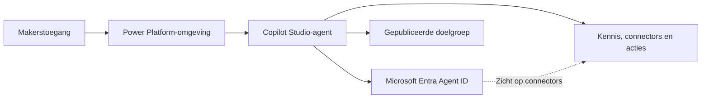

Iemand toegang geven tot Microsoft Copilot Studio kan op een licentie- of adoptiebeslissing lijken. Er wordt een licentie toegewezen, de maker krijgt toegang tot een omgeving en het experimenteren begint.

Op dit moment krijgt iedere nieuwe Copilot Studio-agent automatisch een **Microsoft Entra Agent ID**. Microsoft beschrijft deze identiteit als een **service-principal met het subtype Agent**. Copilot Studio maakt en beheert de identiteit en de bijbehorende referenties.

Makerstoegang stelt mensen daarmee in staat directory-identiteiten en toegangsroutes te maken die de organisatie moet inventariseren, beheren en uiteindelijk beëindigen.

<!-- truncate -->

## Makerstoegang creëert nieuwe identiteiten en toegangsroutes

[Microsoft Security adviseert](https://www.microsoft.com/en-us/security/blog/2026/01/20/four-priorities-for-ai-powered-identity-and-network-access-security-in-2026/) om agents te inventariseren, duidelijk eigenaarschap toe te wijzen, hun toegang te beheren en consistente beveiligingsnormen op menselijke identiteiten en agentidentiteiten toe te passen.

Dat advies wordt concreet in Copilot Studio. Een agent kan kennisbronnen, connectors, acties, HTTP-aanvragen, triggers en externe diensten gebruiken. Publicatie bepaalt wie de agent mag gebruiken. Voor de identiteiten, informatie en acties erachter zijn aanvullende toegangsbeslissingen nodig.

Het diagram is bewust geen rechte machtigingsketen. De Agent ID verbetert de zichtbaarheid van identiteit en connectors, terwijl Copilot Studio, Power Platform-beleid, verbindingen en gebruikersmachtigingen nog steeds bepalen wat er tijdens de uitvoering gebeurt.

## Wat de Agent ID zichtbaar maakt

Copilot Studio maakt en beheert de Agent ID voor nieuwe agents automatisch. Een maker ontvangt geen herbruikbaar clientgeheim of onbeperkt inzetbare service-principal.

Wanneer de agent wordt gepubliceerd, voegt Copilot Studio API-machtigingsbereiken (`permission scopes`) toe voor ondersteunde Power Platform-connectors die voor de agent zijn geconfigureerd. Dit zijn connectorscopes en geen rechtstreekse resourcemachtigingen zoals `Mail.Read` of `Files.Read.All`. Beheerders krijgen zicht op verificatieactiviteiten en geconfigureerde connectortoegang. De runtime van Power Platform-connectors controleert ondertussen nog steeds het toepasselijke connector- en gegevensbeleid.

Dit is nuttig, maar het is geen volledige inventaris van alles wat de agent kan bereiken. Aangepaste connectors, MCP-servers en REST API-tools voegen niet dezelfde API-machtigingen aan de Agent ID toe. Zichtbaarheid in Entra hoort de beoordeling in Copilot Studio en Power Platform daarom te ondersteunen en niet te vervangen.

## Behandel licenties en beveiligingsbeslissingen afzonderlijk

Copilot Studio-licenties maken een omgeving niet automatisch onveilig. De fout is om licentietoewijzing als het volledige besluit te behandelen.

Een maker kan een agent met een eigen identiteit maken en deze verbinden met informatie en mogelijkheden binnen het beleid en de machtigingen die de organisatie toestaat.

Dat zijn aparte beslissingen:

- wie agents mag bouwen;
- waar makers dat mogen doen;
- welke kennisbronnen, connectors, acties, HTTP-eindpunten en triggers zijn toegestaan;
- wie een agent mag publiceren en voor welke doelgroep;
- wie na publicatie eigenaar is en ondersteuning levert;
- hoe wijzigingen worden beoordeeld;
- wanneer de agent en zijn afhankelijkheden worden beëindigd.

Als deze beslissingen niet zijn genomen, laat brede makerstoegang de governance agent voor agent ontstaan.

## Agent Builder gebruikt een ander identiteitsmodel

Het woord *agent* verwijst niet in alle Microsoft-producten naar hetzelfde identiteitsmodel.

Op dit moment hebben agents die met Microsoft 365 Copilot Agent Builder zijn gemaakt geen app-registratie-id of Microsoft Entra Agent ID nodig. Volledige Copilot Studio-agents hebben die wel. Daarmee verdwijnt governance niet uit Agent Builder. Het zwaartepunt ligt daar op toegang tot kennis, delen, vindbaarheid en eigenaarschap.

Copilot Studio voegt omgevingen, connectors, acties, triggers, publicatiekanalen, agentidentiteiten en een aparte operationele levenscyclus toe. Het beleid hoort daarom bij de ingeschakelde mogelijkheden te passen en niet iedere agent als hetzelfde object te behandelen.

## Stel vóór een brede uitrol grenzen in

Mijn voorkeur gaat uit naar een beheerde makergroep in plaats van onbeperkte organisatiebrede makerstoegang. Geef makers een geschikte ontwikkelomgeving, pas data policies toe voordat zij publiceren en vereis een beoordeling voordat een agent een productiedoelgroep bereikt.

Die beoordeling hoort vast te stellen wie de agent beheert, wat deze mag gebruiken, wie de agent kan gebruiken, hoe toegang wordt bewaakt en wat er gebeurt wanneer de eigenaar of het doel verandert. Dit voorkomt experimenten niet. Het houdt experimenten binnen grenzen die iemand bewust heeft gekozen en kan onderhouden.

De praktische uitwerking staat in [Beheer Copilot Studio-agents voordat je makers toegang geeft](../docs/admin-and-governance/govern-copilot-studio-agents).

:::tip[Beslis voordat je makerstoegang verleent]

Bepaal voordat je makerstoegang verleent welke identiteiten, toegangsroutes en acties een maker binnen de gekozen omgeving mag maken.

:::

## Officiële Microsoft-documentatie

- [App-registratie, agentidentiteiten en verificatie voor Microsoft Copilot Studio](https://learn.microsoft.com/nl-nl/microsoft-copilot-studio/requirements-certificates-configuration-values)
- [Automatisch Microsoft Entra Agent ID's maken voor Copilot Studio-agents](https://learn.microsoft.com/nl-nl/microsoft-copilot-studio/admin-use-entra-agent-identities)
- [Beveiliging en governance in Microsoft Copilot Studio](https://learn.microsoft.com/nl-nl/microsoft-copilot-studio/security-and-governance)
- [Copilot Studio-projecten beveiligen](https://learn.microsoft.com/nl-nl/microsoft-copilot-studio/guidance/sec-gov-phase3)
- [Data policies voor agents configureren](https://learn.microsoft.com/nl-nl/microsoft-copilot-studio/admin-data-loss-prevention)
