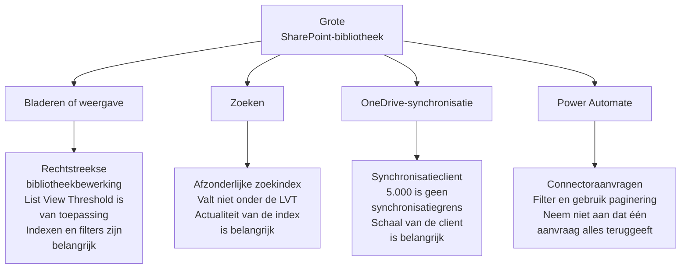

Een SharePoint-bibliotheek bereikt 5.000 bestanden, waarna een weergave niet meer werkt of een flow records mist. De bibliotheek heeft nog ruimte voor veel meer inhoud.

Volgens Microsofts [richtlijnen voor de List View Threshold](https://support.microsoft.com/nl-nl/sharepoint/lists/data-and-lists/list-view-threshold-for-large-lists-and-libraries) kan een SharePoint-lijst of -bibliotheek maximaal **30 miljoen items of bestanden** bevatten. Het bekende getal van 5.000 is de **List View Threshold**. Deze drempel begrenst hoeveel werk bepaalde databasebewerkingen, zoals een query, tegelijk kunnen uitvoeren. Microsoft merkt bovendien op dat de exacte drempel kan verschillen.

De meeste gebruikers en veel bibliotheken krijgen nooit met de List View Threshold te maken. Maar zodra een weergave, flow, migratie of wijziging van machtigingen tegen een grens aanloopt, vertelt de zichtbare foutmelding zelden het hele verhaal. Je moet eerst begrijpen welke technische route vastloopt en waarom.

Splits een bibliotheek niet alleen omdat deze meer dan 5.000 bestanden bevat. Vraag eerst hoe mensen en systemen de bestanden vinden, tonen, synchroniseren, beveiligen en verwerken.

<!-- truncate -->

## 5.000 gaat over werk en niet over opslag

De List View Threshold beschermt SharePoint tegen zware bewerkingen die de dienst voor andere gebruikers kunnen vertragen. Dat verklaart een situatie die tegenstrijdig lijkt: een grote bibliotheek werkt, maar één weergave of proces mislukt.

Daarom zijn **geïndexeerde kolommen** en gefilterde weergaven belangrijk. Met een index kan SharePoint een kleinere verzameling vinden zonder de volledige bibliotheek te controleren. Sorteren, groeperen en kolommen zoals Persoon, Opzoeken of Beheerde metagegevens kunnen een query zwaarder maken. Mappen kunnen helpen, maar geven geen vrijstelling. Ook een query binnen één map kan de drempel overschrijden. Microsoft legt deze keuzes uit in de richtlijnen voor [werken met de List View Threshold](https://support.microsoft.com/nl-nl/sharepoint/data-and-lists/working-with-the-list-view-threshold-limit-for-all-versions-of-sharepoint).

:::tip[Advies]

Houd veelgebruikte weergaven en queries klein. De bibliotheek zelf hoeft dat niet per se te zijn.

:::

Voor machtigingen gelden andere limieten. SharePoint ondersteunt maximaal **50.000 unieke machtigingsbereiken (`permission scopes`)** in een lijst of bibliotheek, terwijl Microsoft een algemene limiet van 5.000 aanbeveelt. Voor migraties adviseert Microsoft in de [richtlijnen voor machtigingen](https://learn.microsoft.com/nl-nl/sharepoint/dev/apis/migration-perm-guidance) minder dan 5.000 unieke scopes per bibliotheek. Een permission scope ontstaat wanneer inhoud de toegang niet meer van het bovenliggende niveau overneemt. Het is een extra uitzondering die iemand moet begrijpen en beoordelen. Deze limiet staat los van de List View Threshold.

## Dezelfde bibliotheek heeft verschillende grenzen

Er is geen enkele limiet voor iedere manier waarop je een bibliotheek gebruikt. Een browserweergave, Search, OneDrive Sync en Power Automate bereiken dezelfde inhoud via verschillende routes.

| Toegangspatroon | Wat is belangrijk? | Praktisch gevolg |
| --- | --- | --- |
| **Bladeren of weergave** | De query, het filter, de index, sortering, groepering en de resultaatgrootte | Maak standaard- en taakgerichte weergaven die beheersbare deelverzamelingen tonen. |
| **Zoeken** | Een afzonderlijke zoekindex die niet onder de List View Threshold valt | Gebruik Zoeken om inhoud te vinden, maar houd rekening met de tijd die nodig is om wijzigingen te indexeren. |
| **OneDrive-synchronisatie** | De schaal van de synchronisatieclient, apparaatbronnen en het totale aantal gesynchroniseerde items | Synchroniseer alleen wat het werk vereist. Bouw niet de volledige fileserver opnieuw op in Verkenner. |
| **Power Automate** | Connectorlimieten, queryontwerp, filters en paginering | Vraag een gerichte verzameling op en verwerk vervolgpaginering expliciet. |

De List View Threshold van 5.000 is **geen limiet voor OneDrive Sync**. Microsoft [adviseert op dit moment voor optimale prestaties om niet meer dan 300.000 items te synchroniseren](https://support.microsoft.com/nl-nl/onedrive/restrictions-and-limitations-in-onedrive-and-sharepoint) in alle cloudopslag samen. Dat getal gaat over de synchronisatieclient en het apparaat. Een bibliotheek met meer dan 5.000 bestanden kan synchroniseren, terwijl een slechte weergave of flow op dezelfde bibliotheek nog steeds kan mislukken.

Search volgt weer een andere route. Microsoft legt uit dat [SharePoint Search een eigen index gebruikt en niet onder de List View Threshold valt](https://support.microsoft.com/nl-nl/sharepoint/data-and-lists/working-with-the-list-view-threshold-limit-for-all-versions-of-sharepoint). Search is daarom een goede manier om inhoud in een grote bibliotheek te vinden. Het is geen realtime-hulpmiddel voor bulkverwerking, omdat een recente wijziging eerst de index moet bereiken.

## Power Automate maakt het probleem zichtbaar

Power Automate legt een zwakke query vaak bloot voordat gebruikers in de browser een probleem zien.

De SharePoint-acties **Get items** en **Get files** geven standaard 100 items terug. Je kunt **Top Count** verhogen tot 5.000. In een lijst met meer dan 5.000 items kan **Get items** geen overeenkomsten teruggeven als de passende records buiten de eerste 5.000 items staan. Microsoft adviseert voor deze situatie **pagination** (paginering) in te schakelen.

Met pagination kan de flow doorgaan met extra aanvragen. Het maakt "alles ophalen" nog geen goed ontwerp. Filter bij de bron, gebruik geschikte geïndexeerde kolommen, haal alleen op wat het proces nodig heeft en test met realistische aantallen. De [richtlijnen voor Get items en Get files](https://learn.microsoft.com/nl-nl/sharepoint/dev/business-apps/power-automate/guidance/working-with-get-items-and-get-files) beschrijven het gedrag van de connector.

Een geslaagde test met 200 items zegt weinig over een bibliotheek die naar 20.000 items groeit. De flow-eigenaar hoort filters, pagination, foutafhandeling en ondersteuning op een realistische schaal te testen.

## Een migratie kan het probleem meekopiëren

Bij een migratie van een fileserver komen deze grenzen samen. Kopieer de oude structuur zonder nieuw ontwerp en je kopieert mogelijk ook diepe mappen, uitzonderingen in NTFS-machtigingen, onduidelijk eigenaarschap en de verwachting dat iedereen alles terug naar Verkenner synchroniseert.

Microsofts [migratiegids voor fileshares](https://learn.microsoft.com/nl-nl/sharepointmigration/fileshare-to-odsp-migration-guide) begint met planning, beoordeling, herstel en voorbereiding van de doelomgeving. De migratie en onboarding van gebruikers volgen daarna. De technische kopie is niet de eerste ontwerpstap.

Gebruik bestaande NTFS-machtigingen als bewijs en niet automatisch als doelmodel. Geef de voorkeur aan duidelijke SharePoint-groepen en overgeërfde machtigingen. Geef iedere uitzondering een eigenaar en beoordelingsdatum. Microsoft staat 50.000 unieke scopes toe, maar adviseert in de [richtlijnen voor migratiemachtigingen](https://learn.microsoft.com/nl-nl/sharepoint/dev/apis/migration-perm-guidance) om onder 5.000 per bibliotheek te blijven. Een ondersteund maximum is geen verstandig ontwerpdoel.

Bedrijfseigenaren en Key Users horen te bepalen welke informatie nog nodig is, wie toegang moet hebben en hoe gebruikers deze moeten kunnen vinden. De migratieleider en het Microsoft 365-team horen verantwoordelijk te zijn voor beoordeling, voorbereiding van de bestemming, vertaling van machtigingen, tests, migratiehulpmiddelen en cut-over. Het volledige werkpatroon staat in [Van fileserver naar SharePoint: kopiëren of opnieuw organiseren?](../docs/admin-and-governance/migrate-file-server-to-sharepoint).

## Ontwerp rond de manier waarop mensen werken

Een grote bibliotheek kan goed werken. Het probleem begint wanneer niemand heeft ontworpen hoe mensen haar gebruiken of wie haar onderhoudt.

Maak deze beslissingen expliciet voordat inhoud groeit of wordt verplaatst:

| Beslissing | Primaire eigenaar | Te beantwoorden vraag |
| --- | --- | --- |
| Structuur en veelgebruikte weergaven | Bedrijfseigenaar en Key User | Hoe vinden mensen een bruikbare deelverzameling? |
| Geïndexeerde kolommen en technische configuratie | SharePoint-beheerder | Welke filters moeten op schaal blijven werken? |
| Automatisering | Flow-eigenaar | Filtert de flow bij de bron en verwerkt deze paginering? |
| Synchronisatie | Bedrijfseigenaar en IT | Wie heeft deze inhoud werkelijk in Verkenner nodig? |
| Machtigingen | Site-eigenaar en IT | Is iedere onderbreking van overerving nodig en beoordeelbaar? |
| Migratie | Migratieleider en bedrijfseigenaar | Wie beheert de verplaatsing en wie neemt het informatiebesluit? |

Gebruik [Site, bibliotheek of map](../docs/decisions/site-library-or-folder) om een structuur te kiezen en [Machtigingen en eigenaarschap](../docs/admin-and-governance/permissions-and-ownership) om verantwoordelijkheden toe te wijzen.

Laat één bekend getal niet de structuur bepalen. Controleer of iedere weergave, zoekopdracht, synchronisatiekeuze, flow en ieder machtigingsmodel het werk nog ondersteunt.

## Officiële Microsoft-documentatie

- [List View Threshold voor grote lijsten en bibliotheken](https://support.microsoft.com/nl-nl/sharepoint/lists/data-and-lists/list-view-threshold-for-large-lists-and-libraries)
- [Werken met de List View Threshold voor alle versies van SharePoint](https://support.microsoft.com/nl-nl/sharepoint/data-and-lists/working-with-the-list-view-threshold-limit-for-all-versions-of-sharepoint)
- [Richtlijnen voor Get items en Get files in Power Automate](https://learn.microsoft.com/nl-nl/sharepoint/dev/business-apps/power-automate/guidance/working-with-get-items-and-get-files)
- [Beperkingen en limieten in OneDrive en SharePoint](https://support.microsoft.com/nl-nl/onedrive/restrictions-and-limitations-in-onedrive-and-sharepoint)
- [Richtlijnen voor SharePoint-migratiemachtigingen](https://learn.microsoft.com/nl-nl/sharepoint/dev/apis/migration-perm-guidance)
- [Fileshares migreren naar SharePoint en OneDrive](https://learn.microsoft.com/nl-nl/sharepointmigration/fileshare-to-odsp-migration-guide)
