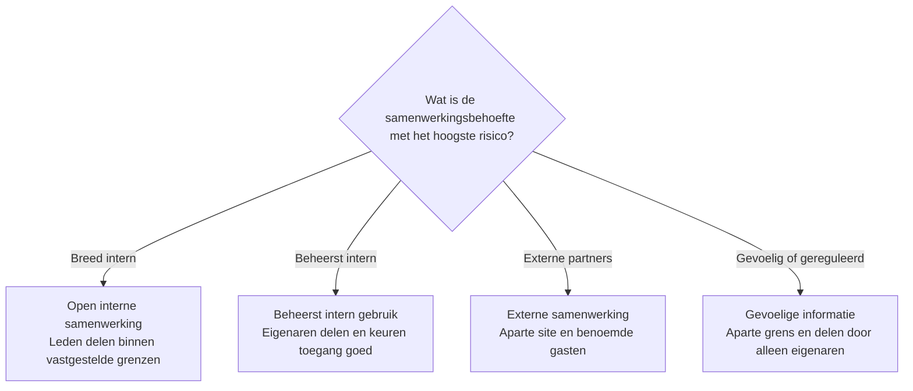

# Delen in SharePoint beheren

Houd delen beschikbaar, maar beheer het per site. SharePoint is ontworpen om mensen met gedeelde informatie te laten werken. Delen overal uitschakelen brengt de frictie van een fileserver terug, terwijl iedere gebruiker ieder item laten delen toegang kan opleveren die niemand kan uitleggen of beoordelen.

Bepaal voordat een site in gebruik gaat wie mag delen, met wie, via welk type koppeling en volgens welk beoordelingsproces.

## Begin met het site- en eigenaarschapsmodel

Inhoud naar SharePoint in plaats van Teams verplaatsen kan organisatorisch beheerd eigenaarschap ondersteunen, maar SharePoint garandeert dat model niet vanzelf. Het sitetype en de werkafspraken bepalen wie toegang beheert:

- beheer eigenaren en leden van een groepsgekoppelde teamsite primair via de Microsoft 365-groep of het Team;
- beheer een communicatiesite of andere niet-groepsgekoppelde site via de SharePoint-groepen Eigenaren, Leden en Bezoekers;
- gebruik centraal beheerde Microsoft Entra-beveiligingsgroepen wanneer lidmaatschap een gezaghebbend organisatieproces moet volgen;
- behoud minimaal twee geschikte eigenaren en leg vast wie toegang en uitzonderingen op delen mag goedkeuren.

Beheer een groepsgekoppelde site niet alsof deze losstaat van de Microsoft 365-groep. Gebruikers die rechtstreeks aan de SharePoint-site zijn toegevoegd, krijgen niet automatisch toegang tot de andere groepsdiensten. Bekijk [delen en machtigingen in de moderne SharePoint-ervaring](https://learn.microsoft.com/nl-nl/sharepoint/modern-experience-sharing-permissions).

## Kies een deelpatroon

| Informatiepatroon | Aanbevolen model voor lidmaatschap en delen |
| --- | --- |
| Open interne samenwerking | Laat leden delen binnen vastgestelde tenant- en sitegrenzen. Gebruik groepen en overgeërfde toegang voor de vaste doelgroep. |
| Beheerst intern gebruik | Laat eigenaren bestanden, mappen en de site delen. Stuur toegangsaanvragen naar verantwoordelijke eigenaren en gebruik benoemde groepen voor terugkerende toegang. |
| Externe samenwerking | Gebruik een aparte site met een duidelijke eigenaar. Geef de voorkeur aan benoemde ontvangers, beoordeel gasten en koppelingen, stel einddatums in en beperk waar nodig partnerdomeinen. |
| Gevoelige of gereguleerde informatie | Gebruik een aparte beveiligingsgrens, schakel extern delen uit, beperk delen tot eigenaren en voeg toepasselijke Purview- of sitetoegangsmaatregelen toe. |

Het patroon is een governancekeuze, geen permanente producteigenschap. Beoordeel het opnieuw wanneer het doel, de doelgroep, de gevoeligheid of de eigenaar verandert.

## Pas beheersmaatregelen in lagen toe

Gebruik de minst complexe combinatie die een uitlegbaar resultaat oplevert:

1. **Tenantinstellingen** bepalen het meest ruime deelniveau dat voor SharePoint en OneDrive beschikbaar is.
2. **Site-instellingen** kunnen strenger zijn voor extern delen, het verlopen van gasttoegang, het standaardtype koppeling en de standaardmachtiging.
3. **Lidmaatschap** geeft de vaste doelgroep toegang via Microsoft 365-groepen, SharePoint-groepen of Microsoft Entra-beveiligingsgroepen.
4. **Deelmachtigingen** bepalen of leden bestanden en mappen mogen delen of dat alleen site-eigenaren mogen delen en toegangsaanvragen verwerken.
5. **Informatiebeveiliging** kan gevoelige activiteiten classificeren, beschermen, bewaken of beperken.

Een site-instelling kan niet ruimer zijn dan de tenantinstelling. Gebruik [deelinstellingen op siteniveau](https://learn.microsoft.com/nl-nl/sharepoint/change-external-sharing-site) en [instellingen voor toegangsaanvragen](https://support.microsoft.com/nl-nl/sharepoint/sharepoint-sharing-and-permissions/set-up-and-manage-access-requests) om het gekozen patroon in te richten.

## Begrijp deelkoppelingen

| Type koppeling | Gevolg voor toegang | Belangrijkste aandachtspunt |
| --- | --- | --- |
| **Personen met bestaande toegang** | Verleent geen nieuwe toegang | Ontvangers hebben nog steeds toegang nodig via lidmaatschap of een andere machtiging. |
| **Specifieke personen** | Verleent alleen toegang aan de benoemde ontvangers | Beoordeel de benoemde toegang wanneer het werk of de relatie eindigt. |
| **Personen in uw organisatie** | Verleent toegang aan iedereen in de organisatie die de koppeling ontvangt | Een doorgestuurde koppeling kan een veel bredere interne doelgroep bereiken dan de eigenaar bedoelde. |
| **Iedereen** | Verleent anonieme toegang aan iedereen die de koppeling ontvangt | Ontvangers melden zich niet aan, waardoor toegang niet betrouwbaar aan een persoon kan worden gekoppeld. |

Stel voor iedere site de veiligste werkbare standaard in. Een standaard vermindert fouten, maar is niet altijd een harde beveiligingsgrens omdat een gebruiker vóór het delen mogelijk een ander toegestaan type koppeling kan kiezen.

:::warning[Maak geen web van machtigingen]

Een bestand of map delen kan een uniek machtigingsbereik maken dat de bovenliggende machtigingen niet meer volgt. Gebruik bij voorkeur groepen en overgeërfde machtigingen voor terugkerende toegang. Wanneer inhoud structureel een andere doelgroep of eigenaar nodig heeft, gebruik dan een aparte site in plaats van een diepe structuur met uitzonderingen.

Bekijk Microsofts [richtlijnen voor het beheren van machtigingsbereiken](https://learn.microsoft.com/nl-nl/sharepoint/manage-permission-scope).

:::

## Scheid basis- en geavanceerde maatregelen

Gebruik eerst de basismaatregelen:

- duidelijke sitegrenzen en verantwoordelijke eigenaren;
- SharePoint-, Microsoft 365- of Microsoft Entra-groepen;
- overgeërfde machtigingen;
- delen door alleen eigenaren waar het risico dit vereist;
- toegangsaanvragen, instellingen voor extern delen en veilige koppelingsstandaarden;
- een uitzonderingsproces en geplande beoordeling.

Voeg mogelijkheden met aanvullende licentie toe wanneer risico en schaal dit rechtvaardigen:

- Microsoft Purview-gevoeligheidslabels kunnen ondersteunde site- en deelinstellingen configureren;
- Data Loss Prevention kan geconfigureerde gevoelige activiteiten registreren, waarschuwen, beperken of blokkeren;
- rapporten voor data access governance kunnen brede of directe toegang helpen vinden;
- Restricted Access Control kan vereisen dat gebruikers zowel een normale machtiging als lidmaatschap van een goedgekeurde controlegroep hebben.

Restricted Access Control vereist SharePoint Advanced Management. De maatregel kan toegang via een rechtstreekse machtiging of gedeelde koppeling blokkeren voor gebruikers buiten de goedgekeurde groep. Zoeken en Copilot respecteren deze beperking. Controleer de vereisten in de [documentatie voor Restricted Access Control](https://learn.microsoft.com/nl-nl/sharepoint/restricted-access-control).

Purview voegt classificatie en bescherming toe, maar herstelt geen onduidelijk eigenaarschap of te ruime machtigingen. Een label op een site of groep labelt niet automatisch de bestanden erin. Een label kan waar nuttig een veiliger standaardtype deelkoppeling instellen voor ondersteunde sites of documenten, maar gebruikers kunnen mogelijk nog steeds een andere toegestane optie kiezen. Bekijk [standaarddeelkoppelingen met gevoeligheidslabels](https://learn.microsoft.com/nl-nl/purview/sensitivity-labels-default-sharing-link) en [gevoeligheidslabels voor groepen en sites](https://learn.microsoft.com/nl-nl/purview/sensitivity-labels-teams-groups-sites).

## Bescherm downloads en gesynchroniseerde kopieën

Cloudtoegang en lokale toegang zijn verschillende beheerspunten. Files On-Demand kan inhoud online houden totdat deze wordt geopend, maar gebruikers kunnen bestanden offline beschikbaar maken en applicaties kunnen bestanden die alleen online staan automatisch downloaden. SharePoint-machtigingen blijven een gewone gedownloade kopie niet per definitie beschermen.

Gebruik eisen voor beheerde apparaten, apparaatversleuteling, schermvergrendeling, acties op afstand bij incidenten en beperkingen voor onbeheerde apparaten als basis. Overweeg voor gevoelige informatie versleutelde gevoeligheidslabels, Endpoint DLP of de gelicentieerde SharePoint-bibliotheekoptie die actuele SharePoint-machtigingen uitbreidt naar gedownloade, gekopieerde of verplaatste bestanden. Test ondersteunde bestandstypen en applicaties; classificatie zonder versleuteling is geen blijvende toegangsbeveiliging.

Schakel synchronisatie niet standaard voor iedere site in. Keur haar goed voor een vastgelegd werkpatroon, gebruik Files On-Demand, beoordeel actuele item- en padlimieten en neem het verwijderen van lokale kopieën op in processen voor uitdiensttreding en verloren apparaten. De [migratiegids voor fileservers](./migrate-file-server-to-sharepoint.md) bevat de operationele checklist.

## Beoordeel eigenaarschap en toegang

Leg de operationele verantwoordelijkheden vast:

- de **bedrijfseigenaar** bepaalt de bedoelde doelgroep en aanvaardbare manier van delen;
- de **site-eigenaren** beheren goedgekeurde toegang, aanvragen, koppelingen en uitzonderingen;
- **IT** configureert tenant- en sitegrenzen, rapportage, ondersteuning en escalatie;
- **identitymanagement** onderhoudt gezaghebbende identiteiten en beheerd groepslidmaatschap;
- de **informatie- of compliance-eigenaar** bepaalt aanvullende eisen voor classificatie, bescherming, bewaring en bewijs.

Bevestig op de afgesproken beoordelingsdatum:

- dat de site nog een geldig doel en minimaal twee geschikte eigenaren heeft;
- dat leden, bezoekers, gasten en rechtstreekse toegang nog gerechtvaardigd zijn;
- dat deelkoppelingen en toegangsaanvragen verantwoordelijke eigenaren hebben;
- dat unieke machtigingen en uitzonderingen nog nodig zijn;
- dat instellingen voor extern delen, koppelingsstandaarden en gevoeligheid nog bij de inhoud passen;
- dat inactieve of verouderde informatie een goedgekeurd levenscyclusbesluit heeft.

## Bereid voor op Copilot en zoeken

Microsoft 365 Copilot en zoeken in de hele organisatie respecteren bestaande machtigingen. Zij verlenen geen nieuwe toegang, maar kunnen informatie waartoe een gebruiker al toegang heeft gemakkelijker vindbaar en herbruikbaar maken.

Vind vóór een brede Copilot-uitrol eigenaarloze of inactieve sites, brede organisatietoegang, rechtstreekse machtigingen, oude koppelingen, gasten en gevoelige informatie met zwakke bescherming. Herstel eerst toegang en delen en gebruik Purview en toepasselijke SharePoint-governancemogelijkheden daarna als aanvullende waarborgen. Volg Microsofts [veilige en beheerste databasis voor Copilot](https://learn.microsoft.com/nl-nl/microsoft-365/copilot/secure-govern-copilot-foundational-deployment-guidance).

## Officiële Microsoft-documentatie

- [Delen en machtigingen in de moderne SharePoint-ervaring](https://learn.microsoft.com/nl-nl/sharepoint/modern-experience-sharing-permissions)
- [De deelinstellingen voor een site wijzigen](https://learn.microsoft.com/nl-nl/sharepoint/change-external-sharing-site)
- [Toegangsaanvragen instellen en beheren](https://support.microsoft.com/nl-nl/sharepoint/sharepoint-sharing-and-permissions/set-up-and-manage-access-requests)
- [Machtigingsbereiken in SharePoint beheren](https://learn.microsoft.com/nl-nl/sharepoint/manage-permission-scope)
- [Toegang tot SharePoint-sites beperken](https://learn.microsoft.com/nl-nl/sharepoint/restricted-access-control)
- [Gevoeligheidslabels gebruiken om de standaarddeelkoppeling te configureren](https://learn.microsoft.com/nl-nl/purview/sensitivity-labels-default-sharing-link)
- [Toegang vanaf onbeheerde apparaten beheren](https://learn.microsoft.com/nl-nl/sharepoint/control-access-from-unmanaged-devices)
- [SharePoint-machtigingen uitbreiden naar gedownloade documenten](https://learn.microsoft.com/nl-nl/purview/sensitivity-labels-sharepoint-extend-permissions)
- [Meer informatie over Endpoint Data Loss Prevention](https://learn.microsoft.com/nl-nl/purview/endpoint-dlp-learn-about)
- [Beperkingen en limieten in OneDrive en SharePoint](https://support.microsoft.com/nl-nl/onedrive/restrictions-and-limitations-in-onedrive-and-sharepoint)

## Gerelateerde gidsen

- [Machtigingen en eigenaarschap](./permissions-and-ownership.md)
- [Extern delen](./external-sharing.md)
- [Van fileserver naar SharePoint: kopiëren of opnieuw organiseren?](./migrate-file-server-to-sharepoint.md)
- [SharePoint-inhoud: sites, bibliotheken, lijsten en machtigingen](../services/sharepoint/sharepoint-content-structure.md)
- [Welke Microsoft Purview-oplossing moet je gebruiken?](../decisions/which-purview-solution-should-you-use.md)
