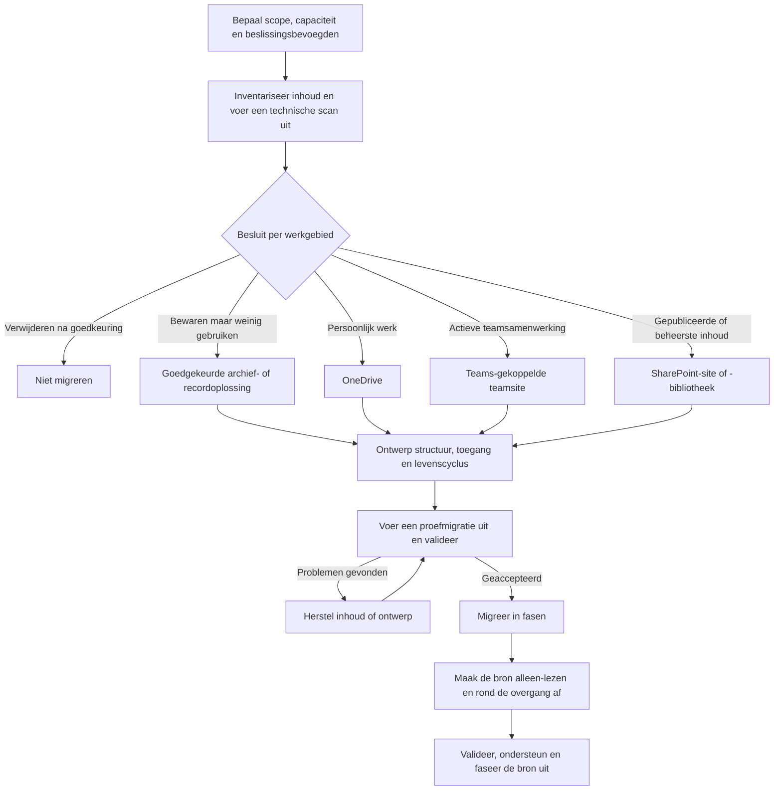

# Van fileserver naar SharePoint: kopiëren of opnieuw organiseren?

Organiseer opnieuw voordat je migreert. Een fileserver is meestal ingericht rond schijven, mappen en overgeërfde machtigingen. SharePoint werkt het beste wanneer de structuur aansluit op doel, eigenaarschap, samenwerking, toegang en de levenscyclus van informatie.

Een migratie is daarom een informatie- en adoptieproject dat door techniek wordt ondersteund, niet alleen een kopieeractie.

## Aanbevolen aanpak

Migreer niet eerst alles om pas daarna over de inrichting na te denken. Werk in beheersbare gebieden, zoals een afdeling, proces of project. Bepaal per gebied wat behouden moet blijven, wie eigenaar is, waar de informatie thuishoort en hoe mensen na de verhuizing gaan werken.

> Verplaats niet automatisch de bestaande chaos naar een nieuw platform.

## Migratiestroom

## Reserveer tijd en capaciteit

Een planning die alleen op het aantal bestanden en de overdrachtssnelheid is gebaseerd, is onvolledig. De technische kopie is maar één onderdeel van het werk. Reserveer mensen en werktijd voor:

- inventarisatie en workshops waarin inhoudelijke besluiten worden genomen;
- eigenaren die hun informatie beoordelen, opnieuw indelen en goedkeuren;
- het ontwerp van de doelstructuur, toegang, bewaarbeleid en beveiliging;
- herstel van bestanden, koppelingen, identiteiten en applicatieafhankelijkheden;
- de proefmigratie, feedback en aanpassingen aan het ontwerp;
- communicatie, taakgerichte training en instructies per doelgroep;
- validatie van de overgang, gebruikersondersteuning en verbeteringen na de migratie.

Dit zijn geplande projectactiviteiten, geen taken die eigenaren en Key Users naast hun gewone werk moeten zien in te passen. Spreek beslistermijnen en escalatieroutes af en geef iedere migratiefase ruimte voor bevindingen uit de vorige fase. Gebruik de proefmigratie om de benodigde tijd voor beoordeling en ondersteuning te schatten; het aantal bestanden voorspelt die inspanning niet.

Als de mensen met kennis van de inhoud geen gereserveerde capaciteit hebben, wacht de migratie op besluiten terwijl de techniek al klaarstaat.

## 1. Bepaal scope en beslissingsbevoegdheid

Begin bij de mensen die inhoudelijke besluiten kunnen nemen. Een migratieteam kan niet zelf bepalen of een oud contract mag worden verwijderd of dat een projectmap een aparte site moet worden.

Wijs per migratiegebied aan:

- een **bedrijfseigenaar** die bepaalt wat nodig is en wie toegang moet hebben;
- een **migratieleider** die scans, proefmigraties, fasen en probleemafhandeling plant;
- een **IT- of Microsoft 365-eigenaar** die bestemmingen, identiteiten, beveiliging en ondersteuning voorbereidt;
- een **contactpersoon voor recordmanagement, juridische zaken of beveiliging** wanneer bewaartermijnen, vertrouwelijkheid of regelgeving van toepassing zijn.

Leg voor verwijdering, archivering, bestemming en afwijkende toegang het besluit, de goedkeurder en de datum vast. Zo wordt het technisch team niet onbedoeld eigenaar van bedrijfsinformatie.

## 2. Inventariseer en beoordeel de bron

Gebruik twee aanvullende beoordelingen. De bedrijfsinventarisatie beschrijft wat de inhoud betekent; de technische scan laat zien wat kan mislukken of moet worden hersteld.

| Bedrijfsinventarisatie | Technische inventarisatie |
| --- | --- |
| Eigenaar en gebruikers | Aantal bestanden en mappen |
| Doel en documentsoorten | Totale omvang en grote bestanden |
| Actief, historisch of verouderd | Datum laatste wijziging |
| Vertrouwelijkheid en bewaarbehoefte | Padlengte, namen en bestandstypen |
| Benodigde toegang | Bestaande bronmachtigingen |
| Bedrijfsapplicaties en processen | Koppelingen, macro's en andere afhankelijkheden |

Behandel bestaande machtigingen als informatiebron, niet als het doelontwerp. Jaren aan uitzonderingen en individuele toegangsregels kunnen de bedoelde doelgroep verbergen. Laat de eigenaar bevestigen wie in de nieuwe locatie lees-, bewerk- of eigenaarsrechten nodig heeft.

[Microsoft Migration Manager kan fileshares scannen en beoordelen](https://learn.microsoft.com/en-us/sharepointmigration/mm-fileshare-scan-assess) en vóór de migratie overzichtsrapporten en gedetailleerde logboeken maken. Gebruik de resultaten om technische blokkades te vinden, maar verwacht niet dat een scan eigenaarschap, waarde of bewaarbehoefte voor je bepaalt.

## 3. Bepaal de bestemming

Kies een bestemming per samenhangend werkgebied, niet in één keer voor de hele schijf.

| Informatiepatroon | Aanbevolen bestemming |
| --- | --- |
| Werkbestanden van één persoon die nog geen onderdeel van een teamproces zijn | OneDrive |
| Documenten die een afgebakende groep actief maakt en onderhoudt | Een aan Teams gekoppelde SharePoint-teamsite |
| Gepubliceerde naslaginformatie voor een brede doelgroep | Een SharePoint-communicatiesite |
| Formele documenten met een vastgelegd proces, eigenaar en toegangsmodel | Een beheerste SharePoint-site of documentbibliotheek |
| Informatie die bewaard moet blijven maar weinig wordt gebruikt | Een goedgekeurde record- of archiefoplossing op basis van bewaar- en toegangseisen |
| Verouderde, dubbele of eigenaarloze inhoud waarvan verwijdering is goedgekeurd | Niet migreren |

OneDrive, Teams en SharePoint zijn geen onderling verwisselbare mappen. De bestemming bepaalt eigenaarschap, levenscyclus, toegang en hoe mensen de informatie vinden en gebruiken. Bekijk [Waar moet dit bestand staan?](../decisions/where-should-this-file-live.md) voor de onderliggende keuze.

:::warning[Archiveren is een levenscyclusbesluit]

Noem inhoud niet automatisch een archief omdat niemand haar gebruikt. Bevestig de eigenaar, vereiste bewaartermijn, toegangsbehoefte, juridische bewaarplichten en het goedgekeurde verwijderproces. Configureer [Microsoft Purview-bewaarbeleid voor SharePoint en OneDrive](https://learn.microsoft.com/en-us/purview/retention-policies-sharepoint) waar beleid of regelgeving dit vereist.

:::

## 4. Ontwerp de nieuwe structuur en toegang

Maak niet automatisch van iedere bovenliggende map een site. Maak een site wanneer inhoud een duidelijk doel, een eigenaar, een doelgroep en een gezamenlijke levenscyclus heeft. Gebruik een aparte site wanneer de beveiligingsgrens of het eigenaarschap wezenlijk anders is.

Gebruik [Site, bibliotheek of map: waar organiseer je documenten?](../decisions/site-library-or-folder.md) om dit ontwerp te doorlopen voordat je migratiebestemmingen maakt.

Binnen een site:

- gebruik je documentbibliotheken voor verschillende inhoudsverzamelingen of beheerregels;
- houd je mappen begrijpelijk en redelijk ondiep;
- voeg je metadata toe wanneer mensen documenten over mappen heen moeten filteren, groeperen, zoeken of beheren;
- geef je de voorkeur aan groepen en overgeërfde machtigingen boven individuele toegang en veel uitzonderingen;
- wijs je voor belangrijke werkomgevingen ten minste twee geschikte eigenaren aan;
- spreek je vóór de migratie naamgeving, navigatie, versiebeheer, delen, bewaarbeleid en evaluatie af.

Het doel is niet om iedere map af te schaffen. De structuur moet uit te leggen zijn aan een nieuwe medewerker zonder kennis van de oude schijf.

## 5. Ruim op en herstel problemen

Laat de bedrijfseigenaar goedkeuren of inhoud moet worden gemigreerd, gearchiveerd of verwijderd. Onderzoek inhoud die:

- dubbel, verouderd of eigenaarloos is;
- binnen de afgesproken beoordelingsperiode niet is gebruikt;
- niet kan worden geopend of met een wachtwoord is beveiligd;
- afhankelijk is van gekoppelde stations, vaste paden, snelkoppelingen, macro's of applicaties;
- namen, typen, formaten of paden heeft die als migratieprobleem zijn gemeld;
- machtigingen heeft die niet aan actieve Microsoft 365-identiteiten kunnen worden gekoppeld.

Gebruik de laatste wijzigingsdatum niet als enige verwijderregel. Sommige records worden zelden geopend, maar moeten wel worden bewaard. Andersom is een recent gewijzigd duplicaat niet automatisch waardevol.

## 6. Voer een proefmigratie uit met een representatieve groep

Kies een proefmigratie met realistische complexiteit: mappen, Office-bestanden, bijzondere machtigingen, koppelingen, grotere bestanden en gebruikers met verschillende werkpatronen. Een technisch eenvoudige map bewijst weinig.

Valideer ten minste:

- aantallen bestanden en migratierapporten;
- namen, paden en of documenten correct openen;
- toegang voor eigenaren, leden, bezoekers en uitzonderingssituaties;
- het gedrag van Word, PowerPoint en Excel, inclusief externe koppelingen en macro's;
- OneDrive-synchronisatie, maar alleen waar synchronisatie onderdeel van het bedoelde werkpatroon is;
- zoeken, metadata, weergaven en navigatie;
- deel- en goedkeuringsprocessen;
- gebruikersinstructies, de gereedheid van ondersteuning en acceptatie door de eigenaar.

[Microsofts migratierichtlijnen voor fileshares](https://learn.microsoft.com/en-us/sharepointmigration/fileshare-to-odsp-migration-guide) adviseren een incrementele proefmigratie gevolgd door een cut-over. Gebruik de bevindingen om het doelontwerp, de herstelregels, communicatie en faseplanning bij te werken voordat je opschaalt.

## 7. Migreer in fasen en rond de overgang af

Migreer per werkgebied, zodat iedere fase een verantwoordelijke eigenaar en bekende doelgroep heeft. Een gebruikelijke fase bevat deze controlepunten:

1. De eigenaar keurt de inhoudslijst, bestemming en het toegangsmodel goed.
2. IT lost scanbevindingen op en bereidt de bestemming voor.
3. Het migratieteam voert een eerste of incrementele kopie uit.
4. Gebruikers valideren de bestemming vóór de afgesproken deadline.
5. De bron wordt alleen-lezen, de laatste wijzigingen worden gemigreerd en gebruikers stappen over op Microsoft 365.
6. Het team valideert rapporten, machtigingen, kritieke bestanden en bedrijfsprocessen.
7. Ondersteuning registreert openstaande problemen en bevestigt wanneer de bron kan worden uitgefaseerd.

Communiceer vooraf het overgangsmoment, de regels voor de schrijfstops, de nieuwe locatie, de ondersteuningsroute en de terugvalcriteria. Laat beide locaties niet langdurig beschrijfbaar; dubbele werkkopieën maken onduidelijk welke versie leidend is.

## Wanneer is de migratie klaar?

Een fase is afgerond wanneer:

- de bedrijfseigenaar de inhoud, structuur en toegang heeft geaccepteerd;
- migratierapporten zijn beoordeeld en afwijkingen een eigenaar hebben;
- gebruikers weten waar ze documenten vinden en opslaan en hoe ze deze delen;
- kritieke koppelingen en processen zijn getest of bewust vervangen;
- bewaarbeleid, evaluatie en eigenaarschap van de werkomgeving zijn vastgelegd;
- de oude locatie volgens plan alleen-lezen of uitgefaseerd is;
- een datum voor evaluatie na de migratie is gepland.

Meet succes aan vindbaarheid, juiste toegang, acceptatie door de eigenaar, continuïteit van processen en afgenomen gebruik van de fileserver, niet alleen aan het aantal gekopieerde bestanden.

:::warning[Veelgemaakte migratiefouten]

- Alles één op één kopiëren.
- Van iedere bovenliggende map een site maken.
- Machtigingen pas na de migratie beoordelen.
- Oude en nieuwe opslag te lang beide beschrijfbaar laten.
- Excel-koppelingen, macro's, snelkoppelingen en applicatieafhankelijkheden missen.
- Adoptie pas na de technische migratie oppakken, waardoor gebruikers geen duidelijk nieuw werkpatroon hebben en terugvallen op de fileserver of lokale kopieën.
- Alleen de technische migratiepartner verantwoordelijk maken.
- Het aantal gekopieerde items als definitie van succes gebruiken.

:::

## Officiële Microsoft-documentatie

- [Overzicht van Migration Manager voor fileshares](https://learn.microsoft.com/en-us/sharepointmigration/mm-get-started)
- [Fileshares scannen en beoordelen met Migration Manager](https://learn.microsoft.com/en-us/sharepointmigration/mm-fileshare-scan-assess)
- [Microsofts planningsgids voor de migratie van fileshares](https://learn.microsoft.com/en-us/sharepointmigration/fileshare-to-odsp-migration-guide)
- [Informatiearchitectuur in modern SharePoint](https://learn.microsoft.com/en-us/sharepoint/information-architecture-modern-experience)
- [Bewaarbeleid voor SharePoint en OneDrive](https://learn.microsoft.com/en-us/purview/retention-policies-sharepoint)
- [Servicelimieten van SharePoint](https://learn.microsoft.com/en-us/office365/servicedescriptions/sharepoint-online-service-description/sharepoint-online-limits)

## Gerelateerde gidsen

- [Waar moet dit bestand staan?](../decisions/where-should-this-file-live.md)
- [Site, bibliotheek of map: waar organiseer je documenten?](../decisions/site-library-or-folder.md)
- [SharePoint-inhoud: sites, bibliotheken, lijsten en machtigingen](../services/sharepoint/sharepoint-content-structure.md)
- [Machtigingen en eigenaarschap](./permissions-and-ownership.md)
- [Samenwerken aan documenten](../scenarios/collaborate-on-documents.md)
