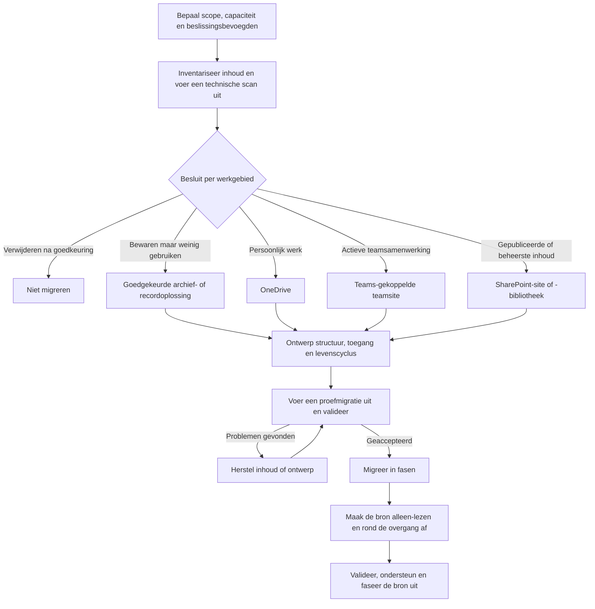
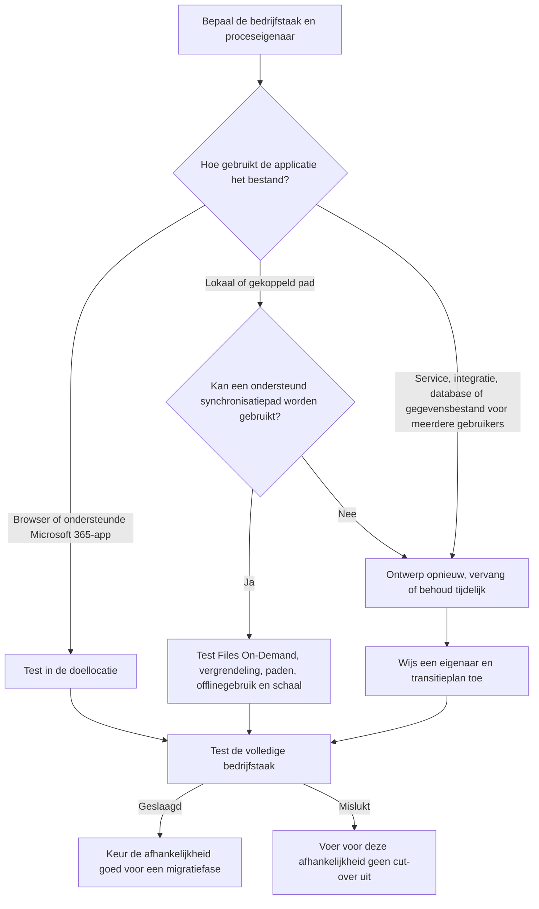

# Van fileserver naar SharePoint: kopiëren of opnieuw organiseren?

Organiseer opnieuw voordat je migreert. Een fileserver is meestal ingericht rond schijven, mappen en overgeërfde machtigingen. SharePoint werkt het beste wanneer de structuur aansluit op doel, eigenaarschap, samenwerking, toegang en de levenscyclus van informatie.

Een migratie is daarom een informatie- en adoptieproject dat door techniek wordt ondersteund, niet alleen een kopieeractie.

## Aanbevolen aanpak

Migreer niet eerst alles om pas daarna over de inrichting na te denken. Werk in beheersbare gebieden, zoals een afdeling, proces of project. Bepaal per gebied wat behouden moet blijven, wie eigenaar is, waar de informatie thuishoort en hoe mensen na de verhuizing gaan werken.

> Verplaats niet automatisch de bestaande chaos naar een nieuw platform.

## Migratiestroom

```mermaid
flowchart TD
    Scope[Bepaal scope, capaciteit en beslissingsbevoegden] --> Assess[Inventariseer inhoud en voer een technische scan uit]
    Assess --> Decide{Besluit per werkgebied}
    Decide -->|Verwijderen na goedkeuring| Delete[Niet migreren]
    Decide -->|Bewaren maar weinig gebruiken| Archive[Goedgekeurde archief- of recordoplossing]
    Decide -->|Persoonlijk werk| OneDrive[OneDrive]
    Decide -->|Actieve teamsamenwerking| Team[Teams-gekoppelde teamsite]
    Decide -->|Gepubliceerde of beheerste inhoud| SharePoint[SharePoint-site of -bibliotheek]

    Archive --> Design[Ontwerp structuur, toegang en levenscyclus]
    OneDrive --> Design
    Team --> Design
    SharePoint --> Design
    Design --> Pilot[Voer een proefmigratie uit en valideer]
    Pilot -->|Problemen gevonden| Fix[Herstel inhoud of ontwerp]
    Fix --> Pilot
    Pilot -->|Geaccepteerd| Waves[Migreer in fasen]
    Waves --> Cutover[Maak de bron alleen-lezen en rond de overgang af]
    Cutover --> Review[Valideer, ondersteun en faseer de bron uit]
```

## Reserveer tijd en capaciteit

Een planning die alleen op het aantal bestanden en de overdrachtssnelheid is gebaseerd, is onvolledig. De technische kopie is maar één onderdeel van het werk. Reserveer mensen en werktijd voor:

- inventarisatie en workshops waarin inhoudelijke besluiten worden genomen;
- eigenaren die hun informatie beoordelen, opnieuw indelen en goedkeuren;
- het ontwerp van de doelstructuur, toegang, bewaarbeleid en beveiliging;
- herstel van bestanden, koppelingen, identiteiten en applicatieafhankelijkheden;
- de proefmigratie, feedback en aanpassingen aan het ontwerp;
- communicatie, taakgerichte training en instructies per doelgroep;
- validatie van de overgang, gebruikersondersteuning en verbeteringen na de migratie.

Dit zijn geplande projectactiviteiten, geen taken die eigenaren en Key Users naast hun gewone werk moeten zien in te passen. Spreek beslistermijnen en escalatieroutes af en geef iedere migratiefase ruimte voor bevindingen uit de vorige fase. Gebruik de proefmigratie om de benodigde tijd voor beoordeling en ondersteuning te schatten; het aantal bestanden voorspelt die inspanning niet.

Als de mensen met kennis van de inhoud geen gereserveerde capaciteit hebben, wacht de migratie op besluiten terwijl de techniek al klaarstaat.

## 1. Bepaal scope en beslissingsbevoegdheid

Begin bij de mensen die inhoudelijke besluiten kunnen nemen. Een migratieteam kan niet zelf bepalen of een oud contract mag worden verwijderd of dat een projectmap een aparte site moet worden.

Wijs per migratiegebied aan:

- een **bedrijfseigenaar** die bepaalt wat nodig is en wie toegang moet hebben;
- een **migratieleider** die scans, proefmigraties, fasen en probleemafhandeling plant;
- een **IT- of Microsoft 365-eigenaar** die bestemmingen, identiteiten, beveiliging en ondersteuning voorbereidt;
- een **contactpersoon voor recordmanagement, juridische zaken of beveiliging** wanneer bewaartermijnen, vertrouwelijkheid of regelgeving van toepassing zijn.

Leg voor verwijdering, archivering, bestemming en afwijkende toegang het besluit, de goedkeurder en de datum vast. Zo wordt het technisch team niet onbedoeld eigenaar van bedrijfsinformatie.

## 2. Inventariseer en beoordeel de bron

Gebruik twee aanvullende beoordelingen. De bedrijfsinventarisatie beschrijft wat de inhoud betekent; de technische scan laat zien wat kan mislukken of moet worden hersteld.

| Bedrijfsinventarisatie | Technische inventarisatie |
| --- | --- |
| Eigenaar en gebruikers | Aantal bestanden en mappen |
| Doel en documentsoorten | Totale omvang en grote bestanden |
| Actief, historisch of verouderd | Datum laatste wijziging |
| Vertrouwelijkheid en bewaarbehoefte | Padlengte, namen en bestandstypen |
| Benodigde toegang | Bestaande bronmachtigingen |
| Bedrijfsapplicaties en processen | Koppelingen, macro's en andere afhankelijkheden |

Behandel bestaande machtigingen als informatiebron, niet als het doelontwerp. Jaren aan uitzonderingen en individuele toegangsregels kunnen de bedoelde doelgroep verbergen. Laat de eigenaar bevestigen wie in de nieuwe locatie lees-, bewerk- of eigenaarsrechten nodig heeft.

[Microsoft Migration Manager kan fileshares scannen en beoordelen](https://learn.microsoft.com/nl-nl/sharepointmigration/mm-fileshare-scan-assess) en vóór de migratie overzichtsrapporten en gedetailleerde logboeken maken. Gebruik de resultaten om technische blokkades te vinden, maar verwacht niet dat een scan eigenaarschap, waarde of bewaarbehoefte voor je bepaalt.

### Breng afhankelijkheden van werkprocessen in kaart

Een bestandsinventarisatie laat niet zien hoe een bedrijfsproces een bestand gebruikt. Applicaties buiten de Microsoft Office-familie verwachten vaak een lokaal of gekoppeld pad, een vaste mapnaam, exclusieve bestandsvergrendeling of een serviceaccount. Een synchronisatieclient kan in sommige gevallen een lokaal pad leveren, maar maakt niet iedere bestandsapplicatie geschikt voor de cloud.

Volg ieder kritisch proces van taak naar applicatie, bestand, identiteit en pad. Test de volledige taak en controleer niet alleen of het gemigreerde bestand opent.

```mermaid
flowchart TD
    Process[Bepaal de bedrijfstaak en proceseigenaar] --> Use{Hoe gebruikt de applicatie het bestand?}
    Use -->|Browser of ondersteunde Microsoft 365-app| Cloud[Test in de doellocatie]
    Use -->|Lokaal of gekoppeld pad| Local{Kan een ondersteund synchronisatiepad worden gebruikt?}
    Use -->|Service, integratie, database of gegevensbestand voor meerdere gebruikers| Redesign[Ontwerp opnieuw, vervang of behoud tijdelijk]
    Local -->|Ja| Sync[Test Files On-Demand, vergrendeling, paden, offlinegebruik en schaal]
    Local -->|Nee| Redesign
    Cloud --> Task[Test de volledige bedrijfstaak]
    Sync --> Task
    Redesign --> Plan[Wijs een eigenaar en transitieplan toe]
    Plan --> Task
    Task -->|Geslaagd| Approve[Keur de afhankelijkheid goed voor een migratiefase]
    Task -->|Mislukt| Block[Voer voor deze afhankelijkheid geen cut-over uit]
```

Rond deze checklist af voordat je de betreffende migratiefase plant:

- [ ] Benoem de proceseigenaar, gebruikers, kriticiteit en aanvaardbare uitvalduur.
- [ ] Leg iedere applicatie, automatisering, macro, integratie, serviceaccount en geplande taak vast die de bestanden leest of schrijft.
- [ ] Leg gekoppelde stations, vaste paden, snelkoppelingen, invoermappen, uitvoermappen en ingesloten koppelingen vast.
- [ ] Test gelijktijdig gebruik, bestandsvergrendeling, offlinegebruik, Files On-Demand en het doelpad met de echte applicatie.
- [ ] Kies en keur één uitkomst goed: gebruik de browser, gebruik een ondersteund synchronisatiepad, pas de applicatie aan, vervang het proces of behoud de afhankelijkheid tijdelijk op beheerde opslag.
- [ ] Bepaal monitoring, ondersteuning, terugval en een datum waarop iedere tijdelijke uitzondering wordt beëindigd.

## 3. Bepaal de bestemming

Kies een bestemming per samenhangend werkgebied, niet in één keer voor de hele schijf.

| Informatiepatroon | Aanbevolen bestemming |
| --- | --- |
| Werkbestanden van één persoon die nog geen onderdeel van een teamproces zijn | OneDrive |
| Documenten die een afgebakende groep actief maakt en onderhoudt | Een aan Teams gekoppelde SharePoint-teamsite |
| Gepubliceerde naslaginformatie voor een brede doelgroep | Een SharePoint-communicatiesite |
| Formele documenten met een vastgelegd proces, eigenaar en toegangsmodel | Een beheerste SharePoint-site of documentbibliotheek |
| Informatie die bewaard moet blijven maar weinig wordt gebruikt | Een goedgekeurde record- of archiefoplossing op basis van bewaar- en toegangseisen |
| Verouderde, dubbele of eigenaarloze inhoud waarvan verwijdering is goedgekeurd | Niet migreren |

OneDrive, Teams en SharePoint zijn geen onderling verwisselbare mappen. De bestemming bepaalt eigenaarschap, levenscyclus, toegang en hoe mensen de informatie vinden en gebruiken. Bekijk [Waar moet dit bestand staan?](../decisions/where-should-this-file-live.md) voor de onderliggende keuze.

Gebruik een beheerde communicatiesite of niet-groepsgekoppelde SharePoint-site wanneer de organisatie publicatie, lidmaatschap of toegang centraal moet beheren. Gebruik een groepsgekoppelde teamsite wanneer een afgebakende groep moet samenwerken en de eigenaren verantwoordelijk kunnen zijn voor het lidmaatschap. SharePoint houdt eigenaarschap niet vanzelf centraal; het sitetype, de groepen, eigenaren en deelinstellingen vormen samen dat werkmodel. Volg [Delen in SharePoint beheren](./govern-sharing-in-sharepoint.md) voordat je de definitieve bestemming kiest.

:::warning[Archiveren is een levenscyclusbesluit]

Noem inhoud niet automatisch een archief omdat niemand haar gebruikt. Bevestig de eigenaar, vereiste bewaartermijn, toegangsbehoefte, juridische bewaarplichten en het goedgekeurde verwijderproces. Configureer [Microsoft Purview-bewaarbeleid voor SharePoint en OneDrive](https://learn.microsoft.com/nl-nl/purview/retention-policies-sharepoint) waar beleid of regelgeving dit vereist.

Gebruik [Welke Microsoft Purview-oplossing moet je gebruiken?](../decisions/which-purview-solution-should-you-use.md) wanneer migratiebesluiten ook gevoeligheidslabels, DLP, records, bewijs of onderzoeksmaatregelen vereisen.

:::

## 4. Ontwerp de nieuwe structuur en toegang

Maak niet automatisch van iedere bovenliggende map een site. Maak een site wanneer inhoud een duidelijk doel, een eigenaar, een doelgroep en een gezamenlijke levenscyclus heeft. Gebruik een aparte site wanneer de beveiligingsgrens of het eigenaarschap wezenlijk anders is.

Gebruik [Site, bibliotheek of map: waar organiseer je documenten?](../decisions/site-library-or-folder.md) om dit ontwerp te doorlopen voordat je migratiebestemmingen maakt.

Binnen een site:

- gebruik je documentbibliotheken voor verschillende inhoudsverzamelingen of beheerregels;
- houd je mappen begrijpelijk en redelijk ondiep;
- voeg je metadata toe wanneer mensen documenten over mappen heen moeten filteren, groeperen, zoeken of beheren;
- geef je de voorkeur aan groepen en overgeërfde machtigingen boven individuele toegang en veel uitzonderingen;
- wijs je voor belangrijke werkomgevingen ten minste twee geschikte eigenaren aan;
- spreek je vóór de migratie naamgeving, navigatie, versiebeheer, delen, bewaarbeleid en evaluatie af.

:::warning[Verplaats toegangsgovernance niet onbedoeld]

Toegang tot fileservers is vaak gebaseerd op groepen die IT of identitymanagement onderhoudt. Een groepsgekoppelde SharePoint-teamsite of een Team kan werkruimte-eigenaren het lidmaatschap laten beheren. Als dat lidmaatschap geen gezaghebbend proces voor instroom, functiewijziging en uitstroom volgt, kan iemand na een functiewijziging noodzakelijke toegang missen of toegang behouden die had moeten eindigen.

Leg voor iedere bestemming vast of lidmaatschap centraal, door eigenaren of hybride wordt beheerd. Benoem de bedrijfseigenaar, minimaal twee werkruimte-eigenaren, de identiteitsbron, de goedkeurder, de uitzonderingsroute en de beoordelingsdatum. Gebruik [Machtigingen en eigenaarschap](./permissions-and-ownership.md) voor het verantwoordelijkheidsmodel.

Teamlidmaatschap is niet de enige toegangsroute. Rechtstreeks delen van bestanden of mappen kan unieke SharePoint-machtigingen maken en privé- of gedeelde Teams-kanalen gebruiken aparte SharePoint-sites. Beoordeel leden, gasten, deelkoppelingen, rechtstreekse toegang en kanaalsites als afzonderlijk bewijs. Gebruik [Delen in SharePoint beheren](./govern-sharing-in-sharepoint.md) en [integratie tussen Teams en SharePoint](https://learn.microsoft.com/nl-nl/sharepoint/teams-connected-sites) voor de toepasselijke maatregelen.

Microsoft 365 Copilot respecteert bestaande machtigingen, maar kan toegankelijke informatie gemakkelijker vindbaar en herbruikbaar maken. Herstel vóór een brede uitrol te ruime toegang, eigenaarloze inhoud en verouderde toegang. Gebruik Purview om gevoelige informatie te vinden, classificeren en beschermen, maar zie labels niet als vervanging voor het herstellen van toegang. Een site- of groepslabel labelt niet automatisch de bestanden erin. Bekijk Microsofts [veilige en beheerste databasis voor Copilot](https://learn.microsoft.com/nl-nl/microsoft-365/copilot/secure-govern-copilot-foundational-deployment-guidance) en [gevoeligheidslabels voor groepen en sites](https://learn.microsoft.com/nl-nl/purview/sensitivity-labels-teams-groups-sites).

:::

Het doel is niet om iedere map af te schaffen. De structuur moet uit te leggen zijn aan een nieuwe medewerker zonder kennis van de oude schijf.

## 5. Beheers risico's van synchronisatie en lokale gegevens

Te ruim delen is meestal verlies van vertrouwelijkheid en niet het verlies van het bestand zelf. Synchronisatie introduceert een ander risico: OneDrive synchroniseert toevoegingen, wijzigingen en verwijderingen tussen het apparaat en de cloud. Een onbedoelde verwijdering, schadelijke applicatie of gecompromitteerd apparaat kan daardoor de gedeelde cloudkopie en andere gesynchroniseerde apparaten raken. Behandel synchronisatie als toegangsmethode en niet als back-up.

| Risico | Wat kan gebeuren | Vereiste ontwerpmaatregel |
| --- | --- | --- |
| Te ruim delen | Breed lidmaatschap, rechtstreekse machtigingen of koppelingen maken informatie zichtbaar voor onbedoelde personen | Herstel toegang en volg [Delen in SharePoint beheren](./govern-sharing-in-sharepoint.md) |
| Lokale blootstelling | Lokaal beschikbare of altijd beschikbare bestanden zijn mogelijk leesbaar via een ontgrendelde of gecompromitteerde gebruikerssessie | Vereis beheer van apparaten, schijfversleuteling, schermvergrendeling, incidentafhandeling en passende downloadbeperkingen |
| Doorgegeven verwijdering of beschadiging | Een gesynchroniseerde verwijdering of wijziging kan SharePoint en andere apparaten bereiken | Configureer versiebeheer en herstel, behoud passende prullenbak- of herstelopties en test de herstelprocedure |
| Overmatige synchronisatie | Grote bibliotheken, te veel gesynchroniseerde items of veel offlinekopieën kunnen opslag, netwerkgebruik en betrouwbaarheid beïnvloeden | Synchroniseer alleen wat het werkpatroon vereist, gebruik Files On-Demand en test tegen de actuele OneDrive- en SharePoint-limieten |
| Incompatibel proces | Een applicatie verwacht een gekoppeld station, vast pad, specifiek vergrendelgedrag of lokaal gegevensbestand | Los de afhankelijkheid vóór de cut-over op of behoud een expliciet beheerde tijdelijke uitzondering |

Files On-Demand kan bestandsinhoud online houden totdat deze nodig is, maar een gebruiker kan bestanden altijd beschikbaar maken en sommige applicaties kunnen bestanden die alleen online staan automatisch downloaden. Het is daarom een opslag- en synchronisatiemaatregel, geen beveiligingsgrens.

SharePoint-machtigingen beschermen ook niet vanzelf iedere gedownloade kopie. Begin met beheerde en conforme apparaten, apparaatversleuteling, sterke aanmelding en vergrendeling en maatregelen voor onbeheerde apparaten. Voeg Purview-gevoeligheidslabels met versleuteling, bescherming die SharePoint-machtigingen uitbreidt naar gedownloade bestanden en Endpoint DLP toe wanneer het informatierisico en de licenties dit rechtvaardigen. Een label dat alleen classificeert, voorkomt niet dat iemand met toegang tot de bevoegde, ontgrendelde sessie het bestand leest.

Voordat je synchronisatie voor een site of bibliotheek inschakelt:

- [ ] Keur goed welke rollen synchronisatie nodig hebben en welke bibliotheken zij nodig hebben.
- [ ] Gebruik Files On-Demand als normaal patroon en leg gerechtvaardigde offline-uitzonderingen vast.
- [ ] Controleer aantallen items, padlengten, beschikbare opslag, bandbreedte en de actuele synchronisatielimieten.
- [ ] Bevestig de eisen voor apparaatbeheer, versleuteling, vergrendeling, acties op afstand en onbeheerde apparaten.
- [ ] Bepaal of gevoelige bestanden versleuteling, uitgebreide bescherming na downloaden, Endpoint DLP of een patroon zonder download nodig hebben.
- [ ] Test verwijdering, versieherstel, herstel vanuit de prullenbak en de escalatieroute voor incidenten.
- [ ] Neem het verwijderen van gesynchroniseerde gegevens en toegang op in processen voor uitdiensttreding, verloren apparaten en apparaatvervanging.

## 6. Ruim op en herstel problemen

Laat de bedrijfseigenaar goedkeuren of inhoud moet worden gemigreerd, gearchiveerd of verwijderd. Onderzoek inhoud die:

- dubbel, verouderd of eigenaarloos is;
- binnen de afgesproken beoordelingsperiode niet is gebruikt;
- niet kan worden geopend of met een wachtwoord is beveiligd;
- afhankelijk is van gekoppelde stations, vaste paden, snelkoppelingen, macro's of applicaties;
- namen, typen, formaten of paden heeft die als migratieprobleem zijn gemeld;
- machtigingen heeft die niet aan actieve Microsoft 365-identiteiten kunnen worden gekoppeld.

Gebruik de laatste wijzigingsdatum niet als enige verwijderregel. Sommige records worden zelden geopend, maar moeten wel worden bewaard. Andersom is een recent gewijzigd duplicaat niet automatisch waardevol.

## 7. Voer een proefmigratie uit met een representatieve groep

Kies een proefmigratie met realistische complexiteit: mappen, Office-bestanden, bijzondere machtigingen, koppelingen, grotere bestanden en gebruikers met verschillende werkpatronen. Een technisch eenvoudige map bewijst weinig.

Valideer ten minste:

- [ ] Aantallen bestanden, migratierapporten, fouten en uitsluitingen zijn beoordeeld.
- [ ] Namen, paden en representatieve documenten werken in de bedoelde doelervaring.
- [ ] Eigenaren, leden, bezoekers en goedgekeurde uitzonderingen hebben de verwachte toegang.
- [ ] Voormalige leden, functiewijzigers, verlopen gasten, rechtstreekse machtigingen en oude deelkoppelingen worden zoals verwacht geweigerd in de toepasselijke negatieve toegangstests.
- [ ] Het gedrag van Word, PowerPoint en Excel, inclusief externe koppelingen en macro's, is getest.
- [ ] Kritieke niet-Office-applicaties en volledige bedrijfstaken slagen voor hun afhankelijkheidstests.
- [ ] OneDrive-synchronisatie is alleen ingeschakeld waar deze onderdeel is van het bedoelde patroon; Files On-Demand, offlinegebruik, aantallen items, verwijdering en herstel zijn getest.
- [ ] Het gedrag op beheerde en onbeheerde apparaten en toepasselijke Purview-bescherming zijn met representatieve gevoelige bestanden getest.
- [ ] Zoeken, metadata, weergaven, navigatie, delen en goedkeuringsprocessen werken zoals ontworpen.
- [ ] Gebruikersinstructies, gereedheid van ondersteuning, terugvalcriteria en acceptatie door de eigenaar zijn afgerond.

[Microsofts migratierichtlijnen voor fileshares](https://learn.microsoft.com/nl-nl/sharepointmigration/fileshare-to-odsp-migration-guide) adviseren een incrementele proefmigratie gevolgd door een cut-over. Gebruik de bevindingen om het doelontwerp, de herstelregels, communicatie en faseplanning bij te werken voordat je opschaalt.

## 8. Migreer in fasen en rond de overgang af

Migreer per werkgebied, zodat iedere fase een verantwoordelijke eigenaar en bekende doelgroep heeft. Een gebruikelijke fase bevat deze controlepunten:

1. De eigenaar keurt de inhoudslijst, bestemming en het toegangsmodel goed.
2. IT lost scanbevindingen op en bereidt de bestemming voor.
3. Het migratieteam voert een eerste of incrementele kopie uit.
4. Gebruikers valideren de bestemming vóór de afgesproken deadline.
5. De bron wordt alleen-lezen, de laatste wijzigingen worden gemigreerd en gebruikers stappen over op Microsoft 365.
6. Het team valideert rapporten, machtigingen, kritieke bestanden en bedrijfsprocessen.
7. Ondersteuning registreert openstaande problemen en bevestigt wanneer de bron kan worden uitgefaseerd.

Communiceer vooraf het overgangsmoment, de regels voor de schrijfstops, de nieuwe locatie, de ondersteuningsroute en de terugvalcriteria. Laat beide locaties niet langdurig beschrijfbaar; dubbele werkkopieën maken onduidelijk welke versie leidend is.

## Wanneer is de migratie klaar?

Een fase is afgerond wanneer:

- [ ] De bedrijfseigenaar heeft de inhoud, structuur, toegang en het werkpatroon geaccepteerd.
- [ ] Migratierapporten zijn beoordeeld en afwijkingen hebben een eigenaar en einddatum.
- [ ] Gebruikers weten waar ze documenten vinden en opslaan, wanneer ze synchroniseren en hoe ze delen.
- [ ] Kritieke koppelingen, applicaties en processen zijn getest of bewust vervangen.
- [ ] Bewaarbeleid, herstel, apparaatbescherming, evaluatie en eigenaarschap van de werkomgeving zijn vastgelegd.
- [ ] De bron voor lidmaatschap, het deelmodel, de eigenaar van toegangsbeoordelingen en de uitzonderingsroute zijn vastgelegd.
- [ ] De oude locatie is volgens plan alleen-lezen of uitgefaseerd.
- [ ] Een datum voor evaluatie na de migratie is gepland.

Meet succes aan vindbaarheid, juiste toegang, acceptatie door de eigenaar, continuïteit van processen en afgenomen gebruik van de fileserver, niet alleen aan het aantal gekopieerde bestanden.

:::warning[Veelgemaakte migratiefouten]

- Alles één op één kopiëren.
- Van iedere bovenliggende map een site maken.
- Machtigingen pas na de migratie beoordelen.
- Aannemen dat SharePoint toegang centraal beheerd houdt zonder eigenaarschap, lidmaatschap en delen in te richten.
- Oude en nieuwe opslag te lang beide beschrijfbaar laten.
- Excel-koppelingen, macro's, snelkoppelingen en applicatieafhankelijkheden missen.
- Adoptie pas na de technische migratie oppakken, waardoor gebruikers geen duidelijk nieuw werkpatroon hebben en terugvallen op de fileserver of lokale kopieën.
- Alleen de technische migratiepartner verantwoordelijk maken.
- Het aantal gekopieerde items als definitie van succes gebruiken.

:::

## Officiële Microsoft-documentatie

- [Overzicht van Migration Manager voor fileshares](https://learn.microsoft.com/nl-nl/sharepointmigration/mm-get-started)
- [Fileshares scannen en beoordelen met Migration Manager](https://learn.microsoft.com/nl-nl/sharepointmigration/mm-fileshare-scan-assess)
- [Microsofts planningsgids voor de migratie van fileshares](https://learn.microsoft.com/nl-nl/sharepointmigration/fileshare-to-odsp-migration-guide)
- [Informatiearchitectuur in modern SharePoint](https://learn.microsoft.com/nl-nl/sharepoint/information-architecture-modern-experience)
- [Bewaarbeleid voor SharePoint en OneDrive](https://learn.microsoft.com/nl-nl/purview/retention-policies-sharepoint)
- [Servicelimieten van SharePoint](https://learn.microsoft.com/nl-nl/office365/servicedescriptions/sharepoint-online-service-description/sharepoint-online-limits)
- [Integratie tussen Teams en SharePoint](https://learn.microsoft.com/nl-nl/sharepoint/teams-connected-sites)
- [Microsoft 365 Copilot veilig beheren](https://learn.microsoft.com/nl-nl/microsoft-365/copilot/secure-govern-copilot-foundational-deployment-guidance)
- [Gevoeligheidslabels voor groepen en sites gebruiken](https://learn.microsoft.com/nl-nl/purview/sensitivity-labels-teams-groups-sites)
- [Bestanden tussen een computer en OneDrive synchroniseren](https://support.microsoft.com/nl-nl/onedrive/sync-your-computer-s-files-and-folders-with-onedrive)
- [Beperkingen en limieten in OneDrive en SharePoint](https://support.microsoft.com/nl-nl/onedrive/restrictions-and-limitations-in-onedrive-and-sharepoint)
- [Toegang tot SharePoint en OneDrive vanaf onbeheerde apparaten beheren](https://learn.microsoft.com/nl-nl/sharepoint/control-access-from-unmanaged-devices)
- [SharePoint-machtigingen uitbreiden naar gedownloade documenten](https://learn.microsoft.com/nl-nl/purview/sensitivity-labels-sharepoint-extend-permissions)
- [Meer informatie over Endpoint Data Loss Prevention](https://learn.microsoft.com/nl-nl/purview/endpoint-dlp-learn-about)
- [Gegevens in SharePoint en OneDrive beschermen](https://learn.microsoft.com/nl-nl/sharepoint/safeguarding-your-data)

## Gerelateerde gidsen

- [Waar moet dit bestand staan?](../decisions/where-should-this-file-live.md)
- [Site, bibliotheek of map: waar organiseer je documenten?](../decisions/site-library-or-folder.md)
- [Welke Microsoft Purview-oplossing moet je gebruiken?](../decisions/which-purview-solution-should-you-use.md)
- [Microsoft Purview](../services/purview.md)
- [SharePoint-inhoud: sites, bibliotheken, lijsten en machtigingen](../services/sharepoint/sharepoint-content-structure.md)
- [Machtigingen en eigenaarschap](./permissions-and-ownership.md)
- [Delen in SharePoint beheren](./govern-sharing-in-sharepoint.md)
- [Samenwerken aan documenten](../scenarios/collaborate-on-documents.md)
