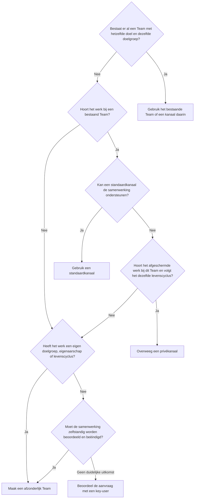

# Microsoft Teams-governance: voorkom wildgroei

## Waarom dit belangrijk is

Zonder governance kan iedere nieuwe vraag, activiteit of werkgroep tot een apart Team leiden. Na verloop van tijd bestaan meerdere Teams met bijna dezelfde naam, overlappende leden en dubbele bestanden.

Gebruikers weten dan niet meer:

- welk Team leidend is;
- waar de actuele versie van een bestand staat;
- wie verantwoordelijk is voor het lidmaatschap;
- welke werkruimte nog actief is;
- wanneer een Team mag worden gearchiveerd of verwijderd.

Wildgroei is niet alleen een technisch beheerprobleem. Het maakt dagelijks samenwerken moeilijker en vergroot de kans dat mensen in het verkeerde Team of bestand werken.

Teams-governance moet samenwerking niet onnodig vertragen. Het doel is dat ieder Team een duidelijk doel, herkenbare naam, passende structuur, verantwoordelijke eigenaren en afgesproken levenscyclus heeft.

:::info[Een bewuste organisatiekeuze]

Microsoft staat standaard toe dat gebruikers Microsoft 365-groepen aanmaken en beschrijft dit als uitgangspunt voor snelle samenwerking.

Het beperken van groepsaanmaak is een M365Wizard-aanbeveling voor organisaties waar aantoonbare wildgroei, onduidelijk eigenaarschap of dubbele informatiebronnen ontstaan. Combineer de beperking altijd met een eenvoudige en snelle aanvraagroute.

:::

## Aanbeveling

Geef ieder Team een duidelijk doel, herkenbare naam, passende eigenaren, toegangsbesluit en beoordelingsdatum. Maak Teams voor herkenbare samenwerkingsverbanden, zoals afdelingen en projecten. Gebruik standaardkanalen voor onderwerpen en werkstromen binnen een Team.

Maak een afzonderlijk Team wanneer de doelgroep, het eigenaarschap of de levenscyclus wezenlijk afwijkt. Gebruik privékanalen sporadisch. Geef bij een samenwerking met een zelfstandige levenscyclus de voorkeur aan een nieuw Team boven een gedeeld kanaal.

Gebruik een duurzame naamgevingsconventie op organisatie- of bedrijfsniveau. Houd de volledige Teamnaam kort genoeg voor bestanden die gebruikers met OneDrive synchroniseren. Neem geen veranderlijke kenmerken zoals afdeling of functietitel op in de technisch afgedwongen naam.

Laat gebruikers Teams aanmaken zolang de organisatie dit zonder wezenlijke wildgroei kan beheren. Beperk het aanmaken alleen wanneer daarvoor een aantoonbare noodzaak bestaat. Bied dan een snelle aanvraagroute via key-users of een andere gedelegeerde rol.

Laat Team-eigenaren periodiek bevestigen wie eigenaar en lid is en of het Team nog nodig is. Voeg, wanneer samenwerkingsvolume, risico en licenties dat rechtvaardigen, ingebouwde Microsoft-maatregelen toe voor naamgeving, groepen zonder eigenaar, toegangsbeoordelingen en groepsverval. Gebruik Microsoft Entra ID, het Microsoft 365-beheercentrum en het Teams-beheercentrum voor eigenaarschap, toegang en levenscyclusbeheer.

## Pas governance proportioneel toe

Dezelfde governanceprincipes gelden voor iedere organisatie, maar niet iedere tenant heeft dezelfde maatregelen nodig. Selecteer maatregelen op basis van het samenwerkingsvolume, personeels- en leerlingverloop, externe toegang, gevoeligheid van informatie, wettelijke eisen en beschikbare beheercapaciteit. Tenantgrootte alleen is onvoldoende: een kleine gereguleerde organisatie kan strengere maatregelen nodig hebben dan een grotere organisatie met stabiele lidmaatschappen en weinig externe samenwerking.

| Context | Proportionele aanpak |
| --- | --- |
| Kleine onderneming | Laat gebruikers Teams aanmaken zolang dit beheersbaar blijft. Gebruik eenvoudige naamgevingsafspraken, passende eigenaren, een periodieke beoordeling door de eigenaar en een opruimproces waarin je eerst archiveert. Voeg beperkingen alleen toe bij aantoonbare wildgroei of risico's. |
| Middelgrote organisatie | Gebruik waar nodig gedelegeerde aanmaak via key-users. Voeg ingebouwde rapportages toe en, wanneer dit gerechtvaardigd en gelicentieerd is, beleid voor groepen zonder eigenaar en groepsverval. |
| Grote organisatie | Stel centrale kaders en delegeer de uitvoering per bedrijfsonderdeel, vestiging of dienst. Maak onderscheid tussen soorten Teams en voeg geautomatiseerde opvolging, toegangsbeoordelingen en classificatie toe op basis van risico. |
| School | Beheer klas-Teams via het proces voor onderwijsgegevens en de levenscyclus van het schooljaar. Pas de gewone afdelings- en projectrichtlijnen toe op Teams voor medewerkers, vakgroepen, management en projecten. |
| Stichting met meerdere scholen | Deel je één tenant, stel dan tenantbrede kaders en beheer School Data Sync centraal. Delegeer standaardaanvragen en eigenaarschap aan iedere school en beheer bovenschoolse Teams als zelfstandige samenwerkingsverbanden. |

Voor iedere organisatie bestaat de basis uit een duidelijk doel, een herkenbare en voldoende korte naam, passende eigenaren, een besluit over externe toegang en een afgesproken beoordelings- of einddatum. Kies bij voorkeur twee eigenaren. Kan een zeer kleine organisatie geen twee geschikte eigenaren aanwijzen, neem het Team dan expliciet op in de controles voor offboarding en eigenaarschap door beheerders.

Voeg technische afdwinging alleen toe wanneer die een werkelijk probleem met volume, delegatie of risico oplost. Een handmatige bevestiging door de eigenaar, ondersteund met ingebouwde rapportages, is een geldige basis. Microsoft Entra-toegangsbeoordelingen, gevoeligheidslabels, beleid voor groepen zonder eigenaar en vervalbeleid zijn optionele maatregelen die passende licenties, configuratie en operationeel eigenaarschap vereisen.

## Wanneer maak je een nieuw Team?

Maak een Team voor een herkenbaar samenwerkingsverband met een eigen doel, doelgroep, eigenaarschap of levenscyclus.

Een afdeling is meestal een duurzaam samenwerkingsverband. Een project heeft doorgaans een duidelijk doel en een verwacht einde. Onderwerpen binnen een afdeling of project horen meestal in standaardkanalen van het bestaande Team.

| Situatie | Aanbevolen keuze |
| --- | --- |
| Een afdeling werkt structureel samen | Maak een Team voor de afdeling |
| Een project heeft een eigen projectgroep of einddatum | Maak een Team voor het project |
| Een onderwerp hoort bij een bestaande afdeling | Gebruik een standaardkanaal |
| Een werkstroom hoort bij een bestaand project | Gebruik een standaardkanaal |
| Een deel van de leden beheert afgeschermde informatie die bij het Team hoort | Overweeg een privékanaal |
| De doelgroep of het eigenaarschap wijkt structureel af | Maak een afzonderlijk Team |
| De samenwerking heeft een eigen levenscyclus | Maak een afzonderlijk Team |
| De samenwerking moet zelfstandig kunnen worden beoordeeld of beëindigd | Maak een afzonderlijk Team |

Maak bijvoorbeeld binnen één project geen afzonderlijke Teams voor *Budget*, *Planning* en *Communicatie*. Maak voor ieder project een eigen Team en gebruik binnen dat Team kanalen voor de werkstromen van dat project.

### Laat de kanaalstructuur aansluiten op het werk

Leg geen vaste kanaalstructuur op voor afdelingen en projecten. Ieder Team ondersteunt ander werk en heeft daarom een passende indeling nodig.

Een Team met twee leden werkt anders dan een Team met tweehonderd leden. Het aantal leden bepaalt echter niet hoeveel kanalen nodig zijn. Een klein project kan veel afzonderlijke onderwerpen hebben, terwijl een groot project met enkele kanalen kan volstaan. Een afdeling heeft bovendien een ander doel en ritme dan een tijdelijk project.

Laat de Team-eigenaren de kanaalstructuur bepalen op basis van:

- de werkzaamheden en terugkerende werkstromen;
- onderwerpen die langere tijd relevant blijven;
- de manier waarop leden informatie zoeken;
- verantwoordelijkheden binnen het Team;
- betekenisvolle verschillen in toegang;
- de verwachte levensduur van het werk.

Begin met de kanalen die bij de start aantoonbaar nodig zijn. Voeg een kanaal toe wanneer een onderwerp of werkstroom voldoende zelfstandig en duurzaam is.

Gebruik geen apart kanaal voor een eenmalige vraag, korte activiteit of onderwerp met nauwelijks eigen samenwerking. Gebruik daarvoor een bericht, gesprek of map binnen een bestaand kanaal.

### Gebruik privékanalen sporadisch

Een privékanaal heeft een afwijkend lidmaatschap binnen het bovenliggende Team en vraagt daardoor extra beheer. Gebruik het wanneer een deel van de Teamleden aantoonbaar geen toegang mag hebben en het afgeschermde werk bij het doel en de levenscyclus van het bovenliggende Team blijft horen.

Deze behoefte kan tijdelijk of langdurig zijn. Afgeschermde operationele of managementinformatie voor leidinggevenden van een afdeling kan bijvoorbeeld in een privékanaal passen wanneer die informatie bij het afdelingsteam hoort. Is de informatie eigendom van een managementteam en wordt zij afdelingsoverstijgend gebruikt, beheer haar dan in het Team van dat management. Dat een teamleider lid is van beide Teams bepaalt niet waar de informatie hoort.

Maak een afzonderlijk Team wanneer de afgeschermde samenwerking een zelfstandig beheerde doelgroep, eigenaren of levenscyclus nodig heeft. Dat maakt toegang, verantwoordelijkheid en beëindiging beter zichtbaar.

### Kies een nieuw Team als de levenscyclus zelfstandig moet zijn

Een gedeeld kanaal heeft geen eigen Microsoft 365-groep en kan daarom niet zelfstandig onder het vervalbeleid voor Microsoft 365-groepen vallen. De levenscyclus blijft gekoppeld aan het bovenliggende Team.

Kies bij voorkeur een nieuw Team wanneer de samenwerking:

- een eigen begin- en einddatum heeft;
- andere eigenaren nodig heeft;
- een afzonderlijke toegangsbeoordeling nodig heeft;
- externe deelnemers bevat;
- eigen informatie- of bewaareisen heeft;
- zelfstandig moet kunnen worden gearchiveerd of verwijderd.

Gebruik een gedeeld kanaal voor een afgebakende samenwerking die inhoudelijk bij het bovenliggende Team hoort en dezelfde algemene levenscyclus volgt.

Microsoft Teams maakt voor ieder privé- en gedeeld kanaal een afzonderlijke gekoppelde SharePoint-site. Dit maakt het beheer van bestanden, toegang, bewaring en levenscyclus complexer. Bekijk de Microsoft-documentatie over [gedeelde kanalen](https://learn.microsoft.com/nl-nl/microsoftteams/shared-channels), [privékanalen](https://learn.microsoft.com/nl-nl/microsoftteams/private-channels) en [aan Teams gekoppelde SharePoint-sites](https://learn.microsoft.com/nl-nl/sharepoint/teams-connected-sites).

## Beperk het aanmaken van Teams

Een Team gebruikt een Microsoft 365-groep voor lidmaatschap en eigenaarschap. Standaard kunnen gebruikers zelf Microsoft 365-groepen aanmaken.

Wanneer wildgroei een reëel probleem is, kan IT het aanmaken van Microsoft 365-groepen beperken tot leden van één aangewezen groep. Microsoft ondersteunt het nesten van andere groepen binnen deze aangewezen groep. Daardoor kun je bijvoorbeeld per bedrijfsonderdeel, vestiging of school gedelegeerde makers aanwijzen.

Key-users vormen een herkenbaar toegangspunt voor gebruikers die een Team nodig hebben. Zij kunnen controleren of een geschikt Team al bestaat en adviseren over de juiste inrichting.

Houd rekening met de gevolgen: de beperking geldt niet alleen voor Microsoft Teams. Zij raakt ook andere diensten die Microsoft 365-groepen gebruiken, zoals Outlook, SharePoint, Planner en Viva Engage. Controleer daarom vooraf welke processen hierdoor veranderen.

Voor het configureren van de beperking en voor de gebruikers die groepen mogen aanmaken, gelden licentievoorwaarden voor Microsoft Entra ID P1, P2 of Basic EDU. Zie [bepalen wie Microsoft 365-groepen mag aanmaken](https://learn.microsoft.com/nl-nl/previous-versions/microsoft-365/solutions/manage-creation-of-groups?view=o365-worldwide).

:::warning[Maak de aanvraagroute niet tot een blokkade]

Als gebruikers lang op een Team moeten wachten, zoeken zij andere manieren om samen te werken en bestanden te delen. Behandel een standaardaanvraag daarom binnen een afgesproken en korte termijn.

:::

## Richt de aanvraagprocedure in

Vraag alleen informatie die nodig is om een goede beslissing te nemen:

- het doel van het Team;
- de afdeling, het project of het samenwerkingsverband;
- de voorgestelde bedrijfseigenaar en Team-eigenaren, bij voorkeur minimaal twee;
- de beoogde deelnemers;
- de verwachte eind- of beoordelingsdatum;
- de noodzaak voor gasten of andere externe deelnemers;
- de gevoeligheid van de informatie;
- de reden waarom een bestaand Team of kanaal niet voldoet.

Gebruik vervolgens deze beslisvolgorde:

Maak een nieuw Team wanneer het werk een zelfstandige samenwerking vormt. Gebruik een standaardkanaal wanneer het onderwerp binnen het bestaande doel, de doelgroep en de levenscyclus van een Team past. Overweeg een privékanaal wanneer het afgeschermde werk bij het bovenliggende Team hoort en dezelfde levenscyclus volgt. Laat aanvragen zonder duidelijke uitkomst door een key-user beoordelen.

### Scheid klas-Teams van andere Teams op school

Laat een school of stichting met meerdere scholen klas-Teams en organisatieteams niet hetzelfde levenscyclusproces doorlopen.

- **Klas-Teams:** gebruik waar beschikbaar het leerlinginformatiesysteem en [School Data Sync](https://learn.microsoft.com/nl-nl/schooldatasync/) om klassen aan te maken en te onderhouden. Stem aanmaak, lidmaatschap, archivering en opruiming af op het schooljaar.
- **Teams voor medewerkers, vakgroepen, afdelingen, management en projecten:** gebruik de beslisvolgorde uit deze gids. Deze Teams volgen meestal een organisatie- of projectlevenscyclus in plaats van een klassenindeling.
- **Bovenschoolse Teams:** maak een afzonderlijk Team wanneer de samenwerking een schoolonafhankelijke doelgroep, eigenaarschap of levenscyclus heeft. Plaats dit niet alleen onder het Team van een deelnemende school omdat een schoolleider lid is van beide Teams.

Gebruik voor klas-Teams een expliciete [overgang tussen schooljaren](https://learn.microsoft.com/nl-nl/microsoft-365/education/tutorial-academic-year-transition/). Centrale IT of de eigenaar van onderwijsgegevens beheert het tenantbeleid en School Data Sync. Lokale key-users en Team-eigenaren ondersteunen aanvragen, toegang en levenscyclusbesluiten binnen iedere school.

### Delegeer waar nodig via key-users

Wanneer één tenant meerdere bedrijfsonderdelen, vestigingen of scholen bedient, wijs dan per passende organisatie-eenheid enkele key-users aan. Zij kunnen:

- controleren of het Team al bestaat;
- helpen bepalen of een nieuw Team of kanaal nodig is;
- de juiste eigenaren vastleggen;
- de naamgevingsafspraken toepassen;
- uitleg geven over kanalen en bestanden;
- afwijkende aanvragen doorzetten naar IT.

Beperk deze rol tot een beheersbaar aantal personen en zorg voor vervanging tijdens afwezigheid. Controleer periodiek wie nog Teams mag aanmaken.

Kleine organisaties hoeven geen key-userlaag toe te voegen wanneer gebruikers een Team-eigenaar of beheerder rechtstreeks kunnen benaderen. Laat de aanvraagroute aansluiten op de organisatie en voorkom onnodige overdrachtsmomenten.

De centrale IT-afdeling blijft verantwoordelijk voor het tenantbeleid, de technische configuratie, licenties, rapportage en uitzonderingen.

## Gebruik duurzame naamgeving en minimale inrichtingsprincipes

Een naam moet gebruikers helpen een Team te herkennen, maar mag niet te sterk afhangen van gegevens die regelmatig veranderen.

### Houd de technisch afgedwongen naamgeving op een hoog niveau

Microsoft Entra ID ondersteunt de kenmerken `[Department]`, `[Company]`, `[Office]`, `[StateOrProvince]`, `[CountryOrRegion]` en `[Title]` in een naamgevingsbeleid voor Microsoft 365-groepen en Teams.

Een afgedwongen naamgevingsbeleid in Microsoft Entra is een gelicentieerde maatregel. Wanneer technische afdwinging niet gerechtvaardigd of gelicentieerd is, gebruik je dezelfde naamgevingsprincipes als gedocumenteerde afspraak en pas je ze tijdens de aanmaak toe. Zie [naamgevingsbeleid voor Microsoft 365-groepen afdwingen](https://learn.microsoft.com/nl-nl/entra/identity/users/groups-naming-policy).

Dat een kenmerk technisch wordt ondersteund, betekent niet dat het geschikt is voor duurzame naamgeving.

Gebruik bij voorkeur een stabiele aanduiding op organisatie- of bedrijfsniveau. Denk aan een vaste organisatiecode of, wanneer de identiteitsgegevens betrouwbaar worden beheerd, het kenmerk `[Company]`.

Gebruik geen `[Title]`. Een functietitel is persoonlijk, verandert bij functiewijzigingen en zegt weinig over het doel of eigenaarschap van een Team.

Gebruik ook geen `[Department]` als technisch afgedwongen onderdeel van de Teamnaam. Een afdelingsoverstijgend project kan tijdens zijn levensduur bij een andere afdeling worden ondergebracht. De naam suggereert dan ten onrechte dat het Team nog bij de oorspronkelijke afdeling hoort.

Hetzelfde risico geldt voor andere veranderlijke kenmerken, zoals `[Office]`, wanneer mensen of werk tussen vestigingen bewegen.

:::warning[Naamgeving is afhankelijk van identity management]

Een naamgevingsbeleid gebruikt kenmerken van de persoon die de Microsoft 365-groep aanmaakt. Wanneer een key-user namens een andere afdeling, vestiging of bedrijf een Team aanmaakt, beschrijft het kenmerk mogelijk de key-user en niet het Team.

Gebruik dynamische kenmerken alleen wanneer de brongegevens volledig, betrouwbaar en passend voor het aanvraagproces zijn. Stem het naamgevingsbeleid daarom af met de verantwoordelijken voor identity management.

:::

### Scheid technische naamgeving van functionele naamgeving

Gebruik twee lagen:

- **Technisch naamgevingsbeleid:** een stabiele organisatie- of bedrijfsaanduiding die Microsoft Entra ID afdwingt.
- **Functionele naamgevingsafspraak:** een duidelijke naam voor het doel van het Team, toegepast tijdens het aanvraagproces.

Voorbeelden:

| Type | Voorbeeld |
| --- | --- |
| Afdeling | `CONTOSO-Financiën` |
| Project | `CONTOSO-ERP-modernisering` |
| Afdelingsoverstijgend project | `CONTOSO-Digitale-werkplek` |
| Project met een stabiele projectcode | `CONTOSO-PRJ-1042-Intranet` |

Gebruik een stabiele projectcode wanneer de organisatie die al beheert. Neem geen afdeling op wanneer het project later onder een andere afdeling kan vallen.

### Houd Teamnamen en bestandspaden kort

Stel een lokale maximumlengte in voor de volledige Teamnaam, inclusief afgedwongen voor- en achtervoegsels. Als praktisch uitgangspunt adviseert M365Wizard maximaal 50 tekens. Dit is een organisatierichtlijn en geen Microsoft-servicelimiet. De richtlijn garandeert niet dat ieder bestandspad werkt.

De Teamnaam telt mee in het pad van de gekoppelde SharePoint-site en gesynchroniseerde bibliotheek. OneDrive en SharePoint staan voor een gedecodeerd bestandspad in de cloud maximaal 400 tekens toe, maar Windows Verkenner en Office-bureaubladapps lopen vaak tegen een padlimiet van 260 tekens aan. De lokale OneDrive-hoofdmap, organisatienaam, site- of bibliotheeknaam, mappen en bestandsnaam gebruiken allemaal ruimte in het pad.

Lange Teamnamen laten daardoor minder ruimte over voor duidelijke map- en bestandsnamen. Houd mapstructuren ondiep en test het volledige pad met de OneDrive-synchronisatie-app en Office-bureaubladapps die de organisatie ondersteunt. Zie [limieten voor bestandspaden](https://support.microsoft.com/nl-nl/onedrive/what-are-file-path-length-limits) en de [SharePoint-servicelimieten](https://learn.microsoft.com/nl-nl/office365/servicedescriptions/sharepoint-online-service-description/sharepoint-online-limits).

Los het probleem niet op met onbegrijpelijke afkortingen. Een korte naam moet in Teams, Outlook, SharePoint en Verkenner nog steeds herkenbaar zijn.

### Behandel hernoemen als een beheerwijziging

Een Team kan worden hernoemd wanneer het doel verandert. Controleer daarbij ook de beschrijving, eigenaren, classificatie, gekoppelde informatie en verwijzingen.

Het wijzigen van de weergavenaam van een Team is niet hetzelfde als het wijzigen van het adres van de gekoppelde SharePoint-site, het groeps-e-mailadres of alle bestaande koppelingen en synchronisatierelaties. Behandel een adreswijziging als een afzonderlijke beheerhandeling en beoordeel de gevolgen. Zie [het adres van een SharePoint-site wijzigen](https://learn.microsoft.com/nl-nl/sharepoint/change-site-address).

### Standaardiseer governance, niet de kanaalindeling

Gebruik geen sjablonen die voor ieder Team dezelfde kanalen aanmaken. Standaardiseer alleen de minimale governancevoorwaarden:

- een duidelijk doel en beschrijving;
- een bedrijfseigenaar en passende Team-eigenaren, bij voorkeur minimaal twee;
- passende privacy en, wanneer gebruikt, een gevoeligheidslabel;
- een beoordelings- of einddatum;
- een besluit over externe toegang;
- een herkenbare en voldoende korte naam.

Laat de Team-eigenaren de inhoudelijke kanaalstructuur bepalen. Zij kennen het werk en kunnen de indeling aanpassen wanneer het Team zich ontwikkelt.

## Onderhoud eigenaarschap en toegang

Wijs waar mogelijk minimaal twee geschikte eigenaren aan. Een Team met één eigenaar is kwetsbaar omdat die persoon kan vertrekken, langdurig afwezig kan zijn of van functie kan veranderen. Is slechts één geschikte eigenaar beschikbaar, neem het Team dan op in de controles voor offboarding en eigenaarschap door beheerders.

Team-eigenaren zijn verantwoordelijk voor:

- het doel en de beschrijving van het Team;
- het toevoegen en verwijderen van leden;
- de kanaalstructuur;
- periodieke controle van toegang;
- het aanwijzen van vervangende eigenaren;
- het verlengen, archiveren of beëindigen van het Team.

Configureer, wanneer tenantgrootte, risico en licenties dat rechtvaardigen, het [beleid voor Microsoft 365-groepen en Teams zonder eigenaar](https://learn.microsoft.com/nl-nl/microsoft-365/admin/create-groups/ownerless-groups-teams?view=o365-worldwide). Dit beleid kan actieve groepsleden vragen eigenaar te worden wanneer een Team geen eigenaar meer heeft. Gebruik anders ingebouwde beheerrapportages en offboardingcontroles om Teams te vinden die een vervangende eigenaar nodig hebben.

Het beleid voor groepen zonder eigenaar is een vangnet. Als niemand de uitnodiging accepteert, wijst het beleid niet automatisch een eigenaar toe. Een beheerder moet het Team dan alsnog beoordelen.

Neem eigenaarschap ook op in het offboardingproces. Wijs vóór het verwijderen van een eigenaaraccount een vervangende eigenaar aan voor ieder betrokken Team.

### Beoordeel leden, gasten en directe deling

Laat eigenaren periodiek bevestigen:

- of alle leden nog toegang nodig hebben;
- of gasten nog bij de samenwerking betrokken zijn;
- of privé- en gedeelde kanalen nog nodig zijn;
- of privacy en classificatie nog passend zijn;
- of directe deling van bestanden of mappen en deelkoppelingen nog gerechtvaardigd zijn;
- of kanaaleigenaren, apps, tabbladen, connectors en automatiseringen nog een verantwoordelijke eigenaar hebben;
- of uitzonderingen nog gerechtvaardigd zijn.

Beoordeel niet alleen het Teamlidmaatschap. Directe SharePoint-machtigingen kunnen blijven bestaan nadat iemand uit een Team of gedeeld kanaal is verwijderd. Bevestiging door de eigenaar is de basis. Wanneer risico, schaal en licenties automatisering rechtvaardigen, kunnen Microsoft Entra-toegangsbeoordelingen de lidmaatschapscontrole ondersteunen. Zie [toegangsbeoordelingen](https://learn.microsoft.com/nl-nl/entra/id-governance/access-reviews-overview), [governance voor Microsoft Teams plannen](https://learn.microsoft.com/nl-nl/microsoftteams/plan-teams-governance) en gebruik [Extern delen](./external-sharing.md) voor uitgebreidere afspraken over gasten en andere externe toegang.

Gebruik [Machtigingen en eigenaarschap](./permissions-and-ownership.md) om eigenaarschap van de werkruimte te scheiden van technische toegang. Gebruik bij eisen voor classificatie, bescherming, bewaring of records de gids [Welke Microsoft Purview-oplossing moet je gebruiken?](../decisions/which-purview-solution-should-you-use.md).

## Beoordeel en beëindig Teams

Leg bij het aanmaken vast wanneer een Team opnieuw moet worden beoordeeld. Voor een project kan dit de geplande einddatum zijn. Voor een afdeling kan dit een jaarlijkse beoordeling zijn.

Controleer tijdens de beoordeling:

- of het oorspronkelijke doel nog bestaat;
- of de eigenaren nog passend zijn;
- of leden en gasten nog toegang nodig hebben;
- of de kanaalstructuur nog begrijpelijk is;
- of het Team actief wordt gebruikt;
- of informatie of gekoppeld werk moet worden overgedragen;
- of het Team moet worden behouden, gearchiveerd of verwijderd.

Met een [vervalbeleid voor Microsoft 365-groepen](https://learn.microsoft.com/nl-nl/entra/identity/users/groups-lifecycle) kan Microsoft Entra ID inactieve groepen laten verlopen. Activiteit in ondersteunde Microsoft 365-diensten kan een groep automatisch verlengen. Wanneer dit niet gebeurt, ontvangen eigenaren herinneringen.

Microsoft Entra ID ondersteunt één vervalbeleid voor Microsoft 365-groepen per organisatie. Het beleid kan op alle of op geselecteerde groepen van toepassing zijn. Kies de reikwijdte zorgvuldig wanneer afdelingen, projecten, klas-Teams en langdurige samenwerkingen verschillende levenscycli hebben. Voor leden van groepen waarop het beleid van toepassing is, gelden licentievoorwaarden. Voor een kleinere tenant kan een handmatige beoordeling met ingebouwde rapportages proportioneler zijn.

Een niet-verlengde groep wordt verwijderd. Microsoft biedt daarna een herstelperiode van 30 dagen.

Gebruik het vervalbeleid niet als enige controle. Een Team kan technisch actief zijn terwijl het oorspronkelijke doel niet meer bestaat. Een inhoudelijke beoordeling door de eigenaar blijft nodig.

### Maak onderscheid tussen archiveren, verwijderen en bewaren

- **Archiveren:** actieve samenwerking in het Team stopt, maar leden kunnen het Team nog bekijken. Een beheerder of eigenaar kan het opnieuw activeren. SharePoint-inhoud wordt alleen-lezen voor leden wanneer die optie wordt gekozen; eigenaren kunnen de inhoud nog bewerken.
- **Verwijderen:** de Microsoft 365-groep en gekoppelde diensten worden verwijderd, met een beperkte herstelperiode.
- **Bewaren:** compliancebeleid kan ondersteunde informatie behouden, ook wanneer gebruikers het Team niet meer kunnen openen.

:::warning[Archiveren stopt het vervalbeleid niet]

Een gearchiveerd Team blijft onder het vervalbeleid voor Microsoft 365-groepen vallen. Sluit het Team uit of verleng het wanneer de organisatie het gearchiveerde Team bewust langer dan de vervalperiode nodig heeft.

:::

Archiveer eerst en gebruik een afgesproken afkoelperiode vóór verwijdering. Zo krijgen eigenaren en gebruikers tijd om gemiste afhankelijkheden te vinden zonder het archief als permanente opslag te behandelen.

Bepaal vóór verwijdering:

- waar leidende bestanden worden beheerd;
- welke koppelingen, tabbladen, notitieblokken, plannen, formulieren, flows, connectors of terugkerende vergaderingen nog van het Team afhankelijk zijn;
- of gasten of partners moeten worden geïnformeerd;
- welke informatie moet worden bewaard of als record moet worden aangemerkt;
- wie de definitieve verwijdering goedkeurt.

Een vervalbeleid vervangt geen bewaarbeleid, Records Management of juridische bewaarplicht. Zie [levenscyclusbeheer voor Microsoft Teams](https://learn.microsoft.com/nl-nl/microsoftteams/plan-teams-lifecycle) en [een Team archiveren of verwijderen](https://learn.microsoft.com/nl-nl/microsoftteams/archive-or-delete-a-team).

## Ruim bestaande wildgroei op

Nieuwe governance verwijdert bestaande dubbele of verlaten Teams niet. Voer daarom bij de invoering een eenmalige opschoningsronde uit.

1. Inventariseer alle Teams via het Teams-beheercentrum en Microsoft Entra ID.
2. Identificeer Teams zonder eigenaar of met slechts één eigenaar.
3. Zoek Teams met vergelijkbare namen, deelnemers of doelen.
4. Controleer activiteit, gasten, privékanalen, gedeelde kanalen en directe deling.
5. Laat de bedrijfseigenaar bepalen welk Team leidend is.
6. Bepaal waar de actuele bestanden en het gekoppelde werk moeten worden beheerd.
7. Communiceer wanneer een oud Team wordt gearchiveerd of verwijderd.
8. Archiveer eerst en verwijder dubbele en verlaten Teams na de afgesproken controle.
9. Leg uitzonderingen, afhankelijkheden en onafgeronde migraties vast.

Verwijder een dubbel Team pas wanneer duidelijk is waar de actuele bestanden staan en koppelingen, apps, automatiseringen of werkprocessen die nog naar het oude Team verwijzen zijn afgehandeld.

Gebruik daarna een beperkt aantal indicatoren om de situatie beheersbaar te houden:

- percentage Teams met minimaal twee eigenaren;
- aantal Teams zonder eigenaar;
- aantal Teams waarvan de beoordelingsdatum is verstreken;
- aantal Teams zonder recente activiteit;
- aantal openstaande uitzonderingen voor externe toegang of levenscyclus;
- gemiddelde doorlooptijd van aanvragen.

Indicatoren moeten een beoordeling starten en niet automatisch over de levenscyclus beslissen.

## Verantwoordelijkheden

| Rol | Verantwoordelijkheid |
| --- | --- |
| Aanvrager | Beschrijft doel, deelnemers en verwachte levensduur |
| Bedrijfseigenaar | Beslist of het Team nodig blijft en wat bij beëindiging met de informatie gebeurt |
| Key-user | Controleert bestaande Teams, adviseert over de structuur en verwerkt standaardaanvragen |
| Team-eigenaar | Beheert leden, kanalen, toegang en dagelijkse inrichting |
| IT | Configureert de toepasselijke maatregelen voor aanmaak, naamgeving, groepen zonder eigenaar, verval en rapportage en beheert technische uitzonderingen |
| Identity management | Beheert de kwaliteit en betekenis van kenmerken die in naamgevingsbeleid worden gebruikt |
| Informatie- of compliance-eigenaar | Bepaalt aanvullende eisen voor bescherming, bewaring en records |

Leg vast wie uitzonderingen mag goedkeuren. Noteer per uitzondering de reden, eigenaar en beoordelingsdatum.

## Officiële Microsoft-documentatie

- [Bepalen wie Microsoft 365-groepen mag aanmaken](https://learn.microsoft.com/nl-nl/previous-versions/microsoft-365/solutions/manage-creation-of-groups?view=o365-worldwide)
- [Naamgevingsbeleid voor Microsoft 365-groepen afdwingen](https://learn.microsoft.com/nl-nl/entra/identity/users/groups-naming-policy)
- [Limieten voor bestandspaden in OneDrive en SharePoint](https://support.microsoft.com/nl-nl/onedrive/what-are-file-path-length-limits)
- [SharePoint-servicelimieten](https://learn.microsoft.com/nl-nl/office365/servicedescriptions/sharepoint-online-service-description/sharepoint-online-limits)
- [Microsoft 365-groepen en Teams zonder eigenaar beheren](https://learn.microsoft.com/nl-nl/microsoft-365/admin/create-groups/ownerless-groups-teams?view=o365-worldwide)
- [Toegangsbeoordelingen plannen en beheren](https://learn.microsoft.com/nl-nl/entra/id-governance/access-reviews-overview)
- [Een vervalbeleid voor Microsoft 365-groepen configureren](https://learn.microsoft.com/nl-nl/entra/identity/users/groups-lifecycle)
- [School Data Sync](https://learn.microsoft.com/nl-nl/schooldatasync/)
- [De overgang tussen schooljaren plannen](https://learn.microsoft.com/nl-nl/microsoft-365/education/tutorial-academic-year-transition/)
- [Governance voor Microsoft Teams plannen](https://learn.microsoft.com/nl-nl/microsoftteams/plan-teams-governance)
- [Levenscyclusbeheer voor Microsoft Teams plannen](https://learn.microsoft.com/nl-nl/microsoftteams/plan-teams-lifecycle)
- [Een Team archiveren of verwijderen](https://learn.microsoft.com/nl-nl/microsoftteams/archive-or-delete-a-team)
- [Integratie tussen Teams en SharePoint](https://learn.microsoft.com/nl-nl/sharepoint/teams-connected-sites)
- [Privékanalen in Microsoft Teams](https://learn.microsoft.com/nl-nl/microsoftteams/private-channels)
- [Gedeelde kanalen in Microsoft Teams](https://learn.microsoft.com/nl-nl/microsoftteams/shared-channels)

## Gerelateerde gidsen

- [Teams](../services/teams.md)
- [Somtoday naar Microsoft School Data Sync](../tools/apps/somtoday-to-school-data-sync.md)
- [Machtigingen en eigenaarschap](./permissions-and-ownership.md)
- [Extern delen](./external-sharing.md)
- [Welke Microsoft Purview-oplossing moet je gebruiken?](../decisions/which-purview-solution-should-you-use.md)
- [Waar moet dit bestand staan?](../decisions/where-should-this-file-live.md)
- [Site, bibliotheek of map: waar organiseer je documenten?](../decisions/site-library-or-folder.md)
