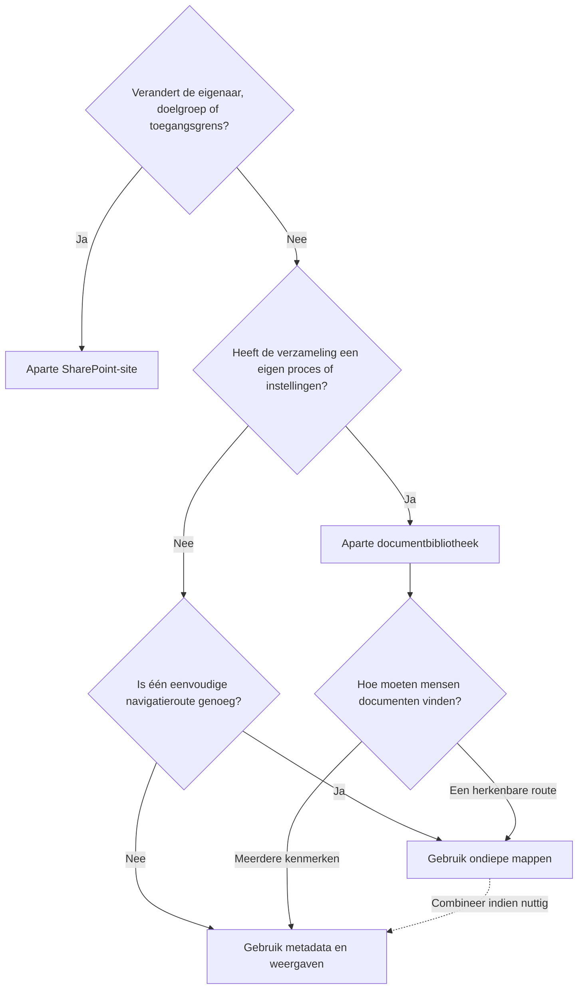

# Site, bibliotheek of map: waar organiseer je documenten?

Kies eerst de grens en daarna pas de indeling. Gebruik een site wanneer eigenaarschap of toegang verandert, een bibliotheek wanneer het beheerpatroon verandert, een map voor een herkenbare route en metadata wanneer mensen dezelfde documenten op meerdere manieren moeten kunnen vinden.

## Kort antwoord

Gebruik:

- een **site** voor een afzonderlijke groep, verantwoordelijkheid, doelgroep of levenscyclus van de werkruimte;
- een **bibliotheek** voor een herkenbare verzameling documenten met een eigen doel, proces of bibliotheekinstellingen;
- een **map** voor eenvoudige en herkenbare navigatie binnen een bibliotheek;
- **metadata en weergaven** om documenten over mapstructuren heen te filteren, groeperen en vinden.

De hoofdregel is:

> Verander de structuur niet alleen omdat de documenten anders zijn. Verander de grens wanneer het eigenaarschap, de toegang of de manier waarop de inhoud wordt beheerd anders is.

Metadata is geen extra opslagniveau. Metadata beschrijft documenten, zodat dezelfde inhoud in meerdere nuttige weergaven kan verschijnen zonder te worden verplaatst of gekopieerd.

## Beslisstroom

Doorloop het schema van boven naar beneden. Bepaal eerst eigenaarschap en toegang, daarna het proces en pas vervolgens de navigatie. Een map mag een onduidelijke site- of bibliotheekgrens niet verhullen.

## Vergelijk de grenzen

| Keuze | Gebruik wanneer | Wat verandert |
| --- | --- | --- |
| Site | Eigenaarschap, doelgroep, samenwerking, toegang of de levenscyclus van de werkruimte wezenlijk anders is | Site-eigenaren, lidmaatschap, navigatie, toegang en governance van de werkruimte |
| Bibliotheek | Een samenhangende verzameling een eigen proces, kolommen, weergaven, documenttypen of bibliotheekinstellingen nodig heeft | Hoe die documenten worden gemaakt, beschreven, gepresenteerd en beheerd |
| Map | Mensen een stabiele en herkenbare route door een bibliotheek nodig hebben | De bladerroute en het bestandspad |
| Metadata en weergaven | Mensen dezelfde documenten via meerdere kenmerken moeten kunnen vinden | Filteren, sorteren, groeperen, zoekcontext en taakgerichte weergaven |

Microsoft ondersteunt het gecombineerd gebruiken van mappen, kolommen en weergaven in een bibliotheek. Kies de kleinste combinatie waarmee de inhoud begrijpelijk en beheerbaar blijft. Bekijk [Microsofts introductie tot bibliotheken](https://support.microsoft.com/en-us/sharepoint/libraries/introduction-to-libraries) om te zien hoe deze functies elkaar aanvullen.

## Gebruik een aparte site wanneer

Maak een aparte site wanneer:

- een andere groep verantwoordelijk is voor de informatie;
- een wezenlijk andere doelgroep toegang nodig heeft;
- de werkruimte zelfstandig moet worden gemaakt, beoordeeld of beëindigd;
- het een zelfstandig project, team, afdeling, proces of publicatiegebied betreft;
- gebruikers het als een afzonderlijke plek ervaren om te werken of informatie te lezen.

Zie een site als een grens voor eigenaarschap, werk en toegang, niet als een grote map. Moderne SharePoint-architectuur kan verwante sites met hubs en gedeelde navigatie verbinden zonder ze in een starre hiërarchie te plaatsen. Microsoft adviseert in de [richtlijnen voor het plannen van SharePoint-hubs](https://learn.microsoft.com/en-us/sharepoint/planning-hub-sites) om voor ieder samenhangend werkgebied een site te overwegen.

Maak niet alleen vanwege bestandscategorieën zoals contracten, presentaties en notulen een site. Dat zijn meestal documenttypen of verzamelingen, geen zelfstandige werkruimtes.

## Gebruik een aparte bibliotheek wanneer

Maak een aparte bibliotheek wanneer documenten dezelfde site-eigenaren en doelgroep hebben, maar een herkenbaar beheerpatroon nodig hebben, zoals:

- een eigen goedkeurings- of publicatieproces;
- andere kolommen, inhoudstypen of openbare weergaven;
- afzonderlijke opties of sjablonen voor nieuwe documenten;
- andere bibliotheekinstellingen voor versiegeschiedenis of inhoudsbeheer;
- een doel dat gebruikers kunnen benoemen, zoals werkdocumenten, goedgekeurd beleid, contracten, sjablonen of vergaderstukken.

Maak niet automatisch een bibliotheek voor ieder bestandstype of iedere oude hoofdmap. Gebruik één bibliotheek wanneer documenten hetzelfde doel, dezelfde doelgroep, instellingen en vindbaarheidsbehoeften hebben. Splits de bibliotheek wanneer het uitleggen of beheren van die verschillen binnen één bibliotheek verwarrend wordt.

## Gebruik mappen wanneer

Mappen werken goed wanneer:

- gebruikers een eenvoudige en herkenbare bladerroute nodig hebben;
- maar enkele niveaus nodig zijn;
- de structuur stabiel is en het echte werk weerspiegelt;
- mensen doorgaans denken in een projectfase, klant, dossier of jaar;
- de mappen de toegang van de bibliotheek kunnen overnemen.

Houd mappen zo ondiep dat mensen de bestemming kunnen voorspellen voordat zij meerdere niveaus openen. Dit is een gebruiksadvies en geen vaste SharePoint-limiet. Als een nieuwe medewerker voor iedere vertakking uitleg nodig heeft, pas dan de structuur aan of voeg metadata en weergaven toe.

Een map is minder bruikbaar wanneer mensen dezelfde documenten moeten vinden op jaar, afdeling, status, documentsoort én eigenaar. Eén mappenboom kan maar één hoofdroute weergeven zonder documenten te dupliceren.

## Gebruik metadata en weergaven wanneer

Gebruik metadata wanneer een document nuttige kenmerken nodig heeft, zoals afdeling, documentsoort, eigenaar, status, publicatiedatum, project of klant. Maak openbare weergaven rond echte taken, bijvoorbeeld:

- documenten die op mijn beoordeling wachten;
- actueel beleid per afdeling;
- contracten die dit jaar verlopen;
- goedgekeurde resultaten per projectfase.

Met kolommen kunnen mensen items sorteren, filteren en groeperen. Weergaven tonen geselecteerde kolommen en filters zonder de documenten zelf te veranderen. Bekijk Microsofts documentatie over [kolomtypen](https://support.microsoft.com/en-us/office/list-and-library-column-types-and-options-0d8ddb7b-7dc7-414d-a283-ee9dca891df7) en [weergaven voor bibliotheken en lijsten](https://support.microsoft.com/en-US/SharePoint/lists/data-and-lists/create-change-or-delete-a-view-of-a-list-or-library).

Begin met een kleine verzameling metadata die een keuze, weergave, zoekpatroon of governanceregel ondersteunt. Te veel verplichte velden veroorzaken wrijving en verlagen meestal de gegevenskwaliteit. Metadata moet de navigatie verbeteren, niet iedere herkenbare route vervangen.

## Combineer ze in één werkpatroon

Voor een klantproject met de naam Atlas kan een praktische inrichting zijn:

- **Site:** Klantproject Atlas, beheerd door het projectteam.
- **Bibliotheken:** Werkdocumenten en goedgekeurde resultaten, omdat publicatie en beheer verschillen.
- **Mappen:** Werkstromen en vergaderingen, wanneer dit herkenbare navigatieroutes zijn.
- **Metadata:** Documentsoort, eigenaar, status en projectfase.
- **Weergaven:** Wacht op beoordeling, recent gewijzigd en goedgekeurde resultaten.

De site bepaalt de verantwoordelijkheid en toegang. Iedere bibliotheek bepaalt hoe een samenhangende verzameling wordt beheerd. Mappen helpen mensen bladeren, terwijl metadata en weergaven documenten over die routes heen vindbaar maken.

## Houd toegang begrijpelijk

Laat bibliotheken, mappen en documenten hun toegang waar mogelijk van de site overnemen. Het verbreken van overerving maakt een uniek machtigingsbereik. Grote aantallen uitzonderingen maken toegang moeilijker te beoordelen en kunnen de prestaties beïnvloeden. Microsoft adviseert het aantal unieke bereiken ruim onder het ondersteunde maximum te houden. Bekijk [Machtigingsbereiken beheren in SharePoint](https://learn.microsoft.com/en-us/sharepoint/manage-permission-scope).

:::warning[Verberg geen toegangsmodel in mappen]

Als een verzameling structureel een andere doelgroep of eigenaar nodig heeft, kies dan bij voorkeur een duidelijk beheerde site. Gebruik unieke machtigingen voor een bibliotheek of map alleen voor een gedocumenteerde uitzondering met een eigenaar en een beoordelingsdatum.

:::

## Behandel bewaring als een beleidskeuze

Een andere bewaarbehoefte is een signaal om eigenaars voor informatiebeheer, juridische zaken, beveiliging of compliance te betrekken. Zij kan het ontwerp van de site of bibliotheek beïnvloeden, maar vereist niet automatisch één bibliotheek of site per bewaartermijn.

Bepaal eerst het beleid en pas daarna de geschikte Microsoft Purview-bewaarbeleidsregels of -labels toe. Microsoft legt in [Bewaring voor SharePoint en OneDrive](https://learn.microsoft.com/en-us/purview/retention-policies-sharepoint) uit hoe bewaring voor deze locaties werkt.

Structuur, machtigingen, gevoeligheid en bewaring beantwoorden verschillende vragen. Gebruik [Welke Microsoft Purview-oplossing moet je gebruiken?](./which-purview-solution-should-you-use.md) wanneer de vereiste verder gaat dan waar documenten moeten worden georganiseerd.

## Stel deze ontwerpvragen

1. Wie is verantwoordelijk voor deze informatie?
2. Wie moet de informatie kunnen lezen, bewerken en beheren?
3. Heeft zij een eigen proces voor maken, beoordelen, goedkeuren of publiceren?
4. Welke regels voor bewaring, gevoeligheid of compliance gelden?
5. Moeten mensen hetzelfde document op meerdere manieren kunnen vinden?
6. Kan een nieuwe gebruiker de voorgestelde structuur zonder voorkennis begrijpen?
7. Wie beoordeelt de werkruimte, toegang, metadata en verouderde inhoud?

Leg de antwoorden vast voordat je containers maakt. Als de eigenaar, doelgroep of het doel niet kan worden benoemd, lost een extra site of bibliotheek het onderliggende governanceprobleem niet op.

:::warning[Veelgemaakte ontwerpfouten]

- De volledige fileserverstructuur kopiëren.
- Voor iedere voormalige hoofdmap een bibliotheek maken.
- Voor iedere bibliotheek of documentcategorie een site maken.
- Unieke machtigingen diep in een mappenstructuur toepassen.
- Meer mapniveaus gebruiken dan mensen met vertrouwen kunnen doorlopen.
- Veel verplichte metadatavelden toevoegen zonder nuttige weergaven.
- Vanuit de techniek naar buiten structureren in plaats van vanuit werk en eigenaarschap naar binnen.

:::

## Aanbevolen aanpak

1. Bepaal het doel, de bedrijfseigenaar, de doelgroep en het beoordelingsmoment van iedere site.
2. Groepeer inhoud met hetzelfde proces en dezelfde beheerbehoeften in een beperkt aantal bibliotheken.
3. Voeg waar nuttig ondiepe mappen toe voor herkenbare navigatie.
4. Voeg alleen metadata toe die nuttige weergaven, vindbaarheid, processen of governance ondersteunt.
5. Test de structuur met echte taken en representatieve documenten.
6. Leg uitzonderingen voor toegang en bewaring vast met een eigenaar en beoordelingsdatum.
7. Beoordeel het ontwerp opnieuw wanneer het team, proces, de doelgroep of de hoeveelheid inhoud verandert.

## Officiële Microsoft-documentatie

- [Principes voor informatiearchitectuur in SharePoint](https://learn.microsoft.com/en-us/sharepoint/information-architecture-principles)
- [SharePoint-hubs plannen](https://learn.microsoft.com/en-us/sharepoint/planning-hub-sites)
- [Introductie tot documentbibliotheken](https://support.microsoft.com/en-us/sharepoint/libraries/introduction-to-libraries)
- [Machtigingsbereiken beheren in SharePoint](https://learn.microsoft.com/en-us/sharepoint/manage-permission-scope)
- [Bewaring voor SharePoint en OneDrive](https://learn.microsoft.com/en-us/purview/retention-policies-sharepoint)

## Gerelateerde gidsen

- [Waar moet dit bestand staan?](./where-should-this-file-live.md)
- [Welke Microsoft Purview-oplossing moet je gebruiken?](./which-purview-solution-should-you-use.md)
- [SharePoint-inhoud: sites, bibliotheken, lijsten en machtigingen](../services/sharepoint/sharepoint-content-structure.md)
- [Machtigingen en eigenaarschap](../admin-and-governance/permissions-and-ownership.md)
- [Van fileserver naar SharePoint: kopiëren of opnieuw indelen?](../admin-and-governance/migrate-file-server-to-sharepoint.md)
