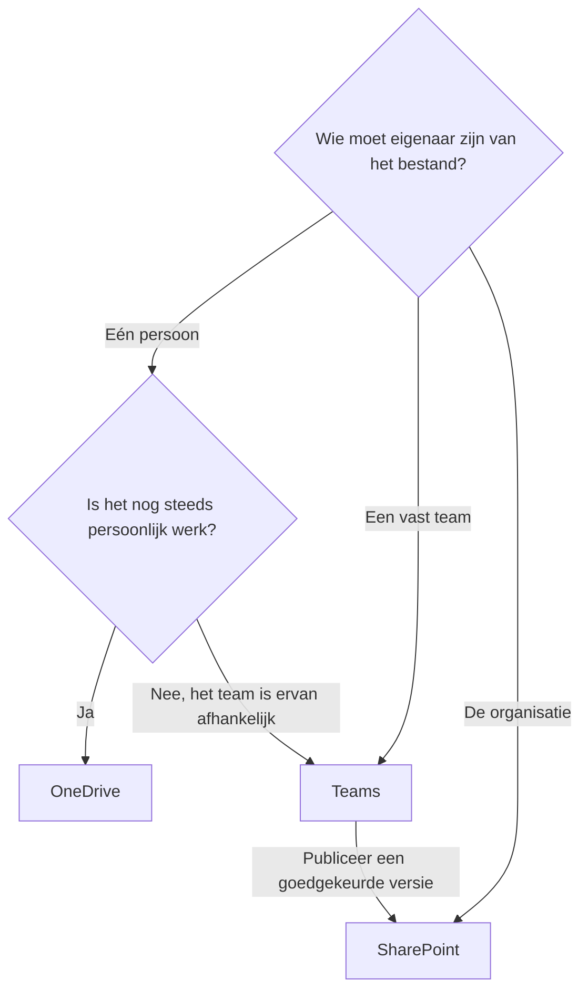

# Waar moet dit bestand staan?

De beste plek voor een bestand hangt af van wie het bezit, wie eraan werkt en hoe lang het beschikbaar moet blijven.

## Kort antwoord

Gebruik OneDrive voor persoonlijk werk en concepten. Gebruik Teams voor actieve samenwerking binnen een afgebakende groep. Gebruik SharePoint voor stabiele, gepubliceerde informatie die een breder publiek nodig heeft.

## Beslisstroom

## Gebruik OneDrive wanneer

- Jij de belangrijkste eigenaar van het document bent.
- Het document een concept, notitie of persoonlijk werkbestand is.
- Je het kort met één persoon deelt voor feedback.
- Het bestand nog geen onderdeel is van een herhaalbaar teamproces.

Gebruik OneDrive voor Bedrijven voor werkdocumenten. Bewaar persoonlijke foto's en privébestanden in een persoonlijk OneDrive-account, niet in je werktenant.

## Verplaats naar Teams wanneer

Verplaats het bestand naar een Team wanneer samenwerking structureel wordt. Als meerdere mensen blijven bewerken, beoordelen of afhankelijk zijn van het document, moet het van het team zijn in plaats van van één persoon.

Dat is belangrijk omdat teameigenaarschap vakanties, functiewijzigingen en vertrek van medewerkers overleeft.

## Publiceer via SharePoint wanneer

Gebruik SharePoint wanneer een groter publiek stabiele toegang tot gepubliceerde informatie nodig heeft. De werkversie kan in Teams blijven terwijl een beoordeelde kopie in SharePoint wordt gepubliceerd.

Zo kan het team het brondocument blijven verbeteren zonder te veranderen wat de organisatie op dat moment ziet.

Gebruik nadat SharePoint als bestemming is gekozen [Site, bibliotheek of map: waar organiseer je documenten?](./site-library-or-folder.md) om binnen SharePoint de juiste structuur te bepalen.

## Let op deze signalen

- Mensen vragen: "Waar staat de nieuwste versie?"
- Een bestand wordt iedere week met meer mensen gedeeld.
- De eigenaar wordt een knelpunt.
- Het document wordt gebruikt bij onboarding, bedrijfsvoering of beleid.
- Het bestand moet beschikbaar blijven als de oorspronkelijke auteur vertrekt.

Wanneer deze signalen optreden, is het bestand de persoonlijke opslag ontgroeid.
