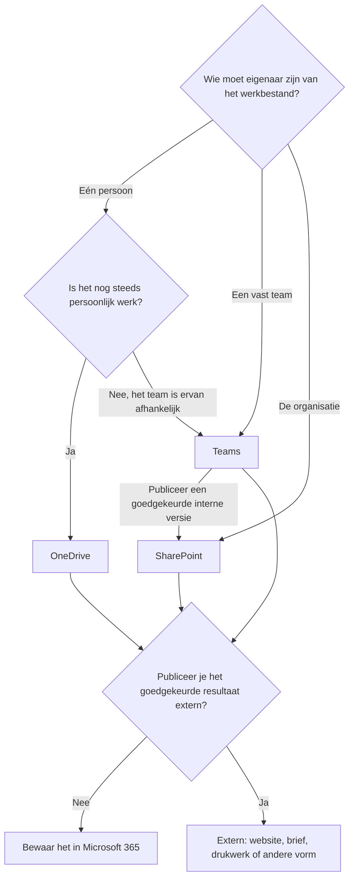

# Waar moet dit bestand staan?

De beste plek voor een bestand hangt af van wie het bezit, wie eraan werkt en hoe lang het beschikbaar moet blijven.

## Kort antwoord

Gebruik OneDrive voor persoonlijk werk en concepten. Gebruik Teams voor actieve samenwerking binnen een afgebakende groep. Gebruik SharePoint voor officiële informatie of informatie voor een bredere interne doelgroep. Kies na het werken aan het bestand op een van deze locaties voor Extern als het goedgekeurde resultaat op een website, in een brief, als drukwerk of in een andere vorm buiten Microsoft 365 moet verschijnen.

## Beslisstroom

```mermaid
flowchart TD
    Start{Wie moet eigenaar zijn van het werkbestand?}
    Start -->|Eén persoon| Personal{Is het nog steeds persoonlijk werk?}
    Start -->|Een vast team| Teams[Teams]
    Start -->|De organisatie| SharePoint[SharePoint]

    Personal -->|Ja| OneDrive[OneDrive]
    Personal -->|Nee, het team is ervan afhankelijk| Teams
    Teams -->|Publiceer een goedgekeurde interne versie| SharePoint

    OneDrive --> Publish{Publiceer je het goedgekeurde resultaat extern?}
    Teams --> Publish
    SharePoint --> Publish
    Publish -->|Nee| Keep[Bewaar het in Microsoft 365]
    Publish -->|Ja| External[Extern: website, brief, drukwerk of andere vorm]
```

## Gebruik OneDrive wanneer

- Jij de belangrijkste eigenaar van het document bent.
- Het document een concept, notitie of persoonlijk werkbestand is.
- Je het kort met één persoon deelt voor feedback.
- Het bestand nog geen onderdeel is van een herhaalbaar teamproces.

Gebruik OneDrive voor Bedrijven voor werkdocumenten. Bewaar persoonlijke foto's en privébestanden in een persoonlijk OneDrive-account, niet in je werktenant.

## Verplaats naar Teams wanneer

Verplaats het bestand naar een Team wanneer samenwerking structureel wordt. Als meerdere mensen blijven bewerken, beoordelen of afhankelijk zijn van het document, moet het van het team zijn in plaats van van één persoon.

Dat is belangrijk omdat teameigenaarschap vakanties, functiewijzigingen en vertrek van medewerkers overleeft.

## Publiceer via SharePoint wanneer

Gebruik SharePoint wanneer een groter publiek stabiele toegang tot gepubliceerde informatie nodig heeft. De werkversie kan in OneDrive of Teams blijven terwijl een beoordeelde kopie in SharePoint wordt gepubliceerd. Mensen kunnen daar aan de volgende versie werken zonder de versie te veranderen die de bredere doelgroep op dat moment ziet.

Behandel het intranet als de bron van de actuele goedgekeurde interne versie. Als aan de voorwaarden is voldaan, raadt M365Wizard aan dat IT de relevante intranetsite aanwijst als authoritative site (gezaghebbende site). Microsoft vermeldt dat authoritative sites officiële, door de organisatie beheerde SharePoint-bronnen aanduiden en dat Copilot Search de inhoud als vertrouwd herkent en geverifieerde organisatiebronnen promoot. Dit helpt om de goedgekeurde versie herkenbaar te maken, maar vervangt duidelijk eigenaarschap, machtigingen, goedkeuring en versiebeheer niet. Zie [Authoritative SharePoint-sites in Copilot Search](https://learn.microsoft.com/nl-nl/sharepoint/sharepoint-authoritative-sites).

Gebruik nadat SharePoint als bestemming is gekozen [Site, bibliotheek of map: waar organiseer je documenten?](./site-library-or-folder.md) om binnen SharePoint de juiste structuur te bepalen.

## Publiceer extern na samenwerking

Kies nadat mensen in OneDrive, Teams of SharePoint aan het bestand hebben gewerkt voor een externe bestemming wanneer anderen het goedgekeurde resultaat buiten Microsoft 365 moeten ontvangen of gebruiken. Denk aan een openbare website, een brief, drukwerk of een andere publicatie- of distributievorm.

Extern is de bestemming van het vrijgegeven resultaat, niet de werklocatie van het bronbestand. Bewaar het concept in OneDrive of Teams wanneer mensen daar de volgende versie verder moeten ontwikkelen. Bewaar de actuele goedgekeurde versie, de goedkeuring en een registratie van de externe publicatie in een SharePoint-site met een duidelijke eigenaar. Wijs een eigenaar aan die de externe versie kan corrigeren, vervangen, beoordelen of intrekken.

Moeten externe personen het beheerde bestand bewerken of beoordelen in plaats van alleen het vrijgegeven resultaat te ontvangen? Gebruik dan het werkpatroon in [Extern delen](../admin-and-governance/external-sharing.md).

:::warning[Controleer vóór publicatie]

Controleer de doelgroep, goedkeuring, privacy, toegankelijkheid, publicatiedatum en beoordelings- of intrekkingsdatum voordat inhoud Microsoft 365 verlaat.

:::

## Let op deze signalen

- Mensen vragen: "Waar staat de nieuwste versie?"
- Een bestand wordt iedere week met meer mensen gedeeld.
- De eigenaar wordt een knelpunt.
- Het document wordt gebruikt bij onboarding, bedrijfsvoering of beleid.
- Het bestand moet beschikbaar blijven als de oorspronkelijke auteur vertrekt.
- Het goedgekeurde resultaat moet op een website, in een brief, als drukwerk of via een andere externe vorm verschijnen.

Wanneer deze signalen optreden, is het bestand de persoonlijke opslag ontgroeid en is een beheerde route voor een team, de organisatie of externe publicatie nodig.

## Gerelateerde handleidingen

- [Informatie publiceren](../scenarios/publish-information.md)
- [Extern delen](../admin-and-governance/external-sharing.md)
