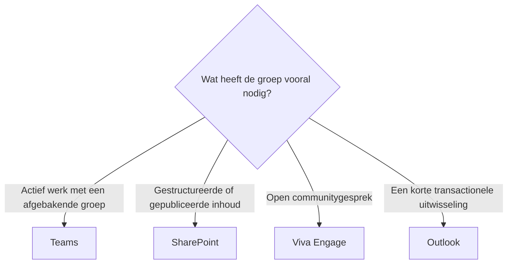

# Welk samenwerkingshulpmiddel moet ik gebruiken?

Samenwerkingshulpmiddelen in Microsoft 365 overlappen bewust. De juiste keuze hangt af van de relatie tussen de betrokken mensen.

## Kort antwoord

Gebruik Teams voor actief werk met een afgebakende groep. Gebruik SharePoint voor gestructureerde inhoud en publicatie. Gebruik Viva Engage voor open communitygesprekken. Gebruik Outlook wanneer het gesprek transactioneel is en geen gedeelde werkruimte nodig heeft.

## Beslisstroom

## Kies Teams voor actief werk

Teams is het sterkst wanneer een groep herhaaldelijk samenwerkt. Het brengt chat, vergaderingen, bestanden, kanalen, Planner, Loop en apps samen in één werkruimte.

Gebruik het voor projecten, afdelingen, werkgroepen en terugkerende samenwerking.

## Kies SharePoint voor inhoud

SharePoint is het sterkst wanneer informatie structuur, machtigingen, publicatie, metagegevens of een langere levenscyclus nodig heeft.

Gebruik het voor intranetpagina's, kennisbanken, documentbibliotheken, beleidsstukken, sjablonen en gepubliceerde bronnen.

## Kies Viva Engage voor community

Viva Engage is het sterkst wanneer een gesprek zichtbaar moet zijn buiten één team. Het werkt goed voor updates van leidinggevenden, vakcommunities, medewerkersbetrokkenheid en vragen die baat hebben bij een breed publiek.

Gebruik het wanneer ontdekken en deelnemen belangrijker zijn dan taakuitvoering.

## Kies Outlook voor korte transacties

E-mail heeft nog steeds een plaats. Gebruik Outlook wanneer een bericht kortdurend is, aan specifieke personen is gericht en geen gedeelde werkruimte of patroon voor langdurige samenwerking nodig heeft.

Wordt de e-mailketen een werkstroom, verplaats die dan naar Teams of SharePoint.
