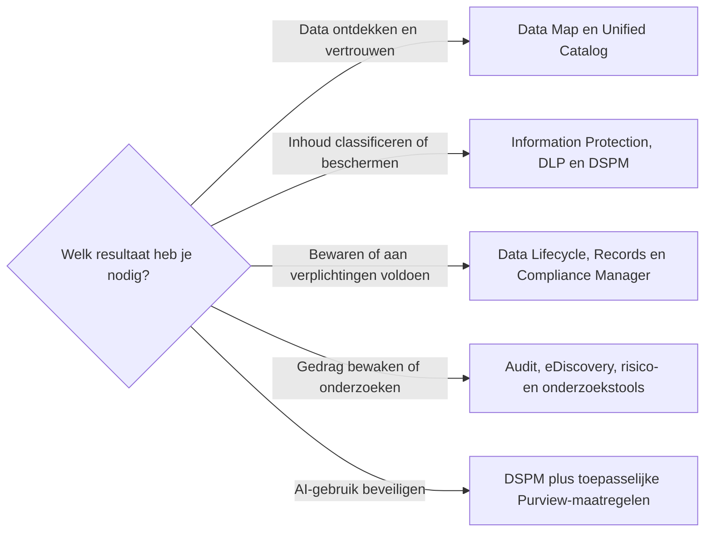

# Welke Microsoft Purview-oplossing moet je gebruiken?

Kies het bedrijfsresultaat voordat je een Purview-oplossing kiest. Begin met de data, het risico, de verplichting en de verantwoordelijke eigenaar; selecteer daarna de kleinste set beheersmaatregelen die aan die behoefte voldoet.

## Kort antwoord

Gebruik:

- **Data Map en Unified Catalog** om data-assets in het datalandschap te ontdekken, beschrijven en beheren en het vertrouwen erin te verbeteren;
- **Information Protection, DLP en DSPM** om gevoelige informatie te classificeren, beschermen, riskante handelingen te voorkomen en de databeveiligingspositie te begrijpen;
- **Data Lifecycle Management en Records Management** om informatie te bewaren, verwijderen, als record te verklaren, beoordelen en af te voeren;
- **Audit, eDiscovery, Compliance Manager en onderzoekstools** voor bewijs, zaken, compliancebeoordelingen en data-incidenten;
- **Insider Risk Management, Communication Compliance, Information Barriers en Privileged Access Management** voor vastgelegde risico's rond gedrag, communicatie, scheiding of bevoorrechte taken;
- **DSPM plus de toepasselijke bovenstaande beheersmaatregelen** om ondersteunde AI-interacties te beheren.

Purview-oplossingen werken vaak samen. Dat betekent niet dat ieder scenario ze allemaal nodig heeft.

## Beslisstroom

## Kies op basis van het probleem

| Bedrijfsprobleem | Purview-oplossing | Aanbevolen eigenaars | Eerste validatie |
| --- | --- | --- | --- |
| We hebben een inventaris, lineage, bedrijfsbetekenis, eigenaarschap of kwaliteit nodig voor data in analytische, SaaS-, hybride of multicloud-bronnen | [Data Map](https://learn.microsoft.com/en-us/purview/data-map) en [Unified Catalog](https://learn.microsoft.com/en-us/purview/unified-catalog) | Centraal datateam, data-eigenaren, datastewards en IT | Kies één governancedomein en bevestig ondersteunde bronnen, eigenaarschap, metadata, kwaliteit en facturering |
| Mensen moeten vertrouwelijke documenten en e-mails herkennen en beschermen | [Information Protection en gevoeligheidslabels](https://learn.microsoft.com/en-us/purview/information-protection) | Informatie-eigenaar, beveiliging, compliance en IT | Bepaal een kleine, begrijpelijke classificatie en test bescherming in de apps en deelroutes die mensen gebruiken |
| We moeten riskante omgang met gevoelige data waarschuwen, registreren, beperken of blokkeren | [Data Loss Prevention](https://learn.microsoft.com/en-us/purview/dlp-learn-about-dlp) | Beveiliging, compliance, workloadeigenaren en ondersteuning | Begin waar ondersteund in simulatie- of auditmodus, beoordeel treffers en foutpositieven en bepaal uitzonderingen voordat je blokkeert |
| We hebben een gecombineerd beeld van gevoelige-datarisico of diepere analyse van data bij een incident nodig | [Data Security Posture Management](https://learn.microsoft.com/en-us/purview/data-security-posture-management-learn-about) en [Data Security Investigations](https://learn.microsoft.com/en-us/purview/data-security-investigations) | Beveiligingsoperaties, databeveiliging, privacy en incidenteigenaren | Beoordeel vóór onderzoek de machtigingen, datascope, integraties, previewafhankelijkheden en kosten voor capaciteit of betalen naar gebruik |
| We moeten informatie consistent bewaren of verwijderen, of waardevolle records en hun verwijdering beheren | [Data Lifecycle Management en Records Management](https://learn.microsoft.com/en-us/purview/manage-data-governance) | Informatiebeheer, juridische zaken, compliance, informatie-eigenaren en IT | Leg de grondslag, startgebeurtenis, termijn, uitkomst, uitzonderingen en goedkeurder vast voordat je beleid of labels maakt |
| We hebben activiteitenbewijs, een juridische of wettelijke zaak of een beoordeling van complianceverplichtingen nodig | [Audit](https://learn.microsoft.com/en-us/purview/audit-solutions-overview), [eDiscovery](https://learn.microsoft.com/en-us/purview/edisc) en [Compliance Manager](https://learn.microsoft.com/en-us/purview/compliance-manager) | Juridische zaken, compliance, audit, beveiliging en privacy | Bepaal de zaak of vereiste, betrokkenen en scope, rollen met minimale rechten, bewijsverwerking en het vereiste licentieniveau |
| We moeten riskant gedrag, ongepaste communicatie, belangenconflicten of permanente bevoorrechte toegang aanpakken | [Insider Risk Management](https://learn.microsoft.com/en-us/purview/insider-risk-management-solution-overview), [Communication Compliance](https://learn.microsoft.com/en-us/purview/communication-compliance-solution-overview), [Information Barriers](https://learn.microsoft.com/en-us/purview/information-barriers) en [Privileged Access Management](https://learn.microsoft.com/en-us/purview/privileged-access-management-solution-overview) | Beveiliging, compliance, privacy, juridische zaken, HR en IT | Bevestig het gerechtvaardigde doel, proportionaliteit, privacywaarborgen, beoordelaars, escalatieroute en ondersteunde workloads voordat je monitoring of beperkingen inschakelt |
| We moeten te ruim delen, datalekken of compliancehiaten in Copilots, agents of andere generatieve AI-apps verminderen | [Purview-databeveiliging en -compliance voor generatieve AI](https://learn.microsoft.com/en-us/purview/ai-microsoft-purview) | AI-diensteigenaar, beveiliging, compliance, data-eigenaren en IT | Inventariseer de exacte AI-apps en agents en controleer daarna voor elk de ondersteuningsmatrix, licenties, facturering, machtigingen en beleidsregels |

## Begrijp de lagen van beheersmaatregelen

Deze beheersmaatregelen beantwoorden verschillende vragen en kunnen op hetzelfde item van toepassing zijn:

| Beheersmaatregel | Vraag die zij beantwoordt | Praktisch effect |
| --- | --- | --- |
| **Machtigingen** | Wie kan deze inhoud hier openen of wijzigen? | Verleent of weigert toegang in de huidige dienst of werkruimte; machtigingen vervangen geen classificatie of levenscyclus via Purview |
| **Gevoeligheidslabel** | Hoe gevoelig is dit en welke bescherming moet met de inhoud meegaan? | Classificeert ondersteunde inhoud en kan markeringen, versleuteling of andere beschermingsinstellingen toepassen |
| **DLP-beleid** | Welke gevoelige handeling moet worden geregistreerd, gewaarschuwd, beperkt of geblokkeerd? | Beoordeelt geconfigureerde inhoud, context, locaties en acties terwijl mensen of processen data verwerken |
| **Bewaarbeleid** | Welke brede locaties of populaties hebben dezelfde bewaar- of verwijderregel nodig? | Past bewaarinstellingen toe op ondersteunde workloads zonder dat gebruikers elk item hoeven te labelen |
| **Bewaarlabel** | Welk item of documenttype heeft een specifieke levenscyclus nodig? | Past bewaring of verwijdering per item toe en kan waar ondersteund worden gepubliceerd, standaard ingesteld of automatisch toegepast |
| **Recordverklaring** | Heeft dit waardevolle item sterkere recordmaatregelen en bewijs van verwijdering nodig? | Gebruikt mogelijkheden van Records Management zoals recordverklaring, bestandsplannen en verwijderingsbeoordeling |
| **Audit** | Welke ondersteunde activiteit van een gebruiker of beheerder heeft plaatsgevonden? | Levert doorzoekbare activiteitenrecords voor beveiligings-, forensisch, compliance- of operationeel onderzoek |
| **eDiscovery** | Welke elektronische informatie moet voor een zaak worden geïdentificeerd, bewaard, beoordeeld of geëxporteerd? | Organiseert juridisch of wettelijk werk rond zaken, holds, zoekacties, beoordeling en export |

Een document kan daarom tegelijkertijd machtigingen, een gevoeligheidslabel en een bewaarlabel hebben. DLP kan beoordelen hoe ermee wordt omgegaan, Audit kan ondersteunde activiteiten registreren en eDiscovery kan het voor een zaak bewaren of verzamelen.

:::warning[Beheersmaatregelen maken geen beleid]

Vertaal een vage instructie zoals "bewaar alles" of "blokkeer vertrouwelijke data" niet rechtstreeks naar tenantbreed beleid. Bevestig eerst het doel, de juridische of beleidsgrondslag, eigenaar, scope, gebruikersimpact, uitzonderingen en actie aan het einde van de levenscyclus.

:::

:::warning[Gebruik gevoelige risicotools proportioneel]

Insider Risk Management, Communication Compliance, eDiscovery en onderzoekstools kunnen gevoelige informatie over mensen en hun werk zichtbaar maken. Bepaal vóór gebruik de waarborgen voor privacy, juridische zaken, HR, beoordelaars, functiescheiding en escalatie.

:::

## Behandel AI als een doorsnijdend scenario

Ga er niet van uit dat de aankoop of inschakeling van één AI-beveiligingsfunctie iedere Copilot of agent afdekt. Begin met dezelfde basis als voor andere data: juiste toegang, bekende eigenaars, bruikbare classificatie, passende DLP, audit, bewaring en onderzoeksprocessen. Controleer daarna welke beheersmaatregelen iedere AI-app of agent ondersteunt.

Op 21 juli 2026 markeert Microsoft sommige DSPM-integraties en proactieve AI-inzichten die Data Security Investigations gebruiken als preview. Houd een stabiele monitorings- of onderzoeksroute beschikbaar en controleer de previewstatus opnieuw voordat je er operationeel van afhankelijk wordt.

## Aanbevolen startpatroon

1. Beschrijf één concreet risico, verplichting of datagovernanceresultaat.
2. Benoem de bedrijfs- of data-eigenaar en de besliseigenaar voor beveiliging, informatiebeheer, juridische zaken, privacy of compliance.
3. Inventariseer de data, locaties, gebruikers, processen en AI-apps binnen de scope.
4. Bevestig rollen, ondersteunde workloads, licenties, facturering en technische vereisten.
5. Voer een pilot uit met representatieve data en gebruikers; gebruik waar ondersteund simulatie, audit of een beperkte scope.
6. Bereid vóór handhaving gebruikersinstructies, antwoorden voor de helpdesk, uitzonderingen, alerteigenaarschap en escalatie voor.
7. Meet foutpositieven, niet-afgedekte data, beleidsresultaten, gebruikerswrijving en onopgeloste zaken; pas daarna aan of breid uit.

:::warning[Controleer licenties voordat ontwerp een toezegging wordt]

Gebruiksrechten kunnen verschillen per beleidstype, toepassingsmethode, locatie en gebruiker die ervan profiteert. Gebruik de [officiële Microsoft Purview-servicebeschrijving](https://learn.microsoft.com/en-us/office365/servicedescriptions/microsoft-365-service-descriptions/microsoft-365-tenantlevel-services-licensing-guidance/microsoft-purview-service-description) als gezaghebbend vertrekpunt. Het [M365 Maps-diagram voor Purview Suite](https://m365maps.com/files/Microsoft-Purview-Suite.htm) en de [featurematrix](https://m365maps.com/matrix.htm) kunnen helpen overlap tussen abonnementen te visualiseren, maar zijn geen officiële licentievoorwaarden.

:::

## Officiële Microsoft-documentatie

- [Waar te beginnen met Microsoft Purview](https://learn.microsoft.com/en-us/purview/purview-where-to-start)
- [Microsoft Purview-oplossingen voor databeveiliging](https://learn.microsoft.com/en-us/purview/purview-security)
- [Datagovernance met Microsoft Purview](https://learn.microsoft.com/en-us/purview/data-governance-overview)
- [Microsoft Purview-oplossingen voor datacompliance](https://learn.microsoft.com/en-us/purview/purview-compliance)
- [Microsoft Purview-databeveiliging en -compliance voor generatieve AI](https://learn.microsoft.com/en-us/purview/ai-microsoft-purview)

## Gerelateerde gidsen

- [Microsoft Purview](../services/purview.md)
- [Site, bibliotheek of map: waar organiseer je documenten?](./site-library-or-folder.md)
- [Machtigingen en eigenaarschap](../admin-and-governance/permissions-and-ownership.md)
- [Extern delen](../admin-and-governance/external-sharing.md)
- [Van fileserver naar SharePoint: kopiëren of opnieuw indelen?](../admin-and-governance/migrate-file-server-to-sharepoint.md)
