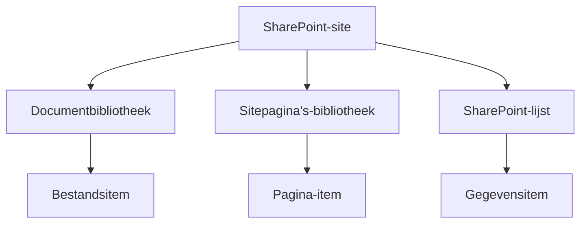
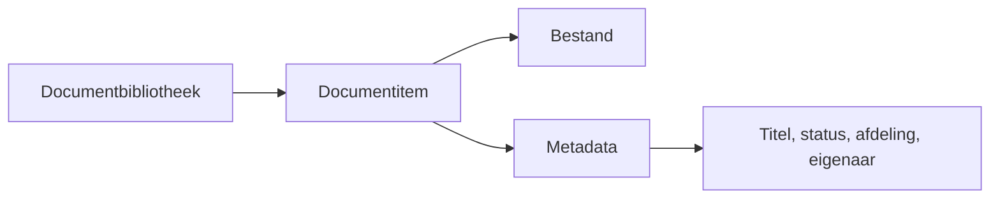
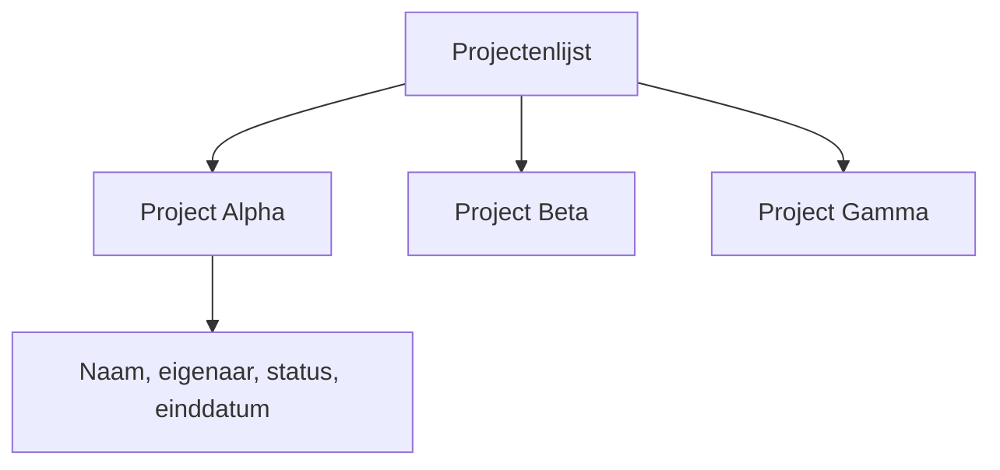
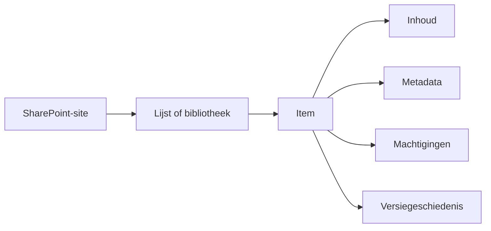
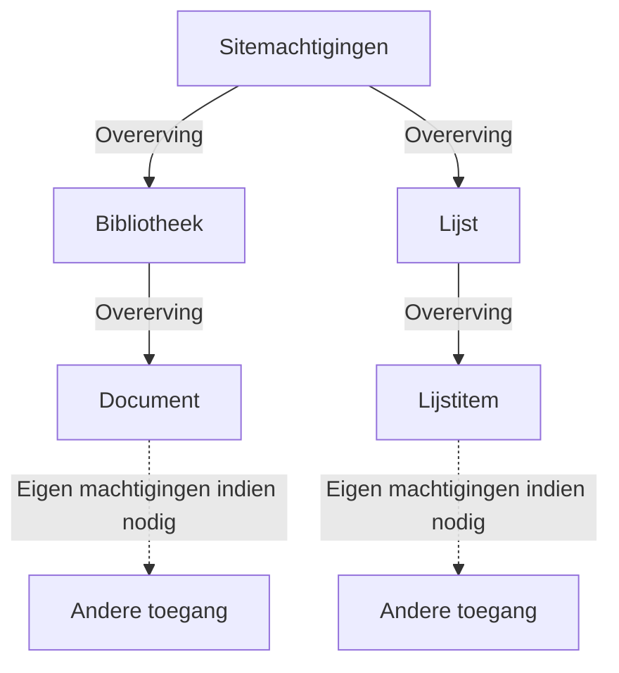

# SharePoint-inhoud: sites, bibliotheken, lijsten en machtigingen

Een SharePoint-site is een gedeelde plek met een doel, zoals een afdelingssite, een projectsite of een onderdeel van het intranet. De site bevat de informatie en instellingen die bij dat doel horen.

## De inhoudsstructuur

Een moderne SharePoint-site wordt technisch als siteverzameling beheerd. In het dagelijkse werk is **site** de bruikbare term: de container waarin mensen inhoud, navigatie en toegangsregels vinden.

In die container kan een site documentbibliotheken, lijsten, de bibliotheek Sitepagina's, instellingen en machtigingen bevatten. Een site hoeft niet alle soorten informatie te bevatten. Het doel van de site moet mensen helpen bepalen wat er thuishoort en wie ervoor zorgt.

## Bibliotheken slaan bestanden op

Een **documentbibliotheek** bewaart bestanden, zoals Word-documenten, spreadsheets, pdf's, afbeeldingen en mappen. Daarnaast bewaart zij informatie *over* ieder bestand, zoals de eigenaar, het documenttype, de status of de publicatiedatum. Deze extra velden heten **metadata** of kolommen.

Zie een bibliotheek als meer dan een map. Metadata, versiegeschiedenis, weergaven en machtigingen helpen mensen het juiste bestand te vinden en te beheren.

Een beleidsbibliotheek kan bijvoorbeeld kolommen bevatten voor afdeling, beleidsstatus, eigenaar en publicatiedatum. Mensen kunnen dan via een weergave actuele HR-beleidsstukken vinden zonder de exacte bestandsnaam of map te kennen.

## Lijsten slaan gegevensrecords op

Een **SharePoint-lijst** bewaart gestructureerde gegevensrecords. Een lijst kan op een spreadsheet lijken, maar is bedoeld om een gedeelde verzameling records in de tijd te beheren.

| Gebruik een bibliotheek wanneer het belangrijkste onderdeel een... | Gebruik een lijst wanneer het belangrijkste onderdeel een... |
| --- | --- |
| Bestand is, zoals een beleidsdocument of sjabloon | Gegevensrecord is, zoals een aanvraag, project, risico, contactpersoon of taak |

Elke rij in een lijst is een **item**. Elk bestand in een bibliotheek is ook een item. Sitepagina's zijn items in de bibliotheek **Sitepagina's**.

| Locatie | Wat een item voorstelt | Voorbeeld |
| --- | --- | --- |
| Documentbibliotheek | Een bestand en de metadata ervan | `Inkoopbeleid.pdf` |
| SharePoint-lijst | Een gestructureerd gegevensrecord | `Laptopaanvraag 2026-004` |
| Bibliotheek Sitepagina's | Een SharePoint-pagina | `Home.aspx` |

Bibliotheken zijn technisch verwant aan lijsten, maar zijn gespecialiseerd in bestandsbeheer. Daarom heeft een bibliotheek bestandsgerichte functies zoals documentversies en mappen, terwijl een lijst meestal wordt gebruikt om records en hun velden bij te houden.

## Machtigingen: begin met overerving

Sites geven hun machtigingen vaak door aan bibliotheken, lijsten, mappen en items. Dit heet **overerving**. Kies overerving als standaard: daardoor kunnen mensen die de site mogen lezen meestal ook de inhoud lezen en kunnen eigenaren toegang begrijpen zonder veel uitzonderingen te hoeven volgen.

Je kunt een bibliotheek, map of item eigen machtigingen geven wanneer daar een goede reden voor is. Doe dat terughoudend. Veel uitzonderingen maken het voor eigenaren lastig om te begrijpen wie toegang heeft en waarom. Overweeg vóór het verbreken van overerving eerst een aparte site of bron met een eigen doel en eigenaar.

De gebruikelijke machtigingen lopen van inhoud lezen tot toevoegen, bewerken, verwijderen of beheren. Begin met de toegang die iemand voor zijn rol nodig heeft, in plaats van gemakshalve brede bewerkrechten te geven. Als een bron een andere doelgroep nodig heeft, overweeg dan eerst of die in een aparte, duidelijk beheerde locatie hoort.

Een koppeling of webpart op een homepage geven iemand geen toegang tot het achterliggende bestand of record. De bron controleert nog steeds zijn eigen machtigingen.

## Volgende stap

Bekijk [hoe een SharePoint-pagina is opgebouwd](./sharepoint-pages-and-web-parts.md) en volg daarna [wat er gebeurt wanneer iemand een homepage opent](./sharepoint-homepage-experience.md).

## Gerelateerde gidsen

- [SharePoint](./index.md)
- [Waar moet dit bestand staan?](../../decisions/where-should-this-file-live.md)
- [Machtigingen en eigenaarschap](../../admin-and-governance/permissions-and-ownership.md)
