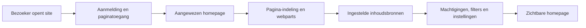
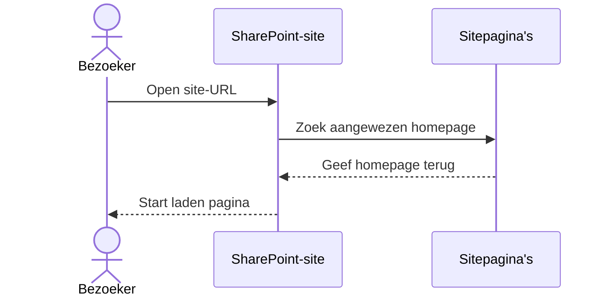
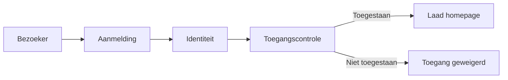
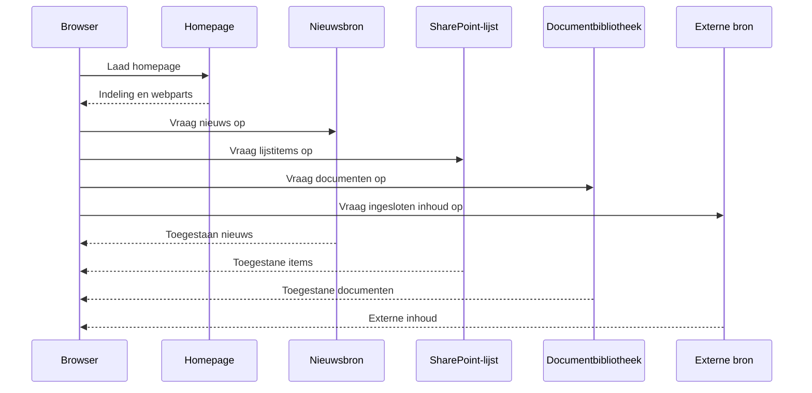
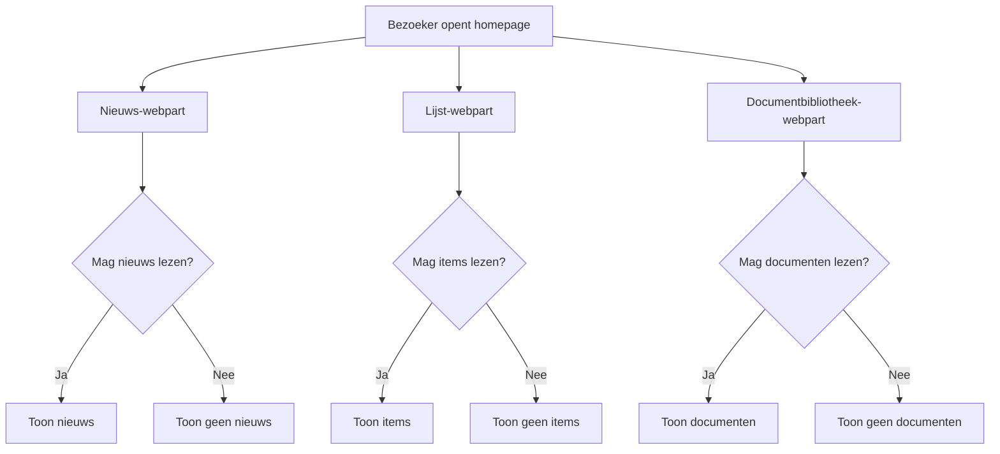
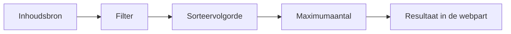

# Wat gebeurt er wanneer je een SharePoint-homepage opent?

Het openen van een SharePoint-site start meer dan één actie. SharePoint herkent de bezoeker, controleert of die de site en pagina mag openen, en laat iedere webpart inhoud ophalen uit de ingestelde bron.

## De homepageflow

De pagina-indeling kan verschijnen voordat iedere webpart de inhoud heeft opgehaald. Webparts kunnen onafhankelijk van elkaar laden uit verschillende bronnen. Nieuws, een lijst, een documentbibliotheek en ingesloten inhoud hoeven dus niet precies tegelijk beschikbaar te zijn.

De flow is gemakkelijker te begrijpen wanneer je onderscheid maakt tussen de acties die SharePoint voor de pagina uitvoert en de acties die iedere webpart voor zijn bron uitvoert.

### 1. Open de site

De bezoeker opent een site-URL, zoals `https://organisatie.sharepoint.com/sites/hr`. SharePoint zoekt de pagina die als homepage van die site is aangewezen. Die heet vaak `Home.aspx`, maar een site-eigenaar kan ook een andere pagina aanwijzen.

### 2. Controleer identiteit en paginatoegang

SharePoint controleert wie de bezoeker is, of die is aangemeld en of die de site en pagina mag openen. Een bezoeker zonder toegang kan de homepage niet gebruiken om de machtigingen van de site te omzeilen.

### 3. Lees de pagina-indeling

SharePoint leest de configuratie van de pagina: secties, kolommen, webparts en de instellingen van iedere webpart. De browser kan de structuur van de pagina al tekenen terwijl afzonderlijke webparts hun resultaten verder laden.

### 4. Haal inhoud voor webparts op

Iedere webpart vraagt informatie op bij zijn eigen bron. Een Nieuws-webpart vraagt om geschikte nieuwspagina's, een Lijst-webpart om lijstitems, een Documentbibliotheek-webpart om documenten en een Insluiten-webpart vraagt de externe dienst om inhoud te leveren.

## Toegang wordt op meer dan één plek gecontroleerd

Eerst moet de bezoeker de site en pagina mogen openen. Daarna past iedere bron nog steeds eigen machtigingen toe. Een Documentbibliotheek-webpart maakt afgeschermde documenten niet zichtbaar alleen omdat hij op een breed toegankelijke homepage staat.

Kies bij voorkeur voor overervende toegang voor de site, de bibliotheek Sitepagina's en iedere inhoudsbron. Gebruik een homepage of losse webpart niet om de normale machtigingsstructuur te omzeilen. Als een andere doelgroep echt andere toegang nodig heeft, maak die uitzondering dan bewust, gedocumenteerd en belegd bij een eigenaar.

Daarom kunnen twee mensen dezelfde homepage openen en toch verschillende resultaten zien. De een kan een document, lijstitem of nieuwsbericht zien waartoe de ander geen toegang heeft.

Hetzelfde principe geldt voor bronnen buiten de site. Een ingesloten dashboard, formulier of video kan eigen aanmeldings- en toegangsvereisten hebben. Een pagina kan een bruikbare ingang bieden, maar kan de regels van het systeem dat de inhoud levert niet overschrijven.

## Webparts passen hun eigen instellingen toe

Webparts tonen normaal gesproken een geselecteerd deel van een bron, niet alles wat erin staat. Hun instellingen kunnen een gekozen weergave, filter, sorteervolgorde of maximumaantal resultaten gebruiken. Een Nieuws-webpart kan bijvoorbeeld de vier nieuwste berichten tonen in plaats van alle nieuwsberichten op een site.

Doelgroepgerichtheid kan inhoud relevanter maken, maar vervangt geen machtigingen. Gebruik machtigingen om inhoud te beschermen en doelgroepgerichtheid om de juiste doelgroep naar bruikbare inhoud te leiden.

Nadat die regels zijn toegepast, plaatst de browser de ontvangen nieuwskaarten, lijstregels, documentkoppelingen en ingesloten inhoud in hun webparts. De bezoeker ervaart één homepage, terwijl de zichtbare informatie uit verschillende opslaglocaties en systemen kan komen.

## Wat dit betekent voor pagina-eigenaren

Houd de homepage gericht op bruikbare ingangen, actuele informatie en duidelijke acties. Beheer inhoud bij de bron, controleer of de instellingen van webparts nog passen bij de bedoelde doelgroep en verberg toegangsproblemen niet achter het paginaontwerp.

## Leer verder

Ga terug naar [hoe een SharePoint-pagina is opgebouwd](./sharepoint-pages-and-web-parts.md) of begin met [sites, bibliotheken, lijsten en machtigingen](./sharepoint-content-structure.md).

## Gerelateerde gidsen

- [SharePoint](./index.md)
- [Informatie publiceren](../scenarios/publish-information.md)
- [Machtigingen en eigenaarschap](../admin-and-governance/permissions-and-ownership.md)
