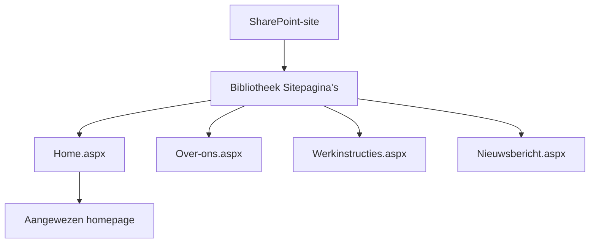
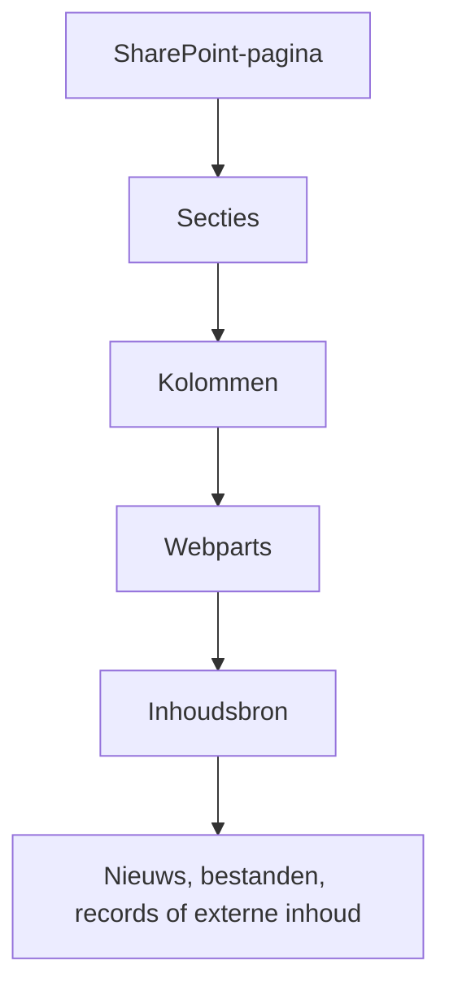
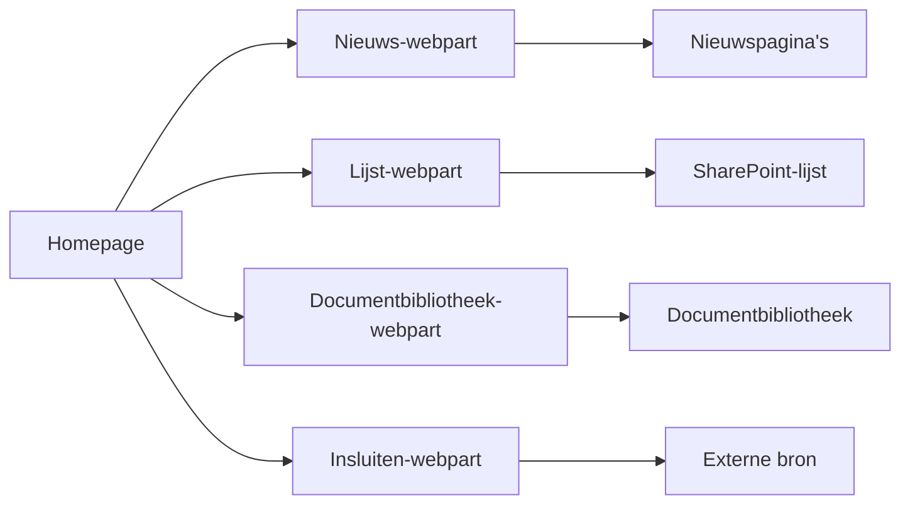
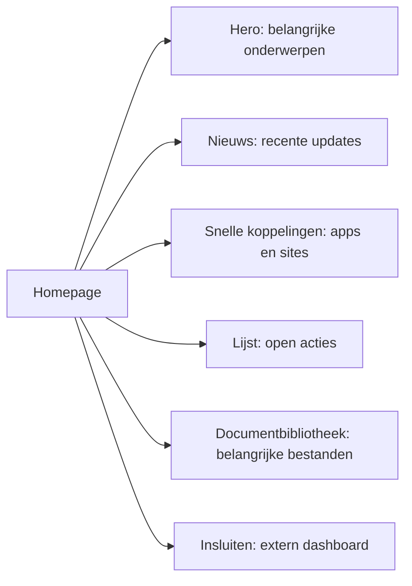

# Hoe een SharePoint-pagina is opgebouwd

Een moderne SharePoint-pagina is een presentatielaag. De pagina geeft informatie een bruikbare indeling, maar veel van de zichtbare informatie kan nog steeds in een bibliotheek, lijst, nieuwspagina of ander systeem staan.

## Pagina's staan in Sitepagina's

Moderne pagina's worden opgeslagen in de bibliotheek **Sitepagina's**. Technisch is een pagina een `.aspx`-bestand. Een site-eigenaar wijst één pagina aan als homepage; die heet vaak `Home.aspx`, maar kan ook een andere naam hebben.

Dezelfde bibliotheek kan gewone pagina's en nieuwsberichten bevatten. Een nieuwsbericht is meestal een pagina met nieuwsspecifieke instellingen, geen aparte kopie van de inhoud op de homepage.

Dat betekent ook dat een site veel pagina's kan hebben: een Over-ons-pagina, werkinstructies, nieuwsberichten en een homepage. Wijzig je welke pagina als homepage is aangewezen, dan verandert de eerste pagina die bezoekers bij het openen van de site ontvangen, maar de andere pagina's blijven bestaan.

## Van indeling naar inhoud

**Secties** en **kolommen** bepalen waar inhoud op het scherm verschijnt. **Webparts** zijn de bouwstenen die in die plaatsen staan.

Een pagina kan bijvoorbeeld een brede bovenste sectie voor belangrijke onderwerpen gebruiken, twee kolommen voor nieuws en snelle koppelingen, en een lagere sectie voor documenten of open acties. De pagina-indeling bepaalt *waar* iets verschijnt; de instellingen van een webpart bepalen *wat* die toont.

Veelgebruikte webparts zijn Tekst, Hero, Nieuws, Snelle koppelingen, Lijst, Documentbibliotheek, Personen, Gebeurtenissen, Power BI en Insluiten. Een pagina-eigenaar stelt iedere webpart in op de juiste bron, weergave, indeling of het gewenste aantal resultaten.

| Webpart | Gebruikelijk doel | Herkomst van de inhoud |
| --- | --- | --- |
| Nieuws | Recente gepubliceerde updates tonen | Geselecteerde nieuwspagina's op één of meer sites |
| Lijst | Een bruikbare verzameling gegevensrecords tonen | Een gekozen SharePoint-lijst en weergave |
| Documentbibliotheek | Belangrijke bestanden uitlichten | Een gekozen bibliotheek, map of weergave |
| Insluiten | Een andere dienst op de pagina tonen | Een externe pagina, video, formulier of dashboard |

De Nieuws-webpart kan nieuws kiezen uit de huidige site, geselecteerde sites of een hub. Hij toont normaal een samenvatting, zoals een titel, afbeelding, datum en inleiding, die naar de volledige nieuwspagina verwijst. De homepage wordt daardoor niet de plek waar alle nieuwsartikelen worden opgeslagen.

## Een pagina is meestal niet de bron

Een Nieuws-webpart selecteert bijvoorbeeld nieuwspagina's om te tonen. Een Lijst-webpart toont een gekozen weergave van een bestaande lijst. Een Documentbibliotheek-webpart toont bestanden uit een bestaande bibliotheek. Een Insluiten-webpart toont inhoud die een ander systeem levert.

Die scheiding is belangrijk:

- Werk een beleidsdocument bij in de documentbibliotheek in plaats van de tekst op meerdere pagina's te plakken.
- Beheer gegevensrecords in hun lijst en toon daarna de bruikbare weergave op een pagina.
- Geef iedere webpart een duidelijk doel en een duidelijke inhoudseigenaar.

De homepage is dus een samengestelde ervaring, niet een opslagplaats waarin alles moet worden gekopieerd.

Wanneer een webpart een lijst of bibliotheek toont, leest hij de bestaande informatie. De pagina maakt geen tweede verzameling projecten of documenten. Daardoor hebben eigenaren één plek om inhoud bij te werken en kan een homepage alleen het nuttigste deel ervan tonen.

## Houd toegang tot pagina's eenvoudig

Laat Sitepagina's en de bronnen die webparts gebruiken waar mogelijk machtigingen van de site overerven. Een filter, indeling of doelgroepinstelling van een webpart vervangt de machtigingen van de bron niet. Geef niet aan losse pagina's of items eigen toegang alleen om te veranderen wat op een homepage verschijnt; gebruik voor een werkelijk andere doelgroep een duidelijk beheerde bron.

## Volgende stap

Lees [wat er gebeurt wanneer iemand een SharePoint-homepage opent](./sharepoint-homepage-experience.md). Je kunt ook terug naar [sites, bibliotheken, lijsten en machtigingen](./sharepoint-content-structure.md).

## Gerelateerde gidsen

- [SharePoint](./index.mdx)
- [Informatie publiceren](../../scenarios/publish-information.md)
- [Bibliotheek met organisatie-assets](../../admin-and-governance/organization-assets-library.md)
